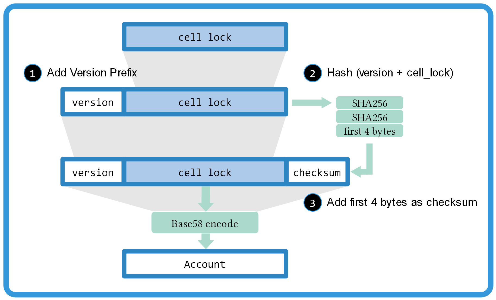

# Account Format

## Abstract

CKB Account Format is an application level [cell lock][cell-lock] display recommendation. In the consideration of user experience, it is necessary to put the raw H256 (may be variable in the future) cell lock into a verifiable and extensible format.

## Solution

CKB Account Format follows [Bitcoin address format][btc-address] rules, which add a version prefix and a checksum suffix to the cell lock, and wrap them in [Base58][base58] encoding.

## Version Prefix Convention
|   Type    | Version prefix | Base58 result prefix |
|-----------|----------------|----------------------|
|  default  | 0x00           | 1                    |
|  testnet  | 0x6F           | m or n               |
|  TBD      | --             | --                   |

[cell-lock]:https://github.com/nervosnetwork/ckb/blob/develop/core/src/transaction.rs#L94

[base58]: https://www.wikiwand.com/en/Base58

[btc-address]:https://en.bitcoin.it/wiki/Address