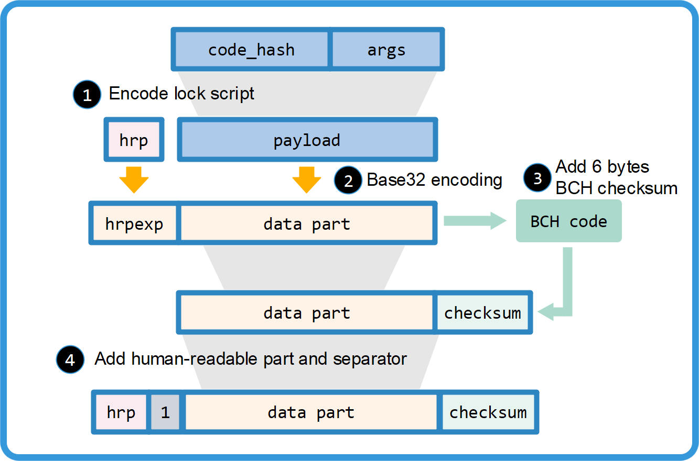

# Address Format

## Abstract

CKB Address Format is an application level *lock hash* display recommendation. *lock hash*  is the 256bit Blake2b hash result of *lock script*. The lock script consists of two key parameters, including *code hash* and *arguments*. To provide lock hash, one could use the original lock script, or directly the hash of the script.

In the consideration of user experience, it is necessary to wrap the raw data structure into a verifiable and extensible format.

## Solution

CKB Address Format follows [Bitcoin base32 address format (BIP-173)][bip173] rules, which wraps data in **Bech32** encoding and a [BCH checksum][bch].

A Bech32 string is at most 90 characters long and consists of the **human-readable part**, the **separator**, and the **data part**. The last 6 characters of data part is checksum. The data part is base32 encoded. Here is the readable translation of base32 encoding table.

|0|1|2|3|4|5|6|7|
|-|-|-|-|-|-|-|-|
|**+0**|q|p|z|r|y|9|x|8|
|**+8**|g|f|2|t|v|d|w|0|
|**+16**|s|3|j|n|5|4|k|h|
|**+24**|c|e|6|m|u|a|7|l|


The human-readable part is "**ckb**" for CKB mainnet, and "**ckt**" for the testnet. The separator is always "1".



## Payload

The first step to encode lock hash or lock script into address is to encode them to payload. We use type field in payload to identify different encoding methods according to different user scenario needs, and parameter fields to represent extensional data.

```
payload = type | parameter1 | parameter2 | ...
```

|   type     |    parameter1    | parameter2  |  lock hash / script |
|-----------|---------------------|------------------|------------------------|
|    0x00    |      lock hash      |              --           |         lock hash        |
|    0x01    |   1 byte index    |  PK/PKHash  | lock script = {code_hash: table[p1], args:[p2]} |
|  <TBD>  |              --               |             --            |                  --                |

Type 0  simply wraps the lock hash to an address. Type 1 is a compact format which identifies common used code hash by 1 byte code hash index instead of 32 bytes code hash. Other type number address formats are to be defined.

Note that current payload types only support 1 lock script argument (in parameter2 field). However, it is easy to be extended to support multiple arguments.

### Code Hash Index

Type 1 of ckb address format uses 1 byte index to refer to common used code hash. Here is a predefined code hash table.

|     code hash index  | code_hash    | args |
|--------------------------|------------------|-------|
|                0x00               | SECP256K1 + blake160 | blake160(PK)  |

The blake160 here means the first 20 bytes truncation of Blake2b hash function.

## Examples

### Encode lock hash to type 0 address

Suppose we have

`
lock_hash = 0xcdf2b97ef29371a53482cf977ac0c1319cc2e102e6ac8185e973c89996b4eaf7`

then,

`payload = 0x00 | lock_hash`

Calculate the base32 format of hrp and payload.
```c
Base32(hrp) = "rrrqrtz"
Base32(payload) = "qrxl9wt772fhrff5st8ew7kqcyceeshpqtn2eqv9a9eu3xvkkn40w"
```
Calculate checksum
```c
checksum = BCH_checksum(Base32(hrp) | Base32(payload)) = v6tu2p
```
Add up together

```c
address = hrp | 1 | Base32(payload) | checksum 
        = "ckb1qrxl9wt772fhrff5st8ew7kqcyceeshpqtn2eqv9a9eu3xvkkn40wv6tu2p"
```

### Encode lock script to type 1 address

The original lock script is,

```js
{
    args: ['13e41d6F9292555916f17B4882a5477C01270142'],
    code_hash: 0x48a2ce278d84e1102b67d01ac8a23b31a81cc54e922e3db3ec94d2ec4356c67c
}
```

Suppose that the code_hash is from secp256k1 with blake160 algorithm implementation binary. And the sole parameter of args is secp256k1 public key's blake160 result. We could simply encode the lock script into P2PH address format.

Firstly, compact lock script to payload.

```c
payload = 0x01 | 0x00 | 0x13e41d6F9292555916f17B4882a5477C01270142
```

Calculate the base32 format of hrp and payload.

```c
Base32(hrp) = "rrrqrtz"
Base32(payload) = "qyqp8eqad7ffy42ezmchkjyz54rhcqf8q9pq"
```

Calculate checksum

```c
checksum = BCH_checksum(Base32(hrp) | Base32(payload)) = rn323p
```

Add up together

```c
address = hrp | 1 | Base32(payload) | checksum 
        = "ckb1qyqp8eqad7ffy42ezmchkjyz54rhcqf8q9pqrn323p"
```

[bip173]: https://github.com/bitcoin/bips/blob/master/bip-0173.mediawiki

[bch]: https://en.wikipedia.org/wiki/BCH_code
