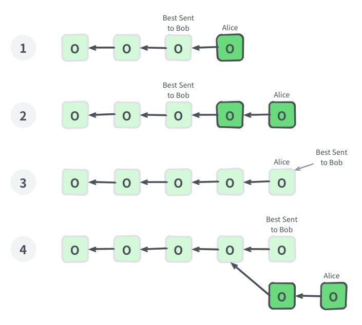

# Chain Synchronization Protocol

Terminology Note

- Chain: a chain starting with genesis block and consisted of successive blocks.
- Best Chain: a chain starting with genesis block and consisted of blocks for which consensus reached by nodes. The chain has the most PoW. 
- Best Header Chain: a chain with the most PoW and consisted only of blocks in the status of Connected, Downloaded or Accepted. Please refer to block status part for more details.
- Tip: the latest block of a chain and Tip can be used to validate a specific chain. 
- Best Chain Tip: the latest block of Best Chain.

## Abstract

Block synchronization **must** be phased with [Bitcoin Headers First](https://bitcoin.org/en/glossary/headers-first-sync) style: Block can be validated by partial blocks information obtained at every different stage, or existing blocks information or both.

1. Connect Header: Get block header, and validate format and PoW.
2. Download Block: Get and validate the complete block. Transactions in ancestor blocks is not required.
3. Accept Blcok: Validate the block in the context of the chain. 

The purpose of stage execution is trying to preclude most of attacks with the least cost. For example, in the first step, header connecting only accounts for 5% workload while there would be 95% possibility to say the block is valid. 

According to execution stages, there are 5 status of blocks:

1. Unknown: the status of a block is unknown before header connecting.
2. Invalid: A block and all of its descendant blocks are marked as'Invalid' if any above steps failed.
3. Connected: A block, given all its ancestor blocks are in status of connected, downloaded or accepted, is marked as connected if its header is connected successfully.
4. Downloaded: A block, given all its ancestor blocks are in status of downloaded or accepted, is marked as downloaded if the block is downloaded successfully.
5. Accept: A block, given all its ancestor blocks are in status of accepted, is marked as accepted if the block is accepted successfully.

Update of block status can only be passed from the previous block to the later ones. According to status numbers above, the status number of a block is always less than which of its father block. Here are conditions, if a block is invalid, all of its descendant blocks must be invalid. The cost of every step for synchronization is higher than the previous one and every step may fail. In this scenario, work will be wasted if child block status are faster than its father block and father block fails to be validated. 

Genesis block is accepted and the rest is unknown in the original status.

Below pictures are used to indicate blocks in different status later on. 

Genesis block of the nodes synchronizing **must be** the same, and all blocks can be constructed as a tree with the genesis block being the root. Blocks will be removed if they cannot connect to the root eventually. 

Every participating node forms its local status tree where the chain consisting of accepted blocks with the most PoW is considered as Best Chain. The chain that consists of blocks in status of connected, downloaded or accepted with the most PoW is Best Header Chain. 

The graph below is an example of Status Tree formed by Alice and blocks signed with name Alice is this node's current Best Chain Tip. 

 
## Connect Header

Synchronizing headers firstly helps to valid PoW with the least cost. Since it costs the same work to construct PoW whether pushed transactions is valid or not, attackers may use other more efficient ways. It means it's highly possible to regard the whole block is valid when the PoW is valid. This is why headers synchronization firstly would be able to help to avoid resource-wasting to download and valid invalid blocks.

Because of the low cost, Headers synchronization can be processed in parallel with all nodes and construct a highly reliable global graph. In this way, block downloading can be managed and we can avoid wasting resource on low PoW chain. 

The goal of connecting header is when Alice connects to Bob, and Alice asks Bob to send all block headers in Bob's Best Chain but not in Alice's **Best Header Chain** and then validate them to decide the blocks status are either connected or invalid. 

When Alice connects header, keeping Best Header Chain Tip updated could help to decrease numbers of receiving headers already existed.

The graph above instructs the process of connecting headers. Nodes are supposed to keep the following synchronization by new block notification. 

Take Alice and Bob above as an example, firstly Alice samples from her Best Header Chain and sent the hashed block as texts to Bob. The basic principle of sampling is that later blocks are more possible to be selected than early blocks. For example, choose 10 blocks from the latest links, and sample other blocks in an index of 2, 4, 8 .. from the 11th latest block. This sampling hashed table is called Locator. Blocks in lightened color are unsampling and genesis block should be always in Locator. 

Bob can get the latest common block between these two chains according to Locator and his own Best Chain. Because the genesis block is identical, there must be this kind of block. Bob will send all block headers from the common block to Best Chain Tip to Alice. 

In the picture above, blocks with unlightened color are block headers that to be sent from Bob to Alice, and golden bordered one is the latest common block. There are three possible cases in the process:

1. If Bob's Best Chain Tip is in Alice's Best Header Chain, the latest common block will be Bob's Best Chain Tip and there is no block header for Bob to send.
2. If Alice's Best Header Chain Tip is in Bob's Best Chain but not Tip, the lastest common block will be Alice's Best Header Chain Tip.
3. If a fork occurs between Alice’s Best Header Chain and Bob’s Best Chain, the latest common block will be the one before the fork occurs.

If there are too many blocks to send, paging processing is needed. Bob send the first page, Alice will ask Bob for the next page if she finds more block headers according to the return results. A simple paging solution is to limit the maximum number of block headers returned each time, 2000 for example. If the number of block headers returned is equal to 2000, it means there may be other blocks could be returned, and then request for the next block header. If the last block of a certain page is Best Chain Tip itself or the ancestor of Best Header Chain Tip, you can optimize it to generate Locator sending the request with the corresponding Tip, reducing the number of the existing block headers received.

Alice could observe Bob's present Best Chain Tip, which is the last block received during each round of synchronization. If Alice’s Best Header Chain Tip is exactly Bob’s Best Chain Tip, Alice couldn't observe Bob’s present Best Chain because Bob has no block header to send. Therefore, it should start building from the father block of Best Header Chain Tip when the first request sent for block header synchronization in each round, including no Tip.

In the following cases, a new round of connection block header synchronization must be done. 

- Received a new block notification from the others, but the father block status of the new block is Unknown.

The following exceptions may occur when connecting a block header: 

- Alice observed that Bob’s Best Chain Tip has not been updated for a long time, or the timestamp is old. In this case, Bob cannot provide with valuable data. When the number of connections reaches a limit, this node could be preferentially disconnected.
- Alice observed that the status of Bob’s Best Chain Tip is Invalid. Any page that finds Invalid status can stop accepting the remaining pages without waiting for the end of a round of Connect Head. There, Bob is on an invalid branch, Alice can stop synchronizing with Bob and add Bob to the blacklist.
- There are two possibilities if the block headers Alice received are all on her own Best Header Chain. One is that Bob sends them deliberately. The other is that Best Chain changes when Alice wants to Connect Head. In this case, those block headers can only be ignored because they are difficult to distinguish. However, the proportion of sent blocks have already been on the local Best Header Chain would be counted. If the proportion is above a certain threshold value, Bob may be added to the blacklist.

Upon receiving the block header message, you can do the following format verification first.

- The blocks in the message are continuous.
- The status of all blocks and the parent block of the first block are not Invalid in the local Status Tree. 
- The status of the father block of the first block are not Unknown in the local Status Tree, which means Orphan Block will not be processed when synchronizing.

Here, verification includes checking if block header satisfies the consensus rules and if Pow is valid or not. Since Orphan Blocks are not processed, difficulty adjustment can be verified as well. 

The picture above is the Status Tree of some nodes (Alice, Bob, Charlie, Davis, Elsa and so on) completing synchronization and other nodes' Best Chain Tip observed.

If the Unknown status block is considered not on the Status Tree, some nodes in the status of Connected or Invalid will be added at the end of the Status Tree during Connect Header. As a result, Connect Header can be viewed as an extended Status Tree and an exploratory stage.

## Download Block

After Connect Header is completed, the branch of the observed neighbor nodes of the some Best Chain Tips on the status tree is ended with one or more Connected block, that is Connected Chain. At this moment, the download block process can be entered, you can request completed blocks from neighbor nodes and perform chain-independent verification.

With the status tree, synchronization can be planned and useless work can be avoided. An effective optimization is to download the block only if the Best Chain of the observed neighbor node is more than the local Best Chain's. And priority can be ordered according to the accumulated workload of the Connected Chain: branches with more work accumulation can be download preferentially and when verification is Invalid or branches cannot be continued due to timeout, those branches would be downloaded only.

When downloading a branch, earlier blocks should be downloaded firstly due to the dependency of blocks; and the download should be done concurrently from different nodes to make full use of bandwidth. A sliding window can be applied to solve the problem.

Let’s assume that the number of the first Connected status block to be downloaded is M and the length of the sliding window is N, then only the blocks numbered M to M+N-1 are need to be downloaded. After the block M is downloaded and verified, the sliding window moves to the next Connected block. If verification of block M fails, then the remaining blocks of this branch are all Invalid, and there is no need to continue downloading. If the window does not move towards the right for a long time, you can judge this as timeout and try again after trying other branches, or try again after some new Connected block are added to this branch.

The picture above is an example of an 8 length sliding window. At the beginning, the downloadable block range from 3 to 10. After block 3 is downloaded,  the window will move to block 5 because block 4 has already been downloaded in advance(as the picture above illustrated).

We already know the Best Chain of our neighbor nodes from Connect Header, so we consider we can download blocks from a neighbor node if our present block is included in neighbor’s Best Chain and that neighbor is a full node. During the downloading, blocks in the sliding window can be split into several small download tasks and those tasks could be scheduled between several downloadable neighbor nodes.

Transactions in Download Block may be mismatched with Merkle Hash Root, or transactions are matched but there are duplicated txid. It doesn't mean that the block is invalid, but it's only considered Download Block content is incorrect. The block content provider could be added to the blacklist, but the block status cannot be marked as invalid. Otherwise, the malicious nodes may pollute nodes' Status Tree by sending the wrong block contents.

Verification of transaction lists and block header matching is required in this stage, but any validation that relies on the transaction contents in the ancestor block is not required, which will be placed in the next stage.

Several validations can be checked in this phase, for example, Merkle Hash validation, transaction txid cannot be repeated, transaction list cannot be empty, inputs and outputs cannot be blank at the same time, or only the first transaction can be generation transaction, etc.

Download Block will change the status of the Connected block in Connected Chain，which has the highest work in Status Tree, from Connected to Downloaded or Invalid.

## Accept Block

In the previous stage, there will be some chains which ended with one or more Downloaded status, hereinafter referred to as Downloaded Chain. If those chains' cumulative work is more than Best Chain Tip's, the whole validation for Chain's legitimacy can be performed in this stage. If there are more than one chains satisfied, the chain with the most work should be choosen.

Completion of all remaining validation is required in this stage, including all rules that depend on historical transaction content.

Because it involves UTXO(unspent transaction outputs) indexes, the cost of validation is very huge in this phase. To simplify the system, you can keep only one set of UTXO indexes and try to rollback local Best Chain Tip necessarily. After that, validate blocks in Downloaded Chain and add them to Best Chain. If there is an invalid block during validation, the remain blocks in Downloaded Chain are also considered as invalid. At this time, Best Chain Tip would even be lower than the previous Tip. We can handle it in several ways:

- If the work of Best Chain before rollback is more than present Tip, then resume to previous Best Chain.
- If the work of other Downloaded Chains are more than Best Chain that before rollbacking, we can continue to redo the process of Accept Block with the next Downloaded Chain.

The process of Accept Block will change the status of Download block in Downloaded Chain to Accepted or Invalid, and the Downloaded Chain which has the most work ought to become the new local Best Chain.

## New block announcement

When the local Best Chain Tip changes, this local node should push an announcement to neighbor nodes. For avoiding to send a duplicate announcement and for sending blocks that neighbor doesn’t have in one time if possible, you can record the block header with the highest cumulative work sent to others(Best Sent Header). Sending not only refers to the new block announcement but also includes the block header that is returned to the others when the block header is connected.

The other nodes can be considered that they have already known Best Sent Header and its ancestors, so these blocks can be excluded when sending new block announcements.

From the above example, Alice's block is the Best Chain Tip for node Alice. Marked as Best Sent To Bob is the block header with the most work that was sent to Bob, and the block unfaded is a new block that Alice needs to announce Bob. Each step of the number is explained below:

1. At the beginning, Alice only has Best Chain Tip to send
2. Alice hasn't had time to send it yet, and another new block is added. In this case, the last two blocks of Best Chain need to be sent.
3. Alice sends the last two blocks to Bob and updates Best Sent.
4. Alice's Best Chain has a branch switch and only needs to send the block after the last common block with Best Sent to Bob.

Connection-based negotiation parameters and the number of new blocks to be announced:

- If there is only one block and nodes prefer Compact Block, then use Compact Block.
- In other cases, just send block header list but need to limit the number of sending blocks, no more than a certain threshold value. For example, if the limit is 8 and there are 8 or more blocks need to be announced, only the latest 7 blocks will be announced.

When receiving a new block announcement, there may be a situation the parent block’s status become Unknown, also called Orphan Block. In this situation, a new round of syncing Connect Header is needed immediately. If receiving a Compact Block and its parent block are the local Best Chain Tip, then try to recover block with transaction pool. If the recovery successes, the work of these three stages can be consolidated, or just considered as a block header received.

## Synchronisation Status 

### Configuration
- `GENESIS_HASH`: hash of genesis block
- `MAX_HEADERS_RESULTS`: the max number of block headers can be sent in a single message
- `MAX_BLOCKS_TO_ANNOUNCE`: the max number of new blocks to be announced
- `BLOCK_DOWNLOAD_WINDOW`: the size of the download window

### Storage
- Block Status Tree
- Best Chain Tip, decide whether to download blocks and accept blocks
- Best Header Chain Tip, Connect Header is used to construct the locator of the first request in each round.

Each connection node needs to be stored separately.
- Observe others' Best Chain Tip
- The block header hash with the most work sent last time —— Best Sent Header

### Message Definition

See the details about message definition in the reference implementation. Only the messages involved and the necessary fields and descriptions are listed here.

The sending of messages is completely asynchronous. For example, sending `getheaders` does not need to wait for the others to reply to `headers` and then send other requests. Also, there is no need to guarantee the order relationship between the request and the reply. For example, node A sends `getheaders`and `getdata`to B, and B can send `block` firstly, then send `headers` to A.

Compact Block [^1] required messages: `cmpctblock` and `getblocktxn` will be described in related Compact Block documentation.

### getheaders

It is used to request a block header from a neighbor node when it is used to connect a block header. The first page of the request and subsequent pages received to use the same getheaders message. The difference between them is that the first page generates a locator for the parent block of the local Best Header Chain Tip, and the subsequent page generates the locator using the last block of the previous page.

- `locator`: 对 Chain 上块采用，得到的哈希列表

### headers

It is used to reply `getheaders` and announce new blocks. There is no difference in processing logic, but if an Orphan Block is founded when the number of block headers is less than `MAX_BLOCKS_TO_ANNOUNCE`, then we need to resyncing Connect Header because maybe it represents a new block announced. If the number of block `headers`received equals is equal to `MAX_HEADERS_RESULTS`, it indicates that there are more blocks need to request.

- `headers`：block headers list

### getdata

It is used in downloading block phase

- `inventory`:  object lists for download, each member includes several fields
- `type`: types of object, ‘block’ for here
- `hash`: use the hash of object as identity

### block

It is used to reply block downloading request of `getdata` 

- `header` block header
- `transactions` transaction list

[^1]: Compact Block is a technique for compressing and transferring complete blocks. It is based on the fact that when a new block is propagated, the transactions should already be in the trading pool of other nodes. Under this circumstances, only if the transaction txid list involves and complete information about the transactions that others may not have is predicted, then the receiver can recover the complete transaction based on the transaction pool. Please refer to Compact Block RFC (TODO: link to rfc) and Bitcoin-related BIP for details.
