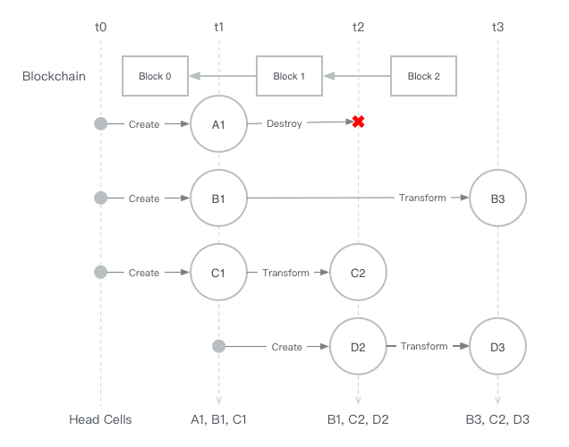

# Cell

```
Author: ian <ian@nervos.org>
Category: CKB
Start Date: 2018-02-26
```

## Cell 基础属性

| 属性        | 类型            | 说明                  |
| --------- | ------------- | ------------------- |
| module    | u32           | Cell 所属模块           |
| capacity  | u32           | 存储空间上限              |
| data      | binary        | 存储数据                |
| lock      | binary        | 验证 Cell 所有者的密码学挑战   |
| recipient | (u32, binary) | 接收者模块 + 验证接收者的密码学挑战 |

#### Module

相同 Module 中的 Cell 可以自由通信，跨 Module 必须通过 `recipient` 指定接收者模块。Module 使用 32 位无符号整数作为标识符。

#### Capacity

Capacity 需要保证不小于整个 Cell 的存储占用空间，包含所有基础属性，以及之后可能添加的扩展属性。

#### Data

Cell 存储的数据，通过 Module 定义的 Schema 可以解释数据的含义。

#### Lock

验证 Cell 所有者的密码学挑战。绝大部分 Cell 的操作都需要提供相应证明是 Cell 所有者授权的。

#### Recipient

Recipient 是复合类型，由 `recipient_module` 和 `recipient_lock` 两部分组成。Recipient 用于跨模块通信，详见[交易规则](#tx-rules)中相关说明和[模块相关 RFC](TODO) 的说明。

## Cell 链

Cell 创建之后是不可变的，但是可以转换成新的 Cell，直到最终被销毁。通过创建 (create)，转换 (transform)，销毁 (destroy) 可以组成一个 Cell 链。每个 Cell 都唯一属于一个 Cell 链。


Cell 被创建时，其所在的 Cell 链也被同时创建，并把新创建的 Cell 作为链头 (Chain Head)。

Cell 转换时，新的 Cell 被添加到 Cell 链中并作为新的链头。

Cell 被销毁，其所在的 Cell 链也被销毁。

在某个时间点，所有未销毁 Cell 链的链头称为 Head Cell。所有 Head Cell 集合就是该时间点的 CKB 快照。


上图中，t0, t1, t2, t3 为 4 个时间点，相邻时间点之间会发生 Create, Transform 和 Destroy 操作，从上到下依次是 A, B, C, D 四个 Cell 链。

- 在 t1 时刻，有 3 个新创建的 Cells，该时刻的 Head Cells 有 A1, B1, C1
- 在 t2 时刻，A1 被销毁，B1 不变，C1 转换成 C2，同时新创建了 D2，所以此时 Head Cells 有 B1, C2, D2
- 在 t3 时刻，B1 转化成 B3, C2 不变，D2 转换成 D3，所以 Head Cells 有 B3, C2, D3

如果把 ti 时间点时的 Head Cells 集合计为 `H[i]`。在 ti 到 tj 时间点所有发生的 Transform 和 Destroy 操作的输入 Cell 集合计为 `I[i, j]`，所有 Transform 操作的输出 Cell 集合计为 `O[i, j]`，容易得到:

```
H[j] = H[i] + O[i, j] - I[i, j]
```

其中，`+` 表示集合并，`-` 表示集合减。

Cell 链中的第一个 Cell 称为 Root Cell，计其高度为 0，Transform 的输出 Cell 的 Cell 高度为输入 Cell 高度加 1。

## 交易结构

一个交易包含多个组，每个组可以包含多个操作。操作可以时创建 (create), 转换 (transform) 或者销毁 (destroy)。交易保证原子性，交易中的所有操作要么都被接受，要么都被拒绝。


多个交易组成一个区块 (Block)。所以 Block 包含的是两个时间点间所有发生的 Cell 操作的集合。划分为交易是保证原子性，划分为组是方便以 Module 为单位进行交易验证。

把 Block 结合到 Head Cell 图中可以得到



## 交易规则 {#tx-rules}

交易必须满足一系列规则才可被接受加入到区块中。一个包含的交易全部都是有效的区块才是有效的区块，才能被参与节点接受添加到链上。

### 扩容交易

每个区块的第一个交易是扩容交易 (Enlarge Transaction)，该交易只包含一个 Group，一个 Create 操作。

### Capacity 规则

首先所有交易中的 Create 和 Transform 输出的 Cell 必须满足：

> Cell 所占用存储空间的字节数不得大于 Cell 的 capacity 字段。

区块中除了扩容交易，其它交易必须满足条件:

> 交易中所有 Transform 和 Destroy 操作的输入 Cell 的 Capacity 总和不得小于 Transform 和 Create 操作的输出 Cell 的 Capacity 总和。

如果把区块 i 添加之前的时刻计为 ti，添加之后的时刻计为 tj，且 `j = i + 1`，那么上面的规则可以写成:

> 集合 `I[i, j]` 中所有 Cell Capacity 之和不得小于 `O[i, j]` 中所有 Cell Capacity 之和

或者

```
sum(c.capacity for c in I[i, j]) >= sum(c.capacity for c in O[i, j])
```

对于扩容交易必须满足条件:

> 扩容交易中唯一 Create 输出的 Cell 的 Capacity 不得大于系统在当前区块高度允许的可扩容容量 E 加上该区块中所有非扩容交易可收集空间的总和 F。

为了能让系统引导起来，E 先采用简单的策略:

- 创世块中 E = 100M
- 其它块中 E = 0

一个交易可收集手续费 F 等于集合 `I[i, j]` 和 `D[i, j]` 中所有 Cell Capacity 之和减去 `O[i, j]` 和 `C[i, j]` 中所有 Cell Capacity 之和，即

```
sum(c.capacity for c in I[i, j]) - sum(c.capacity for c in O[i, j])
```

### Cell 链不可分叉

系统历史所有已产生的的 Cell，不会存在两个不同的 Cell，有相同的 Cell 高度，同时所在 Cell 链有相同的 Root Cell。

或者说系统所有已经接受的 Cell 操作中，不会有两个操作有相同的 Cell 输入。

或者说 Blockchain 中所有区块的输入 Cell 不能有重复。

### Cell 链连续性

令 `j = i + 1`，在一个区块 i 中，所有交易的输入集合 `I[i, j]`，必须是 `H[i] + O[i, j]` 的子集。

也就是交易的输入必须是从上一个区块后的 Head Cell 集合，和所在区块的输出 Cell 集合里选取。允许输入是同一个区块中的输出，可以在一个区块中包含一个 Cell 链的多个串行操作。


### 模块不变性

Transform 操作中，输入 Cell 和输出 Cell 必须有相同的模块。

想在不同模块间转移空间，只需要构造一个交易包含在一个模块 M 里的 Destroy 操作，和另一个模块 N 里的 Create 操作，这样空间就从 M 转移到 N 了。

### 组单一模块限制

Cell 根据 data 和 recipient 是否为空，可以划分为三种状态: 空 (Empty), 稳定 (Stable)，挥发 (Volatile)

| data | recipent | 状态       |
| ---- | -------- | -------- |
| 空    | 空        | Empty    |
| 非空   | 空        | Stable   |
| 空    | 非空       | Volatile |
| 非空   | 非空       | Volatile |

定义一种特殊操作 Consume: Consume 本身是 Transform 操作，它的输入 Cell 状态是 Volatile，输出 Cell 状态是 Empty。

组必须满足以下规则：

- 一个组中必须有一个非 Consume 操作
- 所有非 Consume 操作的输入输出 Cell 都必须有相同的模块，又可称为组所在模块。
- 组如果包含 Consume 操作，Consume 操作的输入 Cell 的 Recipient Module 必须和组所在模块相同。

Volatile Cell 充当了模块之间通信的角色，可以看作是装着消息的信封。

### Consume 操作规则

Consume 操作的输出 Cell 的 lock, capacity 必须和输入 Cell 相同。因为 Consume 操作是由 recipient lock 授权的，recipient lock 并没有 Cell 的所有权，所以不可以更改 lock 和 capacity。

### 组模块检查

Module 本身也是一个 Module，它是系统在创世块引导时就创建的系统 Module。通过该 Module 中的 Cell 能够找到每个 Module 对应的 Validator 函数定义。

Validator 函数接收参数是 Cell 操作列表，可以访问所有操作的输入，输出，以及输入的一些原信息，比如：

- 输入 Cell 所在区块的高度，时间等。

Validator 的返回结果是布尔值。

交易中的所有组都必须使用组所在模块对应的 Validator 进行检查，输入就是组所包含的 Cell 操作，Validator 返回 true 说明组通过了模块检查。

因为 Consume 操作只允许清空 data，并且是通过其所在模块检查才创建出来的，所以可以参与到其它模块组中。

先规定所有模块的 Validator 永远返回 true，会有专门 Module RFC 进行详细讨论。

创世块所有交易都跳过组模块检查，以完成系统引导。

### Lock 证明

交易中所有的 Transform 和 Destroy 都必须提供密码学证明，所有人都可以通过证明验证操作是被授权了的。

会有两种情况：

- 如果是非 Consume 操作，需要提供 Cell lock 对应的证明。
- 如果是 Consume 操作，需要提供 Cell 的 recipient lock  对应的证明。

Lock 先采用简单的 Bitcoin P2PKH，后续会通过 RFC 提出更灵活和容易扩展的方案。

Lock 由 `secp256k1` 公钥 hash160 后得到。提供的证明包括两部分：

- `secp256k1` 公钥
- 使用对应私钥对整个交易签名的结果

证明的验证同样包括两步：

- 对公钥 hash160 后必须等于 lock
- 使用公钥对交易签名验证

特殊的，如果 Lock 为空，提供空的证明即可通过验证。