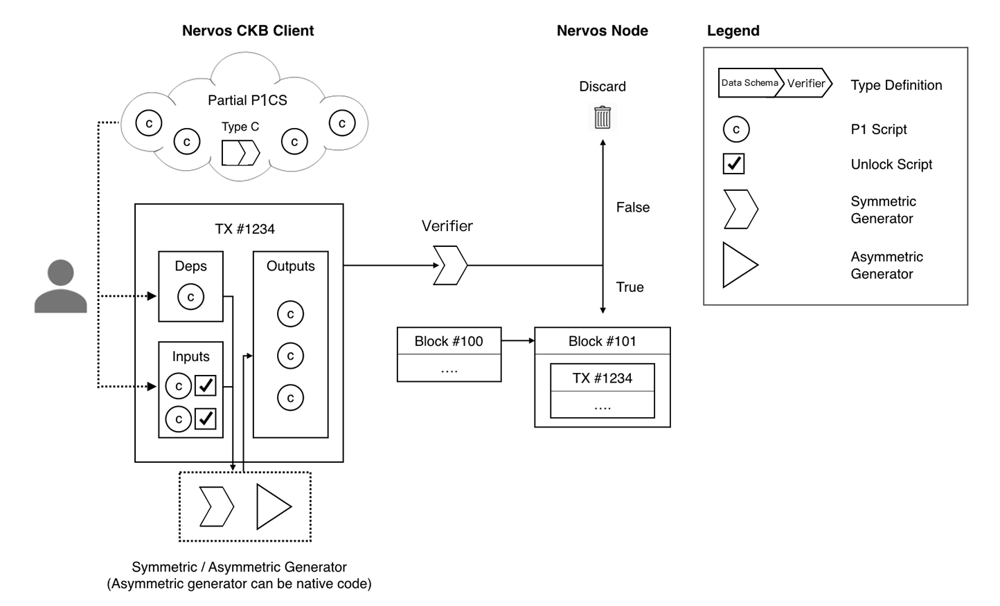

# Nervos CKB: A common knowledge base for blockchains and applications

- Jan Xie
- nervos.org
- January 2, 2018
- Draft v0.5

## Abstract

This document provides an overview of the Nervos Common Knowledge Base (CKB), the core component of the Nervos Network, a decentralized application platform with a layered architecture. The CKB is the layer 1 of Nervos, and serves as a general purpose common knowledge base that provides data, asset, and identity services.

## Contents

1. Motivation
    1. Background
    2. Problem
    3. Vision
2. Nervos Common Knowledge Base
    1. State Generation and Validation  
    2. Cell
        1. Life Cycle
        2. Type
        3. Identity
    3. Transaction
    4. Generator
3. Architecture
    1. Layered Network
        1. Common Knowledge Layer
        2. Generation Layer
    2. Nervos Nodes
        1. Light client
    3. Hybrid consensus
4. CKB Token
    1. Economics
    2. Governance
    3. Liquid Voting
5. Summary
6. References
7. Appendix
    1. Common Knowledge Base
    2. General Purpose Common Knowledge Base

## 1. Motivation

### 1.1  Background

In distributed environments with network delay and node faults, consensus algorithms aim to achieve two goals: correctness and performance. Correctness includes consistency (identical copies of data on each node) and availability (the system responds to user’s requests within reasonable time). Performance includes transaction latency (the time between the submission of request and the confirmation of execution results) and transaction throughput (number of transactions the system is capable of processing per second).

Permissionless blockchains run in open networks where nodes can join and exit freely, and there is no certainty when they are online. Those are difficult problems for traditional BFT consensus algorithms to solve. Satoshi Nakamoto introduced economic incentives and probabilistic consensus to solve these problems. The Nakamoto Consensus requires two more properties, openness and fairness, to guarantee its correctness. Openness allows nodes to join and exit the network freely - the blockchain must work properly, no matter there are 100,000 nodes or only 1 node in the network; fairness ensures nodes to get fair returns for their efforts to keep the network functioning and secure. Permissionless blockchains’ consensus protocols also need to consider operational cost as part of the performance metrics.

The Nakamoto Consensus, popularized by Bitcoin’s Proof of Work, has excellent openness and availability. Nodes in the Bitcoin network may join and exit freely with minimal cost, and the network performance remains constant with more participating nodes. However, its throughput is quite low - Bitcoin network’s 7 transactions / second throughput cannot meet the demands of real world business use cases. Even with layer 2 scalability solutions (e.g. Lightning Network), where most transactions can happen off-chain, a channel’s opening and closing are still constrained by the performance of the root chain. The safety of 2nd layer solutions can be compromised when the root chain is too crowded. Nakamoto Consensus uses blocks as votes, which takes longer (up to 10 minutes to an hour) to confirm transactions, and leads to inferior user experience. When there is a network partition, the Bitcoin network may continue to function, but it cannot guarantee whether the transactions will be confirmed, therefore it is not suitable for business scenarios requiring high degree of certainty.

After 30 years of research, traditional Byzantine Fault Tolerance consensus algorithms can achieve throughput and transaction confirmation speed on par with centralized systems. However, it is difficult for nodes to join or exit freely, and the network’s performance decreases rapidly with increasing number of consensus participating nodes. Traditional BFT consensus algorithms have lower tolerance on network faults. When the network partitions, nodes cannot achieve consensus and the network loses liveliness, making it difficult to meet the availability requirements of permissionless blockchains.

Bitcoin is the first public blockchain network in the world, designed as a peer to peer cash ledger. The Bitcoin ledger’s state is maintained by the Bitcoin network. UTXO (Unspent Transaction Output) is the basic storage unit of the ledger. Users can use wallets to spend current UTXOs, generate new UTXOs, and package them into transactions to send to the Bitcoin network for validation and consensus. UTXOs have both cash amount and ownership information expressed with lock scripts. Users have to provide proper unlocking data to spend UTXOs. Due to limitations of the UTXO data structure and lock script, it is difficult to record other types of assets and data in the Bitcoin ledger. While solutions like Colored Coins, Meta Coins or hard forks are possible, they are unsafe, inflexible, and expensive.

Ethereum brought us a general purpose distributed computation platform with the introduction of smart contracts. The Ethereum network maintains a world state of accounts. Smart contracts are accounts with code stored inside, together with a 256 bits K/V store. Users can send two types of transactions on Ethereum: the first type creates a contract and deploys it on the blockchain; the second type sends input data to a specific deployed contract. This executes code stored in the contract and updates the contract state. Ethereum’s smart contract design provides a more general computation model, allows more flexibility, and solves some of Bitcoin’s problems. But Ethereum still has limitations:

- Scalability problems: Ethereum’s design focuses on the state machine’s events (Figure 1). With a Turing-complete language and transactions containing state transition inputs (instead of new states themselves), it is difficult for full nodes to determine dependencies between transactions. This makes it difficult for nodes to process transactions in parallel. Because states are not stored on-chain, potential sharding solutions also need to mitigate data availability issues.

- Indeterministic state transition: in Ethereum, contract state is updated by the contract code, which depends on the execution context (such as the internal state of the callee contract). Users cannot determine the exact execution result when they send the transactions.

- Mono-Contract: Ethereum smart contracts tightly couple computation and storage. Users have to use the paradigm of accounts, EVM bytecode and the 256 bit K/V database to implement all business scenarios. This is not efficient nor flexible.

The economic models of current blockchains also face challenges. With more users and applications moving to blockchain platforms, the data stored on blockchains also increases. Current blockchain solutions care more about the cost of consensus and computation, making it possible for a user to pay once, and have their data occupy full nodes’ storage forever. Cryptocurrency prices also are highly volatile. Users may find it difficult to pay for high transaction fees as the price of the cryptocurrency increases.

### 1.2  Problem

As more applications emerge, blockchain technologies have shown their limitations in universality, scalability, incentive design, and trust model. They do not meet the increasingly difficult demands of today’s real-world applications.

Current blockchain technologies also pursue extreme decentralization, requiring full nodes in the network to be completely equal peers. The need for complete data replication among full nodes reduces the speed of transactions and increases the costs associated with computation and storage on these networks. This imposes constraints on the design of blockchain systems, making it harder for them to meet the demands of real world applications. The hardware cost of running full nodes becomes ever more expensive with the inflation of on-chain states. There are less and less users who are willing to run full nodes. At the same time, users are increasingly relying on mobile devices and mobile apps to access the Internet, instead of desktop based web apps. This exacerbates the design problem of full nodes as equal peers. Having multiple types of blockchain nodes is going to be the norm of the future.

### 1.3  Vision

Based on all of the above, we conceived and designed Nervos CKB with a novel, completely decoupled paradigm for DApps. Nervos CKB supports more general-purpose computation and storage, comes with better scalability and more balanced economic incentives, and is more friendly to mobile devices. The Nervos Networks’ goal is to become the world’s common knowledge base, and the foundation of all types of decentralized applications.

| | Bitcoin | Ethereum | Nervos CKB |
|-|---------|----------|------------|
|Knowledge Type|Ledger|Smart Contract|General|
|Storage|UTXO|Account K-V Store|Cell|
|Data Schema|N/A|N/A|Type|
|Validation Rule|Limited(Script)|Any(Contract)|Any(Validator)|
|State Write|Direct(User)|Indirect(EVM)|Direct(User)|
|State Read*|No|Yes|Yes|
<div align="center">Table 1. Comparison of Bitcoin, Ethereum and Nervos CKB (* State Read refers to on-chain readability only, which means whether the state can be read during on chain validation. Chain state is always readable to off chain reader.)</div>

## 2. Nervos Common Knowledge Base

CKB proposes a new decentralized application paradigm. The paradigm consists of the following five components:

- Cell
- Type
- Validator
- Generator
- Identity

With these five components, CKB deconstructs the responsibilities of decentralized applications into computation, storage and identity. Computation is further divided into state generation (Generator) and state validation (Validator); storage (Cell) is made more generic to support any structured (Type) data. DApps in the CKB use Types to define the appropriate data structure and store application data in Cells. The application logic is implemented with Generators, and the state validation logic is implemented with Validators. Generators run on the client side to generate new states, which get packaged into transactions and broadcast to the entire network. Consensus nodes in CKB network first authenticate the submitter of the transaction, then validate new states in the transaction with Validators, and put valid transactions in the transaction pool. Once a new block is generated and received, new states in the block are committed into the CKB.

The CKB’s design of data flow and economic incentives is based on states - transactions store new states, instead of the events that trigger the state machine. Therefore, the CKB blockchain stores states directly, and states are synchronized together with blocks, with no need for extra state synchronization protocols. This reduces complexity of the system and increases system availability. A DApp’s states are stored in Cells. Generators and Validators are pure functions without internal states, relying entirely on inputs to produce outputs, and can be easily combined to form complex logic. 


<div align="center">Figure 1. Event-focused vs. State-focused Design</div>

### 2.1 State Generation and Validation

The Nervos Network can use the same algorithm for state generation and validation. In this model, the client side uses a generation algorithm to create a new state, and consensus nodes run this same algorithm using the transaction’s inputs and compare the output states with the new states in the transaction. If the states match, then the validation passes. 

When the same algorithm is used, state generation and validation have the same computational complexity, but run in different environments. There are several advantages in  to this separate state generation and validation:

- Deterministic state transition: Certainty of transaction execution is one of the core pursuits of distributed applications. Certainty in transaction latency (see Hybrid Consensus) has seen a lot of attention, but certainty in transaction execution result has not seen much discussion. If new states are generated on full nodes, a transaction’s creator cannot be certain about its execution context, then it could generate unexpected outputs. In CKB, users generate new states on the client side. They can confirm the new states before propagating it to the network. The transaction outcome is certain: either the transaction passes validations and the new state gets accepted, or the validation process fails without state changes (Figure 2).

- Parallelism: If new states are generated on consensus nodes, the nodes will not know the state read or written by the transaction beforehand, therefore they cannot determine the dependencies between transactions. In CKB, because transactions include old states and new states explicitly, nodes can see dependency relationships between transactions (see Transaction). Independent transactions can be processed in parallel in many ways, such as on different CPU cores or sent to different shards. Parallelism is the key solution to blockchain scalability problems.

- Distributed computation: The system’s efficiency improves when we utilize computation resources on the clients and lower the computation load on nodes.

- Flexibility:  Even when the algorithms are the same, generation and validation can be implemented differently. The client side has the flexibility to choose the programming language for better performance. It is also possible to integrate the generation logic into client side application runtimes to give the best user experience.

In many specific scenarios, validation algorithms are much more efficient than generation algorithms. The most typical examples are the UTXO transactions and zero knowledge proofs. Other interesting examples include sorting and searching algorithms: the computational complexity for quicksort, one of the best sorting algorithms for the average case, is O(NlogN), but the algorithm to validate the result is just O(N); searching for the index of an element in a sorted array is O(logN) with binary search, but its validation only takes O(1). The more complex business rules, the higher probability that there can be asymmetric generation and validation algorithms with different computational complexity.

The throughput of nodes can greatly improve with asymmetric generation and validation algorithms. Putting details of computation to the client side is also good for protection of the algorithms or privacy. With the advancement of cryptography, we may find methods to design generic asymmetric algorithms, such as general purpose non-interactive zero-knowledge proof technologies. CKB’s architecture is designed to provide proper support when that happens.


<div align="center">Figure 2. Non-deterministic vs. Deterministic State Generation</div>

### 2.2  Cell

This document provides an overview of the Cell data model in CKB, with the goal of better explaining the functionality of the CKB itself. In the actual implementation of the CKB, we need to consider other factors including incentives and execution efficiency, and the data structure will be more complicated. Details of CKB implementation will be found in the technical documents.

There are two sources of trust for data in the CKB: the first type is when the data is independently verifiable, therefore trust is built-in, and the second type is when the data is endorsed by identities in the system. Therefore, the smallest storage unit in CKB must include the following elements:

- the data to be stored
- validation logic of the data
- data owner

Cells are the smallest storage units of CKB, and users can put arbitrary data in it. A cell has the following fields:

- type: type of the cell (see Type)
- capacity: capacity of the cell. The byte limit of data that can be stored in the cell.
- data: the actual binary data stored in the cell. This could be empty. Total bytes used by cell, including data, should always be less than or equal to the cell’s capacity.
- owner_lock: lock script to represent the ownership of the cell. Owners of cells can transfer cells to others.
- data_lock: lock script to represent the user with right to write the cell. Cell users can update the data in the cell.

The cell is an immutable data unit, and it cannot be modified after creation. Cell ‘updates’ are essentially creating new cells with the same ownership. Users create cells with new data through transactions, and invalidate old cells at the same time (see Life Cycle. This means CKB is a versioned data store, with the set of new cells representing the current version, and invalidated cell set representing the history.

There are two rights with cells - ownership and usage. Cell’s owner_lock specifies its ownership, the right to transfer cell capacity; Cell’s data_lock specifies its usage right, the right to update the cell’s data. CKB allows users to transfer cell capacity all at once, or transfer only a capacity fraction, which will lead to cell creation (e.g. a cell with capacity=10 becomes two cells with capacity=5). The rate of increase of CKB’s total capacity is decided by Consensus Participating Rate and Liquid Voting.

Cell’s lock scripts are executed in CKB’s VM. When updating data or transferring ownerships, users need to provide the necessary proof as inputs to the lock scripts. If the execution of lock scripts with user provided proof returns true, the user is allowed to transfer the cell or update its data according to its validation rules.

The lock scripts are the authentication mechanism of cells. The scripts can represent a single user, as well as a threshold signature or more complicated schemes. Cells come with better privacy. Users can use different pseudonyms (by using different lock scripts) to lock different cells. Cell’s owners and rightful users can be the same or different users, which means users do not have to own cells to interact with the CKB. This lowers the barrier of entry of the system and encourages adoption.

#### 2.2.1  Life Cycle

There are two phases in the life cycle of Cells. Newly created cells are in the first phase P1. Cells are immutable data objects. Updates to cells are done through transactions. Transactions take the P1 Cells to be updated as inputs, and output new P1 Cells with new states produced by the Generator.

Every P1 Cell can only be used once - they cannot be used as inputs for two different transactions; after use, P1 cells enter the second phase P2. P2 Cells cannot be used as transaction input. We call the set of all P1 Cells as P1CS (P1 Cell Set). The P1CS has all the current states of the CKB. We call the set of all P2 cells as P2CS (P2 Cell Set). The P2CS has all the historical states of the CKB.

Full nodes on the CKB only needs P1CS to validate transactions. They can deploy certain strategies to clear P2CS. P2CS can be archived on Archive Nodes or distributed storage. CKB light clients only need to store block headers and specific cells, and do not need to store the entire P1CS or P2CS.

#### 2.2.2 Type

CKB provides a type system for cells and users can define their own types. With the type system, we can define different structures of common knowledge and their corresponding validation rules.

To define a new cell type we must specify two essential components:

- Data Schema: defines the data structure of cells
- Validator: defines the validating rules of cells

Data Schema and Validator themselves are common knowledge and stored in cells. Each cell has one and only one type, while different cells could be of the same type or different types.

The data schema defines the data structure of cells in this type, so that the validator can interpret and interact with the data. Validators are verifying programs that run on nodes, in CKB’s virtual machine. A validator uses the transaction’s dependencies, input and output as program input (Transaction), and returns a boolean value on whether the validation is successful. The creation, update and destruction of cells can use different validation rules.

#### 2.2.3 Identity

Identity is a System Type. Users can create any number of identity cells to represent themselves, which can be used for other cell’s data_lock/owner_lock scripts. If a cell uses an identity cell as its \*\_lock script, its update or transfer requires the unlock script of the identity cell’s data_lock (Figure 3).

Identity in the CKB is generalized identity that could represent any aspects of individuals or machines. Identity cell is the core component of the NIP (see Nervos Identity Protocol Paper for details). With the NIP, the Nervos network brings in the CA certificates system to be compatible with the current PKI system. Users can have identities in CKB, and decentralized applications can be built on top of those identities. Users can store their public profiles or digests of profiles in identity cells, and only provide details to decentralized applications when necessary.


<div align="center">Figure 3. Identity Cell</div>

Cell is a more generic storage model compared to the UTXO or the account model. Both the UTXO model and the account model can express relationships between assets and their owners. The UTXO model defines ownership on assets (with the lock script), while the account model defines ownership of assets on owners (with the balance). The UTXO model makes the ledger history more clear, but its lack of explicit accounts makes its already inexpressive scripts harder to use. There is also no way to store account metadata such as authorizations conveniently. The account model is easy to understand, and can support authorizations and identities well, but is not easy to process transactions in parallel. The Cell model, with types and identity, takes the best of both models to provide a more generic data model.

### 2.3  Transaction

Transactions express update and transfer of cells. In a single transaction, users can update data in one or more cells, or transfer cells to another user. A transaction includes the following:

- deps: dependent cell set, provides read-only data that validation needs. They must be references to P1 cells or user input.
- inputs: input cell set, includes cells to be transferred and/or updated. They must be references to P1 cells with corresponding unlock scripts.
- outputs: output cell set, includes all newly created P1 cells.

Because cells are immutable, cells cannot be modified directly. Instead new versions of cells are created and all cell versions can be linked together to form a “cell version chain”. A cell capacity transfer creates the cell’s first version, and the updates become its historical versions. The head of a cell version chain is its current version. The CKB is the superset of all cell version chains. The set of all cell heads is the current version of the CKB.

The design of the CKB cell model and transactions is friendly to light clients. Since all the states are in blocks, block synchronization also accomplishes state synchronization. Light clients only need to synchronize blocks, and do not need to perform state transition computations. If we only stored events in blocks, we would have needed full nodes to also support state synchronization. This extra protocol can be difficult for large deployments, because the incentive to do so is not defined within the blockchain protocol. CKB defines state synchronization in the protocol itself, and this makes light nodes and full nodes more equal peers, leading to a more robust and decentralized system.


<div align="center">Figure 4. Transaction Parallelism and Conflict Detection</div>

The deps and inputs in CKB transactions make it easier for nodes to determine transaction dependencies and perform parallel transaction processing (Figure 4). Different types of cells can be mixed and included in a single transaction to achieve atomic operation across types.

### 2.4  Generator

Generators are programs that create new cells for given types. Generators run locally on the client side. They utilize user input and existing P1 cells as program inputs, to create new cells with new states as outputs. The inputs that generators use and the outputs they produce together form a transaction (Figure 5).

By defining Data Schemas, Validators and Generators, we can implement any data type’s validation and storage in the CKB. For example, we can define a new type for AlpacaCoin:

```javascript
Data Schema = {amount: "uint"}

// pseudo code of checker check():
// 1. check all inputs have valid unlock scripts
// 2. Calculate the sum of all AlpacaCoin amounts in inputs as IN
// 3. Calculate the sum of all AlpacaCoin amounts in outputs as OUT
// 4. Return the equality of IN and OUT
Validator = validate(context ctx, inputs, outputs)

// pseudo code of generator gen():
// 1. Find all cells of the AlpacaCoin type that the user can spend
// 2. Based on the receiver address and amount given by user, generate new AlpacaCoin
//    type cells that belong to the receiver and the change cells belong to the sender.
// 3. Return a list of all used cells and new created cells, which would be used 
//    to create a transaction.
Generator = gen(context ctx, address to, uint amount, ...)
```


<div align="center">Figure 5. Transactions, Generations, and Validations</div>

## 3.  Architecture

### 3.1  Layered Network

In the Nervos network, CKB and generators form a layered architecture.

#### 3.1.1  Common Knowledge Layer

CKB is the foundation of the Nervos Network. The CKB is the common knowledge layer with the broadest consensus and providing a data store for decentralized applications. CKB only cares about new states provided by generators, and does not care about how they are generated.

#### 3.1.2  Generation Layer

Generators form the data generation layer implementing the application logic. Therefore generators can be implemented in many different ways (Figure 6).


<div align="center">Figure 6. Layered Structure</div>

The layered architecture separates data and computation, giving each layer more flexibility, scalability and the option to use different consensus methods. CKB is the bottom layer with the broadest consensus. it is the foundation of the Nervos network. Different applications prefer different consensus, forcing all applications to use CKB’s consensus is inefficient. In the Nervos network, participating applications can choose appropriate generators and consensus based on their real needs, and the only time they need to submit states to CKB, to get wider agreement, is when they need to interact with other services outside of their local consensus.

Possible generators include (but are not limited to) the following:

- Local generators on the client: Generators run directly on the client’s devices.

  The generation algorithms can be implemented in any programming languages, using the CKB light client API or the CKB SDK.

- State services: Users may use traditional web services to generate new states.

  All current web services may work with CKB in this way, to gain more trust and liquidity to the generated states. For example, game companies may define CKB types and rules for in-game props, having the game itself function as a state service to generate game data and store it in CKB.

  Information sources may use identity and state services together to implement Oracles, to provide useful information for other decentralized applications in the Nervos network.

- State channels: Two or more users may use peer to peer communication to generate new states.

  State channel participants must register themselves on the CKB, and obtain other participants’ information. One participant may provide security deposits on the CKB to convince other participants on the security of the state channel. The participants may use the consensus protocol or secure multi-party computation to generate new states.

- Generation chains: A generation chain is a blockchain used that generates new states on the CKB.

  Generation chains may be permissionless blockchains (such as an EVM compatible blockchain) or permissioned blockchains (such as CITA or Hyperledger Fabric). On permissioned blockchains, consensus is reached in smaller scopes, which gives better privacy and performance. On generation chains, participants perform computations together, validate results with each other, and commit blockchain states to the CKB to get wider agreement when necessary.

### 3.2  Nervos Nodes

Nervos CKB (CKB for short) is designed as a general purpose common knowledge base (Appendix: Common Knowledge Base). The CKB network consists of three types of nodes:

- Archive Nodes: full nodes in the CKB network. They validate new blocks and transactions, relay blocks and transactions, and keep all historical transactions on disk. Archive Nodes can increase the overall robustness of the system, and provide query services for historical data. 
- Consensus Nodes: consensus participating nodes in the CKB network. Consensus Nodes listen to new transactions, package them to blocks, and achieve consensus on new blocks. Consensus Nodes do not have to store the entire transaction history.
- Light Clients: users interact with the CKB network with Light Clients. They store only very limited data, and can run on desktop computers or mobile devices.

CKB nodes together form a peer to peer distributed network to relay and broadcast blocks and transactions. Consensus Nodes run a hybrid consensus protocol (hybrid consensus), to reach consensus on newly created blocks at a certain time interval. The new block will be acknowledged by all nodes and added to the end of CKB blockchain. The transactions in the new block will update CKB’s states.

#### 3.2.1 Light Client

Strictly uniform architecture (every node has the same role, does the same thing) is currently facing serious challenges. On permissionless blockchains, the hardware capabilities of nodes vary a lot. Strictly uniform architecture not only puts high demand on user’s hardware, but also fails to utilize the potential of high performant nodes. We see more and more users give up running full nodes and choose to run light clients or even clients rely on centralized services. Full nodes validate all blocks and transaction data, requiring minimum external trust. But they are costly and inconvenient to run. Clients relying on centralized services give up validation, and trust the central services completely to provide data. Light clients in Nervos trade minimum trust for the substantial cost reduction on validation, leading to much better user experience.

At the same time, mobile devices are becoming the main way people access the Internet. Native applications are also becoming more popular. Mobile friendliness is one of the design principles of the Nervos CKB. Nervos DApps should be able to run smoothly on mobile devices and integrate with mobile platforms seamlessly.

CKB supports light clients. CKB aims to use authenticatable data structure to organize block headers, in order to substantially accelerate light clients synchronization. Benefiting from CKB’s state focused design, light clients can obtain the latest states (P1CS) without having to repeat the computation. Light clients can also only subscribe to a small subset of P1 cells that they care about. With minimized local storage and bandwidth requirements, Nervos’ light clients can provide better DApp experiences.

### 3.3 Hybrid Consensus

While traditional BFT algorithms function well in normal situations with simple logic, they need complicated logic to deal with fault conditions. In contrast Nakamoto Consensus functions with the same logic under either normal or fault conditions, at the expense of normal path system performance. Each consensus mechanism has its fault, but if  Nakamoto Consensus and traditional BFT consensus algorithms could be combined in a secure way, the new hybrid consensus algorithm may give the best balance in consistency, availability, fairness, and operational cost [3][4].

The Nervos Network will be implementing a new hybrid consensus algorithm optimized for the CKB layer. By combining Nakamoto Consensus and the traditional BFT consensus, Nervos retains the system’s openness and availability, and takes advantage of the excellent performance of traditional BFT consensus. This minimizes transaction latency and greatly improves system throughput.

Please check the CKB Consensus Paper for more details.

## 4. CKB Token

### 4.1  Economics

A well-designed economic model should incentivize all participants to contribute to the success of the community and maximize the utility of the blockchain.

The Nervos Network is designed  to motivate users, developers and node operators to work towards the common goal of forming and storing common knowledge. The Protocol’s economic model focuses on states, by using increased Cell Capacity and transaction fees as incentives for stakeholders.

The creation and storage of states on the CKB incur cost. The creation of states needs to be validated by full nodes, incurring computational cost; the storage of states needs full nodes to provide storage space on an ongoing basis. Current permissionless blockchains only charge one time transaction fees, but allow data to be stored on all full nodes, occupying storage space forever.

In CKB, cells are basic storage unit of states. Unoccupied cell capacity is transferable and this gives cells liquidity. Occupied cell capacity cannot be transferred and cells lose liquidity on their occupied capacity. Therefore, cell owners pay for storage cost with liquidity of their cell’s capacity. The larger capacity and longer time they occupy, the higher liquidity cost they pay. The advantage of liquidity payments, compared to upfront payments, is that it avoids the problem that upfront payments could be used up, and the system would have to recycle the cells. The price of cell capacity is a direct measurement on the value of common knowledge stored in the CKB.

Cells could have different owners and users, and owners can pay the liquidity cost on behalf of their users. Updating cell’s data or transferring their ownership incurs transaction fees. Nodes can set the transaction fee level that they are willing to accept. Transaction fees are determined by the market. Owners can also pay transaction fees on behalf of their users.

Another obstacle preventing blockchains mass adoption is that transaction fees have to be paid with native tokens of the blockchain. This requires users to acquire native tokens before using the services, raising the barrier of use. On the other hand, users are used to the freemium business model, and mandatory transaction fees hurt adoption of the the blockchain technology. By allowing cell owners to pay on behalf of their users, CKB solves both of the problems, and provides more business model choices to developers.

Other than paying for the cost of common knowledge creation and storage, cell capacity can also be used for other purposes such as consensus security deposits and liquid voting. The security of CKB is directly related to the security deposits of consensus nodes. The higher the total consensus deposits, the higher cost malicious behaviors will incur, and the more secure the system as a whole will be. Ensuring adequate consensus deposits, therefore system security, is one of the goals of Nervos’ monetary policy. Adjusting inflation rate changes the risk free rate of return for consensus participants and modulates participation of the consensus nodes.

Please check the Nervos CKB Economic Paper for details of the economic model.

### 4.2  Governance

As the core infrastructure of the Nervos network, CKB has to evolve with the ecosystem on top of it. It has to keep functioning while adjusting runtime parameters or performing larger system upgrades. We can see from history that bigger community consensus cost stifles innovation and stagnates the ecosystem.

Therefore, CKB has built-in mechanisms for liquid voting and hot deployment, making the system a self evolving network.

### 4.3  Liquid Voting

The voting mechanism is important for the long term stability of the Nervos system. For example, CKB relies on a set of system parameters to function. While some of the parameters can be adjusted automatically, others need opinions from the community with voting. Fixing bugs, proposing and deploying new feature also need support from community.

CKB supports liquid voting [5] (See figure 7). Every cell owner, weighted by their cell capacity, can participate in the decision making process of CKB’s development. In liquid voting, users can set their own delegates, and delegates can also set their own delegates. Taking into account a proposal’s technicality and incentives, different proposals can have different acceptance criteria, such as participation rate and support ratio.

Note that CKB’s liquid voting is a tool to express community consensus, not one to form consensus. Before the votes, the community should use various communication channels to study the proposals in detail and form rough consensus. 
Please check the Nervos Governance Paper for details of the the liquid voting mechanism.


<div align="center">Figure 7. Liquid Voting</div>
Benefiting from the generality of the cell model, we may implement and store some CKB’s function modules in cells. We call this type of cells Neurons. Neurons are of a special cell type, and the user of neurons is the CKB itself.

When system upgrade proposals are implemented as neurons, the community votes on its deployment with liquid voting. After community consensus is achieved, new neurons will be deployed to provide new features or fix bugs. Fine grained neuron upgrades significantly lower CKB’s evolution friction.

## 5. Summary

Nervos CKB provides a common knowledge layer for a next generation decentralized application platform. The design of Nervos CKB focuses on states, with a more general storage model, more balanced incentives, and a more scalable architecture for decentralized applications.

## 6. References

1. Alonzo Church, Lambda calculus, 1930s
2. Satoshi Nakamoto, “Bitcoin: A Peer-to-Peer Electronic Cash System”, 2008
3. Vitalik Buterin, Virgil Griffith, “Casper the Friendly Finality Gadget”, 2017
4. Rafael Pass, Elaine Shi, “Thunderella: Blockchains with Optimistic Instant Confirmation”, 2017
5. Bryan Ford, “Delegative Democracy”, 2002

## 7. Appendix

### 7.1  Common Knowledge Base

Common Knowledge is knowledge that’s accepted by everyone in a community. Participants in the community not only accept the knowledge themselves, but know that others in the community also accept the knowledge. Generally, by the way they are formed, there can be three types of common knowledge:

- The first type of common knowledge can be independently verified with abstract algorithms. For example, the assertion that “11897 is a prime number” can be independently verified with a primality test algorithm. In this context, the statement can become a piece of common knowledge, regardless whether the person who makes the assertion can be trusted.

- The second type of common knowledge relies on a delegated verification process, typically to a trusted authority. For example, science discoveries require empirical evidence in the form of peer review and result reproducibility, to be accepted as common knowledge of the science community. The general public does not have the ability on their own to verify the evidence, but delegates their trust to the science community.

- The third type of common knowledge requires a trusted party, and it is pervasive in business transactions. For a piece of data to become common knowledge to facilitate transactions, the participants of transactions have to all trust the party that backs the data. For example, in a centralized exchange, transactions imply trust on the exchange, thereby the accuracy of its data feed and the fairness of its matchmaking algorithm. In the credit card point of sale context, the consumer and the business can complete a transaction based on their mutual trust on the financial intermediaries such as banks and credit card companies.

In the past, the common knowledge is scattered in people’s heads, and its formation requires repeated communication and confirmation. Today with the advancement of cryptography and distributed ledger technologies, algorithms and machines are replacing humans as the medium for the formation and storage of common knowledge. Every piece of data in the blockchain, including digital assets and smart contracts, is a piece of common knowledge.

Blockchain systems are common knowledge bases. Participating in a blockchain network implies accepting and helping validate the common knowledge in the network. Transactions are stored in the blockchain, together with their proofs. Users of the blockchain can trust the validity of the transactions, and know other users trust it too.

### 7.2  General Purpose Common Knowledge Base

A general purpose common knowledge base that’s suitable for generation and storage of all types of common knowledge should have the following features:

- State focused, not event focused (Figure 1)
- Data model that’s generic enough, with enough abstraction power that users can use to express the business domain
- A validation engine that’s generic enough with sufficient abstraction power that users can use to express data validation rules.

If distributed ledgers are the “settlement layer” of digital assets, general purpose common knowledge bases are the “settlement layer” of all types of common knowledge. The goal of Nervos CKB is to become the state layer of the Nervos network as a general purpose common knowledge base. It provides the state and trust foundation for decentralized applications.

"The various ways in which the knowledge on which people base their plan is communicated to them is the crucial problem for any theory explaining the economic process, and the problem of what is the best way to utilizing knowledge initially dispersed among all the people is at least one of the main problems of economic policy - or of designing an efficient economic system."

\- “The Use of Knowledge in Society”, Friedrich A. Hayek, 1945
