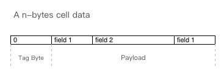
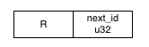
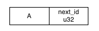
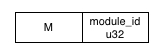
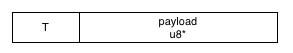
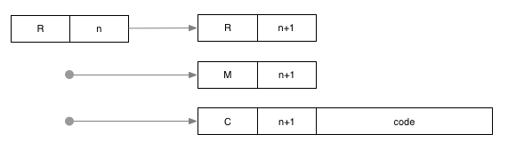
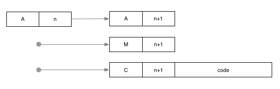
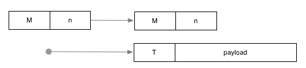
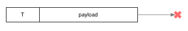

# Module

```
Author: ian <ian@nervos.org>
Category: CKB
Start Date: 2018-03-07
```

## 简介

在 RFC Cell 中每个 Cell 都属于一个模块，而在交易中操作被分成组，每个组也唯一属于某个模块，并且由模块的 Validator 函数来检查操作组是否是被允许的。

模块本身的创建，修改都是在 Module 这个系统模块中进行的，也就是说模块自己也是一个模块。Module 模块是在创世块中初始化创建的。

本 RFC 定义了如何通过 Cell 注册模块，定义和修改 Validator，以及一种 Validator 的实现方案。

## Validator

Validator 是一个函数，接收 Cell 操作列表，如果这个操作列表构成的组是允许的就返回 true，否则返回 false。

在生成 Block 时，所有交易中的所有组都必须通过 Validator 的验证。

Validator 函数本身也是存放在某个 Cell 的 data 中的，为了能正确允许，节点必须对 Validator 的 data 格式有共识。

未来 Cell 的 data 如何解释需要有一套 data schema 系统，本 RFC 先制定一些简单的 data schema 用于 PoC 版本的 CKB。

## Module 模块

本章会定义 Module 模块中会有什么样的 Cell，如何通过 Module 模块查询模块 Validator 函数，以及如何执行 Validator 函数。

Module 模块分配的模块 ID 为 0。

### Module 模块类型

Module 模块会有几种不同类型的 Cell 参与，类型系统会作为 data schema 的一部分在未来进行完善，这里提出一种简单的类型编码方式来定义 Module 模块。

Module 模块 Cell 的 data 的第一个字节会作为类型 tag。之后字节作为该类型数据的 payload，是按照类型连续排放的类型属性二进制编码。



因为类型不多，所以会挑选 ASCII 字母来作为 tag，下表是使用到类型和对应的 tag。每种类型的用途以及 data 编码方式会依次说明。

| 类型        | Tag |
| --------- | --- |
| Root      | R   |
| Allocator | A   |
| Module    | M   |
| Token | T |
| Validator   | V   |

#### R = Root

Root 的作用是通过其 lock 来授权创建和修改系统预留模块。



- `next_id`  大端序编码的 32 位无符号整数，表示下一个可用的系统模块 ID。

#### A = Allocator

Allocator 用于 Module 32位无符号整数的分配。



- `next_id`  大端序编码的 32 位无符号整数，表示下一个可用的非系统模块 ID。

#### M= Module

每个模块都有对应的一个 Module 类型的 Cell。Module Cell 的主要作用是通过创建 Token 影响到模块内的操作，比如行使管理员的职责。



#### T = Token

Token 类型是 Volatile Cell，一般由 Module Cell 授权创建，通过 Consume 操作参与到模块的操作组中。



- `payload` Token 的 payload 可以是任意长度的二进制数据。

#### V = Validator

Validator Cell 存储模块的 Validator 函数。


- `module_id` Validator 函数所属的模块 ID
- `code` 任意二进制

### Module Validator

Module 模块的 Validator 以白名单的方式允许下列的操作组，拒绝所有不在白名单中的操作组。

#### 系统模块注册

系统模块是 ID 0 \~ 127 （暂定）的模块。通过 Root Cell 获得下一个可用模块 ID，更新 Root Cell 并创建 Module Cell 和 Validator Cell。



额外条件：

- n \< 127

Root Cell 单例在创世块中创建，初始 `next_id` 根据创世块中已经创建的系统模块数量确定。

#### 非系统模块注册

和系统模块一致，只是用 Allocator Cell 替代。



额外条件：

- n != 2^32

Allocator 同样在创世块中创建，初始 `next_id` 等于 128

#### Validator 更新

Validator 更新只允许更新 code 部分。


#### 创建 Token

Token 的创建需要 Module Cell 授权



额外条件：

- 创建的 Token Cell 的 receipt type 必须等于 Module Cell 中的模块 ID

#### 销毁

Token 可以被销毁



### Lua Validator Code

Validator 是函数，节点需要运行需要将数据解释成指令然后在允许。在本 RFC 中，使用 Lua VM 来执行函数，Validator Cell 中 code 存储的 UTF-8 编码的 Lua 代码。

Code 存储的 Lua 代码需要返回一个 Lua 函数，该函数接受所在模块的 ID 和要验证的操作列表，并返回布尔值。比如下面的代码是允许任何操作组的 Validator code

``` lua
return function(module_id, group)
  return true
end
```

#### 操作列表 Lua 表示

操作列表在 Lua 中表示为一个 list，每个成员包含两个属性

- `input` Input Cell，对于 Create 操作是 `nil`
- `output` Output Cell，对于 Destroy 操作是 `nil`

比如:

```
{ { input = i1 }, { output = o2 }, { input = i3, output = o3 } }
```

是一个包含三个操作的组，依次是输入为 i1 的 Destroy，输出为 o2 的 Create，和 i3 到 o3 的 Transform。

Input Cell 是 table 或者 `nil`，当为 table 时包含属性：

- `cell` Lua table, Cell 结构体
- `unlock` Lua string, Unlock 证明的二进制，类型是 Lua string
- `height` Lua number, Input Cell 作为输出的 Create/Transform 操作所在区块的高度
- `outpoint` Lua table, Input Cell 所在交易的 Hash 已经 Cell 在该交易中的位置

Outpoint 包含属性：

- `transaction_hash` 输出 Cell 的 Transaction Hash
- `cell_index` 输出 Cell 在 Transaction 中的位置

Output Cell 同样是 table 或者 `nil`，当为 table 时包含属性：

- `cell` Cell 结构体

Cell 结构体的属性如下：

- `module_id` Lua number, 模块 ID
- `capacity` Lua number, Cell 空间上限
- `data` Lua string, Cell 存储的二进制数据
- `lock` Lua string, 二进制编码的 lock public key hash，可能为 `nil`
- `recipient` Lua table，可能为 `nil`

Recipient 结构体的属性如下：

- `module_id` Recipient 模块 ID
- `lock` Recipient lock，可能为 `nil`

### 系统模块初始化

最基础的系统模块在创世块中创建，除了 0 Module 模块，还有 1 Space 模块。

Space 模块的 Validator 允许任何的操作组，可以用在扩容交易 (Enlarge Transaction) 中。

## 示例模块

下面是一些常见需求的模块实现示例。所有参与的 Cell 的 data schema 会用 Lua table 来描述，其中字符串是对应的键的数据类型，Table 可以嵌套。比如用来下面的例子用来描述 Cell 结构体

```lua
{
  module_id = "number",
  capacity = "number",
  data = "string",
  lock = "string",
  recipient = {
    module_id = "number",
    lock = "string"
  }
}
```

如果某个字段时常量，会在类型后指定值，比如 `module_id = "number=0"` 表示 `module_id` 字段是常量数字 0.

提供的示例代码认为 Cell 的 data 存放的是 UTF-8 编码的代码，执行后会返回满足其 schema 要求的 Lua table，比如对于 Schema `{ value = "number" }` 下面是有效的 Cell data

```
return { value = 1 }
```

这些示例模块只关注如何实现最基本的功能，实践使用时还需要根据需求进行扩展。而且提出的方案也不是唯一可行的方案。

### Banking

Banking 是中心化的代币发行。代币的增发需要中心授权，销毁需要用户和中心同时授权，用户之间可以自由转账。

这里使用一个模块来管理一种代币，不同代币属于不同的模块。下面以 Banking 来代称某个代币的模块。

Banking 模块需要对代币的发行和销毁有中心化的授权，这个可以使用 Module 模块中 Token Cell 来作为发行令牌 (MintToken) 和销毁使用的令牌 (BurnToken)。因为 Token 的生成需要 Module Cell 授权，保证了中心化的授权。Token 通过 Recipient Lock 保证授权给了指定的用户。

持有 Token 可以用简单的数字来表示，在 Validator 需要检查所有的组中输入 Cell 的 Token 总额必须等于输出 Cell 的 Token 总额。

Schema 定义如下：

```
{
  MintToken = {
    type = "string=MintToken",
    value = "number"
  },
  BurnToken = {
    type = "string=BurnToken",
    value = "number"
  },
  Coin = {
    type = "string=Coin",
    value = "number"
  }
}
```

Validator 可以把发行，销毁和转账混合在一个操作组里:

```
return function(module_id, group)
  -- 统计 Balance，输入 Cell value 为负，输出 Cell value 为正，统计完必须满足仍然为 0
  local balance = 0
  for _, op in ipairs(group) do
    if op.input then
      local input_cell = op.input.cell
      local input_data = load(input_cell.data)()

      if input_cell.module_id == module_id then
        if input_data.type == "Coin" then
          -- 输入 Cell value
          balance = balance - input_data.value
        else
          -- unknown type
          return false
        end
      else if input_cell.module_id == 0 then
        if input_data.type == "MintToken" then
          -- MintToken 相当额外的输入 Cell value，所以计为负数
          balance = balance - input_data.value
        else if input_data.type == "BurnToken" then
          -- BurnToken 需要抵消部分输入 Cell 的 value，所以计为正数
          balance = balance + input_data.value
        else
          -- unknown type
          return false
        end
      else
        -- unknown module
        return false
      end

    end
    if op.output then
      local output_cell = op.output.cell

      if output_cell.module_id == module_id then
        local output_data = load(input_cell.data)()
        if output_data.type == "Coin" then
          -- 输出 Cell value
          balance = balance + output_data.value
        else
          -- unknown type
          return false
        end
      end
    end

    return balance == 0
  end
end
```

### Crowdfunding

Crowdfunding 是众筹 Capacity 的应用，这里只考虑最简单的情况：发起人可以设定目标，当达到目标，发起人可以获得所有 Cell 的 Capacity，发起人可以取消众筹。

模块会有两种类型的 Cell，Fund 是发起的众筹，Share 是投资人投入的份额。Fund 在 data 中保存目标，Share 在 data 中保存投资的目标 Fund 的地址，也就是 Outpoint。Schema 定义如下

```
{
  Fund = {
    type = "string=Fund",
    target = "number"
  },
  Share = {
    type = "string=Share",
    fund_outpoint = {
      transaction_hash = "string",
      cell_index = "number"
    }
  }
}
```

Fund 能收集 Share 必须能提供 Lock 的证明，所以 Share 的 Lock 必须是 Fund 和 Share 都知道如何提供证明，最简单的就是设置为空。而 Share 要支持撤回，不许限制 Share 要么是随 Fund 一起销毁，要么是被原来的所有者销毁，为了满足 Lock 的限制，可以这样构造 Share Cell:

- Lock 为空，所以 Fund 的所有者可以在满足合约条件的情况下销毁 Share
- Share 设置 Recipient Lock，允许 Transform 将 `fund_outpoint` 设置为空
- 允许单独销毁 `fund_outpoint` 为空的 Share

通过组合后两步可以实现撤回。根据 Volatile Cell 的规则，销毁需要提供 Lock 证明，转换需要提供 Recipient Lock，而合约限制了不能随意销毁 Share。

合约允许以下形式的操作组

- 发起众筹：创建 Fund Cell，设定目标
- 取消众筹：销毁 Fund Cell
- 完成众筹：同时销毁 Fund 和 Share Cell，要满足 Share 的 Capacity 之和达到目标，并且都指向 Fund。Fund 所有者可以在同一个 Transaction 的其它组中转移销毁所获得的 Cell 空间。
- 申领份额：创建 Share Cell
- 取消份额：转换 Share Cell，将 `fund_outpoint` 设置为空。注意设置输出 Cell 的 Lock 不然任何人都可以销毁取走 Cell 的空间。
- 取回份额：销毁 `fund_outpoint` 为空的 Share Cell

Validator 示例如下

```
return function(module_id, group)
  if
    #group == 1 and
    group[1].input == nil and
    group[1].output ~= nil and
    group[1].output.module_id == module_id
  then
    local output_data = load(group[1].output.data)()

    if output_data.type == "Fund" then
      -- 发起众筹
      return output_data.target and output_data.target > 0
    else if output_data.type == "Share" then
      -- 申领份额
      return output_data.fund_outpoint != nil and
        output_data.fund_outpoint.transaction_hash != nil and
        output_data.fund_outpoint.cell_index != nil and
    end
  end

  if
    #group == 1 and
    group[1].output == nil and
    group[1].input ~= nil and
    group[1].input.module_id == module_id
  then
    local input_data = load(group[1].input.data)()

    if output_data.type == "Fund" then
      -- 取消众筹
      return true
    else if output_data.type == "Share" then
      -- 取回份额
      return output_data.fund_outpoint = nil
    end
  end

  -- 取消份额
  if
    #group == 1 and
    group[1].input ~= nil and
    group[2].input.module_id == module_id and
    group[1].output ~= nil and
    group[2].output.module_id == module_id
  then
    return input_data.type == "Share" and output_data.type == "Share"
  end

  -- 完成众筹
  if #group > 1 and
    group[1].input ~= nil and
    group[1].input.module_id == module_id and
    group[1].output == nil
  then
    local fund_cell = group[1]
    local fund_data = load(fund_cell.data)()
    if fund_data.type ~= "Fund" then
      return false
    end

    local remaining_target = fund_data.target
    for i = 2, #group do
      local share_cell = group[i]
      if share_cell.input == nil or
        share_cell.output ~= nil or
        share_cell.input.module_id ~= module_id
      then
        return false
      end
      local share_data = load(share_cell.data)()
      if share_data.type ~= "Share" or
        share_data.fund_outpoint == nil or 
        share_data.fund_outpoint.transaction_hash ~= fund_cell.outpoint.transaction_hash or 
        share_data.fund_outpoint.cell_index ~= fund_cell.outpoint.cell_index
      then
        return false
      end
      remaining_target = remaining_target - share_cell.capacity
    end

    return remaining_target <= 0
  end

  return false
end
```

### Voting

Voting 是参于者在一段时间类锁定 Cell Capacity 进行投票。

一次投票涉及三种类型的 Cell

- Poll: 发起投票，包含投票选项数量，投票截止日期都信息
- Vote: 选票
- Tally: 统票结果

难点在于保证 Tally 包含所有满足条件的选票，这里使用的策略是任何人都可以通过举出一个反例，来销毁无效的统票结果，举报者可以获得 Tally 的 Cell 空间。

Poll 包含属性

- `choices_amount` 整数，选项数量，这里设计的是一个简单的单选投票，Vote 可以从 1 到 `choices_amount` 中进行选择。
- `tally_start` 整数，Tally 不能在这个指定的区块高度之前创建
- `tally_end` 整数，Tally 不能在这个指定的区块高度之后创建

Vote 包含属性

- `poll_outpoint` 指向 Poll，包含 `transaction_hash` 和 `cell_index` 两个子属性。
- `in_tally` boolean，记录是否包含在 Tally 中，用于统票记录

Tally 包含属性

- `result` 统票结果。是个数组，长度等于 `choices_amount`，依次是各个选项的得票。有效票是在 Poll 创建之后，到 `tally_start` 之前创建的 Vote Cell，计票为 Vote 的 capacity 乘以有效锁定期，有效锁定期等于 `tally_end` - 创建高度。

Schema 定义如下

```
{
  Poll = {
    type = "string=Poll",
    choices_amount = "number",
    tally_start = "number"
  },
  Vote = {
    type = "string=Vote",
    choice = "number",
    poll_outpoint = {
      transaction_hash = "string",
      cell_index = "number"
    },
    in_tally = "boolean"
  },
  Tally = {
    poll_start = "number",
    tally_start = "number"
    poll_outpoint = {
      transaction_hash = "string",
      cell_index = "number"
    },
    result = "number[]",
  }
}
```

合约允许下列操作组：

- 创建 Poll
- 销毁 Poll
- 创建 Vote
- 销毁 Vote
- 统票: 销毁 Poll，创建 Tally，同时转换 Vote 修改 `in_tally` 为 true
- 举报统票结果：提交一个反例 Vote，转换 Vote 并销毁 Tally
- 取消统票结果：需要分两步，先 Transform 为 result 为空的 Tally，然后再销毁

对 Lock 的要求：

- Vote 需要设置 Recipient 并且 Recipient 为空，这样 Poll 所有者可以转换 Vote 来创建 Tally；任何人都可以举报统票结果
- Tally 需要设置 Lock 为空，同时设置一个 Recipient Lock 用于两步销毁。

示例 Validator 如下

```
-- 创建 Poll
local function validate_creating_poll(module_id, group)
  if
    #group == 1 and
    group[1].input == nil and
    group[1].output ~= nil and
    group[1].output.module_id == module_id
  then
    local output_data = load(group[1].output.data)()

    if output_data.type == "Poll" then
      return output_data.choices_amount > 0 and
        output_data.tally_start > 0 and
        output_data.tally_end > output_data.tally_start
    end
  end

  return false
end

-- 销毁 Poll
local function validate_destroying_poll(module_id, group)
  if
    #group == 1 and
    group[1].input ~= nil and
    group[1].input.module_id == module_id
  then
    local input_data = load(group[1].input.data)()

    return input_data.type == "Poll"
  end

  return false
end

-- 创建 Vote
local function validate_creating_vote(module_id, group)
  if
    #group == 1 and
    group[1].input == nil and
    group[1].output ~= nil and
    group[1].output.module_id == module_id
  then
    local output_data = load(group[1].output.data)()

    if output_data.type == "Vote" then
      return output_data.poll_outpoint ~= nil and
        output_data.in_tally == false
    end
  end

  return false
end

-- 销毁 Vote
local function validate_destroying_vote(module_id, group)
  if
    #group == 1 and
    group[1].input ~= nil and
    group[1].input.module_id == module_id
  then
    local input_data = load(group[1].input.data)()

    return input_data.type == "Vote"
  end

  return false
end

-- 统票
local function validate_creating_tally(module_id, group)
  if
    #group > 1 and
    group[1].input ~= nil and
    group[1].input.module_id == module_id and
    group[1].output ~= nil and
    group[1].output.module_id == module_id
  then
    local poll = group[1].input
    local tally = group[1].output
    local poll_data = load(poll.data)()
    local tally_data = load(tally.data)()

    if poll_data.type ~= "Poll" or
      tally_data.type ~= "Tally" or
      tally_data.poll_start ~= poll.height or
      tally_data.tally_start ~= poll_data.tally_start or
      tally_data.poll_outpoint == nil or
      tally_data.poll_outpoint.transaction_hash = poll.outpoint.transaction_hash or
      tally_data.poll_outpoint.cell_index = poll.outpoint.cell_index or
    then
      return false
    end

    local reult = {}
    for i = 1, poll.choices_amount do
      result[i] = 0
    end
    for i = 2, #group do
      if group[i].input == nil or
        group[i].input.module_id ~= module_id or
        group[i].output == nil or
        group[i].output.module_id ~= module_id
      then
        return false
      end
      local vote_in = group[i].input
      local vote_in_data = load(vote_in.data)()
      local vote_out = group[i].output
      local vote_out_data = load(vote_out.data)()

      if vote_data.type == "Vote" and
        vote_in_data.choice >= 1 and
        vote_in_data.choice <= poll_data.choices_amount and
        vote_in_data.in_tally == false and
        vote_out_data.in_tally == true and
        vote_in.height > tally_data.poll_start and
        vote_in.height < tally_data.tally_start and
        vote_in.poll_inpoint.transaction_hash == tally_data.poll_inpoint.transaction_hash and
        vote_in.poll_inpoint.cell_index == tally_data.poll_inpoint.cell_index
      then
        result[vote_in_data.choice] = result[vote_in_data.choice] + vote_in.capacity * (poll_data.tally_end - vote_in.height)
      end
    end

    if #tally_data.result ~= #result then
      return false
    end
    for i = 1, #result do
      if result[i] ~= tally_data.result[i] then
        return false
      end
    end

    return true
  end

  return false
end

-- 举报统票
local function validate_slashing_tally(module_id, group)
  if
    #group == 1 and
    group[1].input ~= nil and
    group[1].input.module_id == module_id and
    group[1].output == nil and
    group[2].input ~= nil and
    group[2].input.module_id == module_id and
    group[2].output ~= nil and
    group[2].output.module_id == module_id
  then
    local tally = group[1].input
    local vote_in = group[2].input
    local vote_out = group[2].output

    local tally_data = load(tally.data)()
    local vote_in_data = load(vote_in.data)()
    local vote_out_data = load(vote_out.data)()

    if tally.type ~= "Tally" or
      vote_in_data.type ~= "Vote" or
      vote_out_data.type ~= "Vote"
    then
      return false
    end

    return vote_in_data.in_tally == false and
      vote_in.height
      vote_in.height > tally_data.poll_start and
      vote_in.height < tally_data.tally_start and
      tally_data.poll_outpoint ~= nil and
      vote_in_data.poll_outpoint.transaction_hash == tally_data.poll_outpoint.transaction_hash and
      vote_in_data.poll_outpoint.cell_index == tally_data.poll_outpoint.cell_index
  end

  return false
end

-- 取消统票
local function validate_destroying_tally(module_id, group)
  if
    #group == 1 and
    group[1].input ~= nil and
    group[1].input.module_id == module_id
  then
    local input_data = load(group[1].input.data)()

    if input_data.type ~= "Tally" then
      return false
    end

    -- Transform
    if group[2].output ~= nil then
      local output_data = load(group[1].output.data)()
      return input_data.result ~= nil and output_data.result == nil
    end

    -- Destroy
    return input_data.result == nil
  end

  return false
end

return function(module_id, group)
  return validate_creating_poll(module_id, group) or
    validate_destroying_poll(module_id, group) or
    validate_creating_vote(module_id, group) or
    validate_destroying_vote(module_id, group) or
    validate_creating_tally(module_id, group) or
    validate_slashing_tally(module_id, group) or
    validate_destroying_tally(module_id, group)
end
```
