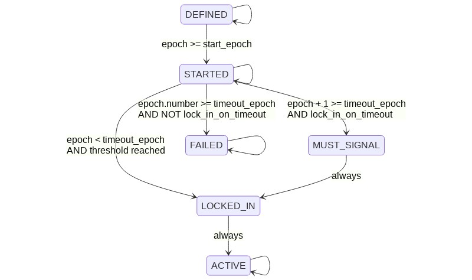

# User Activated Soft Forks

## Abstract

This document proposes a mechanism for doing parallel soft forking deployments based on miner signaling via the block version field.

This is based on the BIP8[^1] from bitcoin with little revisions:

* Epoch numbers are used for `start` and `timeout` rather than block heights because CKB re-targets difficulty by epoch.

The key words "MUST", "MUST NOT", "REQUIRED", "SHALL", "SHALL NOT", "SHOULD", "SHOULD NOT", "RECOMMENDED", "MAY", and "OPTIONAL" in this document are to be interpreted as described in RFC 2119.

## Specification

### Parameters

Each soft fork deployment is specified by the following per-chain parameters (further elaborated below):

* The `name` specifies a very brief description of the soft fork, reasonable for use as an identifier. For deployments described in a single RFC, it is recommended to use the name "rfcN" where N is the appropriate RFC number.
* The `bit` determines which bit in the `version` field of the block is to be used to signal the soft fork lock-in and activation. It is chosen from the set `{0,1,2,...,28}`.
* The `start_epoch` specifies the first epoch at which the bit gains its meaning.
* The `timeout_epoch` specifies an epoch at which the miner signaling ends. Once this epoch has been reached, if the soft fork has not yet locked in (excluding this block's bit state), the deployment is considered failed on all epochs starting from this one.
* The `lock_in_on_timeout` boolean if set to true, blocks are required to signal in the final epoch, ensuring the soft fork has locked in by `timeout_epoch`.

### Selection guidelines

The following guidelines are suggested for selecting these parameters for a soft fork:

* `name` should be selected such that no two softforks concurrent or otherwise, ever use the same name.
* `bit` should be selected such that no two concurrent softforks use the same bit.
* `start_epoch` should be set to some epoch number in the future, approximately 30 days (or 180 epochs) after a software release date including the soft fork.  This allows for some release delays, while preventing triggers as a result of parties running pre-release software, and ensures a reasonable number of full nodes have upgraded prior to activation.
* `timeout_epoch` should be 1 year, or 2190 epochs after `start_epoch`.
* `lock_in_on_timeout` should be set to true for any softfork that is expected or found to have political opposition from a non-negligible percent of miners. (It can be set after the initial deployment, but cannot be cleared once set.)

A later deployment using the same bit is possible as long as the `start_epoch` is after the previous one's `timeout_epoch` or activation, but it is discouraged until necessary, and even then recommended to have a pause in between to detect buggy software.

`timeout_epoch` must be at least 180 epochs after `start_epoch`.

### States

With each epoch and soft fork, we associate a deployment state. The possible states are:

* **DEFINED** is the first state that each soft fork starts out as. The genesis epoch is by definition in this state for each deployment.
* **STARTED** for epochs at or beyond the epoch number `start_epoch`.
* **MUST_SIGNAL** for one epoch prior to the timeout, if **LOCKED_IN** was not reached and `lock_in_on_timeout` is true.
* **LOCKED_IN** for one epoch after the first epoch with **STARTED** (or **MUST_SIGNAL**) blocks of which at least threshold have the associated bit set in `version`.
* **ACTIVE** for all epochs after the **LOCKED_IN** epoch.
* **FAILED** for all epochs at or beyond the epoch number `timeout_epoch` if `LOCKED_IN` is not reached.

### Bit flags

The `version` block header field is to be interpreted as a 32-bit little-endian integer (as present), and bits are selected within this integer as values (`1 << N`) where N is the bit number.

Blocks in the STARTED state epoch get a `version` whose bit position bit is set to 1. The top 3 bits of such blocks must be 000 and are reserved for future extensions. So the range of actually possible `version` values is `[0x00000000...0x1FFFFFFF]`, inclusive.

### New consensus rules

The new consensus rules for each soft fork are enforced for each block in the epoch that has **ACTIVE** state.

During the **MUST_SIGNAL** and **LOCKED_IN** phases, blocks that fail to signal are invalid.

### State transitions

<details>
<summary>



</summary>

```
%% https://mermaid-js.github.io/mermaid-live-editor/
stateDiagram-v2
    DEFINED --> DEFINED
    DEFINED --> STARTED: epoch >= start_epoch
    STARTED --> MUST_SIGNAL: epoch + 1 >= timeout_epoch\nAND lock_in_on_timeout
    STARTED --> LOCKED_IN: epoch < timeout_epoch\nAND threshold reached
    MUST_SIGNAL --> LOCKED_IN: always
    LOCKED_IN --> ACTIVE: always
    STARTED --> STARTED
    ACTIVE --> ACTIVE

    STARTED --> FAILED: epoch.number >= timeout_epoch\nAND NOT lock_in_on_timeout
    FAILED --> FAILED
```

</details>

Note that when `lock_in_on_timeout` is true, the **LOCKED_IN** state will be reached no later than at the epoch of `timeout_epoch`, and ACTIVE will be reached no later than at a height of `timeout_epoch + 1`.

It should be noted that the states are maintained along block chain branches, but may need recomputation when a reorganization happens.

The genesis epoch has state DEFINED for each deployment, by definition.

    State GetStateForEpoch(epoch) {
        if (epoch.number == 0) {
            return DEFINED;
        }

The next state depends only on the state and blocks of the previous epoch:

        switch (GetStateForEpoch(GetEpochByNumber(epoch.number - 1))) {

We remain in the initial state until we reach the start epoch.

        case DEFINED:
            if (epoch.number >= start_epoch) {
                return STARTED;
            }
            return DEFINED;

After an epoch in the STARTED state, we tally the bits set, and transition to **LOCKED_IN** if a sufficient number of blocks in the past period set the deployment bit in their version numbers. The threshold is ≥ 95% of blocks in the epoch, or ≥75% for testnet.

If the threshold hasn't been met, `lock_in_on_timeout` is true, and we are at the last period before the timeout, then we transition to **MUST_SIGNAL**.

If the threshold hasn't been met and we reach the timeout, we transition directly to **FAILED**.

Note that a block's state never depends on the `version` of the blocks in the same epoch; only on that of the previous epoch.

        case STARTED:
            count = 0;
            prev_epoch = GetEpochByNumber(epoch.number - 1);
            block = GetBlockByNumber(prev_epoch.start_block_number + prev_epoch.length - 1);
            for (; block.epoch_number == prev_epoch.number; block = block.parent) {
                assert(block.version & 0xE0000000 == 0);
                if ((block.version >> bit) & 1 == 1) {
                    ++count;
                }
            }
            if (count >= threshold * prev_epoch.length) {
                return LOCKED_IN;
            } else if (lock_in_on_timeout && epoch.number + 1 >= timeout_epoch) {
                return MUST_SIGNAL;
            } else if (epoch.number >= timeout_epoch) {
                return FAILED;
            }
            return STARTED;

If we have finished a period of **MUST_SIGNAL**, we transition directly to **LOCKED_IN**.

        case MUST_SIGNAL:
            return LOCKED_IN;

After an epoch of **LOCKED_IN**, we automatically transition to **ACTIVE**.

        case LOCKED_IN:
            return ACTIVE;

And **ACTIVE** and **FAILED** are terminal states, which a deployment stays in once they're reached.

        case ACTIVE:
            return ACTIVE;

        case FAILED:
            return FAILED;
        }
    }


### Mandatory signaling

Blocks received while in the **MUST_SIGNAL** and **LOCKED_IN** phases must be checked to ensure that they signal. For example:

    if (GetStateForEpoch(epoch) == MUST_SIGNAL) {
        if ((block.version & 0xE0000000) != 0 || ((block.version >> bit) & 1) != 1) {
            return Err("UASF must signal");
        }
    }
    if (GetStateForBlock(epoch) == LOCKED_IN) {
        if ((block.version & 0xE0000000) != 0 || ((block.version >> bit) & 1) != 1) {
            return Err("UASF must signal");
        }
    }

Implementations should be careful not to ban peers that send blocks that are invalid due to not signaling (or blocks that build on those blocks), as that would allow an incompatible chain that is only briefly longer than the compliant chain to cause a split of the p2p network. If that occurred, nodes that have not set `lock_in_on_timeout` may not see new blocks in the compliant chain, and thus not reorg to it at the point when it has more work, and would thus not be following the valid chain with the most work.

Implementations with `lock_in_on_timeout` set to true may potentially follow a lower work chain than nodes with `lock_in_on_timeout` set to false for an extended period. In order for this not to result in a net split nodes with `lock_in_on_timeout` set to true, those nodes may need to preferentially connect to each other. Deployments proposing that implementations set `lock_in_on_timeout` to true should either use parameters that do not risk there being a higher work alternative chain, or specify a mechanism for implementations that support the deployment to preferentially peer with each other.

### Warning mechanism

To support upgrade warnings, an extra "unknown upgrade" is tracked, using the "implicit bit" mask = `(block.version & ~expectedVersion)` != 0. Mask will be non-zero whenever an unexpected bit is set in `version`.  Whenever **LOCKED_IN** for the unknown upgrade is detected, the software should warn loudly about the upcoming soft fork. It should warn even more loudly after the next epoch (when the unknown upgrade is in the **ACTIVE** state).

### `getblocktemplate` changes

The template request Object is extended to include a new item:

| Key | Required | Type | Description |
| --- | -------- | ---- | ----------- |
| `rules` | No | Array of Strings | list of supported softfork deployments, by name |

The template Object is also extended:

| Key | Required | Type | Description |
| --- | -------- | ---- | ----------- |
| `rules` | Yes | Array of Strings | list of softfork deployments, by name, that are active state |
| `version_bits_available` | Yes | Object | set of pending, supported softfork deployments; each uses the softfork name as the key, and the softfork bit as its value |
| `version_bits_required` | No | Number | bit mask of softfork deployment version bits the server requires enabled in submissions |

The `version` key of the template is retained, and used to indicate the server's preference of deployments.

Miners MAY clear or set bits in the block version WITHOUT any special "mutable" key, provided they are listed among the template's `version_bits_available` and (when clearing is desired) NOT included as a bit in "version_bits_required".

Servers MUST set bits in `version_bits_required` for deployments in **MUST_SIGNAL** and **LOCKED_IN** states, to ensure blocks produced are valid.

Softfork deployment names listed in `rules` or as keys in `version_bits_available` may be prefixed by a '!' character. If a client does not understand a rule without the prefix, it may use it unmodified for mining. On the other hand, when this prefix is used, it indicates a more subtle change to the block structure or generation transaction. A client that does not understand a rule prefixed by '!' must not attempt to process the template, and must not attempt to use it for mining even unmodified.

## Copyright

This document is dual licensed as BSD 3-clause, and Creative Commons CC0 1.0 Universal.

[^1]: Fry, S. & Dashjr, L. (2017). BIP8 Version bits with lock-in by height. https://github.com/bitcoin/bips/blob/master/bip-0008.mediawiki
