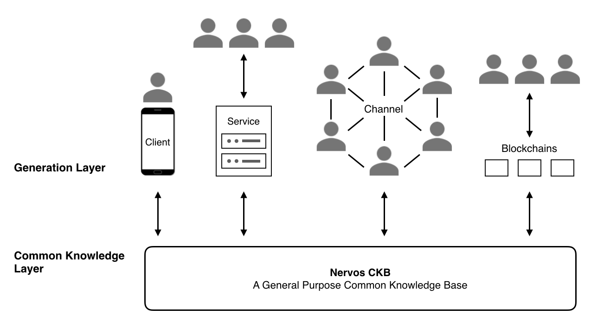
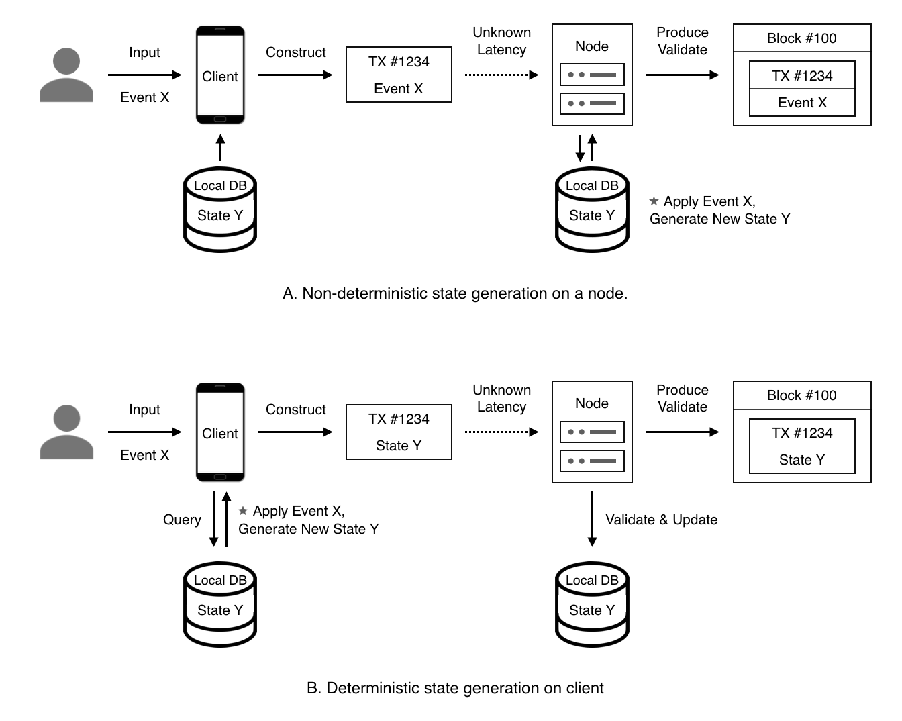
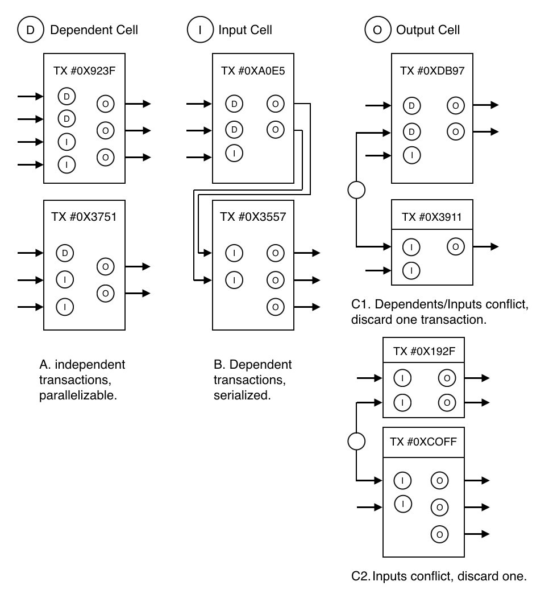

# Nervos CKB: A Common Knowledge Base for Crypto-Economy

## Abstract

Nervos is a layered crypto-economy network. Nervos separates the infrastructure of a crypto-economy into two layers: a verification layer (layer 1) that serves as a trust root and smart custodian, and a generation layer (layer 2) for high-performance transactions and privacy protection.

This document provides an overview of the Nervos Common Knowledge Base (CKB), a public permissionless blockchain and layer 1 of Nervos. CKB generates trust and extends this trust to upper layers, making Nervos a trust network. It's also the value store of the Nervos network, providing public, secure and censorship-resistant custody services for assets, identities and other common knowledge created in the network.

## Contents

1. Motivation
2. Overview
3. Consensus
4. Programming Model
    1. State Generation and Verification
    2. Cell
    3. VM
    4. Transaction
5. Economic Model
6. Network
7. Summary
8. References
9. Appendix

## 1. Motivation

We want a peer-to-peer crypto-economy network.

In such a network, people can not only collaborate but also have incentives to do so. We need the ability to define, issue, transfer, and own assets in a peer-to-peer network to create such incentives. Blockchain technology brings us the last piece of the puzzle.

Bitcoin[1] was the first public permissionless blockchain, designed to be used solely as peer-to-peer cash. Ethereum[2] extends the use case of blockchain to create a general purpose trust computing platform on which people have built all kinds of decentralized applications. The booming applications on the Bitcoin and Ethereum networks have proven the concept of the future crypto-economy. However, these networks also suffer from the notorious scalability problem, their transaction processing capability cannot scale with the number of participants in the network, which severely limits their potential.

The blockchain community has proposed many scalability solutions in recent years. In general, we can divide these solutions into two categories, on-chain scaling and off-chain scaling. On-chain scaling solutions are those that try to scale at the same layer where consensus runs. The consensus process is the core of a blockchain protocol, in which nodes exchange network messages and reach agreement eventually. A consensus is slow almost by definition, because message exchange on a public and open network is slow and uncertain, nodes must wait and retry to reach agreement in the consensus process. To scale at this layer, we can either "scale up" by increasing the processing ability and network bandwidth of nodes (but sacrifice decentralization due to high hardware and infrastructure costs), or "scale out" by sharding. The idea of sharding is to divide nodes into many small "shards", and ask each shard to process only a fraction of network transactions. Sharding is widely adopted by Internet giants, as they face the same scalability issues when serving millions of users. However, sharding is well known for the complexity of shard coordination and cross-shard transactions, which even in a trusted environment, leads to performance degradation as the number of shards grows.

In contrast, off-chain scaling solutions acknowledge the inherent complexity of the consensus process. They recognize that consensus within different scopes incur different costs, and the global consensus created by a public permissionless blockchain is the most expensive consensus. While it is hard to scale a global consensus, we can use it wisely. Most transactions between two or more parties don't need to be known by every node in the network, except when they are securely settled; in other words, when users want to turn their transactions into common knowledge of the network. This network scales by offloading most of the work to upper layers, with no limit on scalability. Processing transactions off-chain also brings additional benefits, such as lower latency and higher privacy.

While we agree with the general ideas of off-chain scaling, we have found that there is no existing blockchain designed for it. For example, though the lightning network is one of the earliest explorations in off-chain scaling, it has taken years to launch its testnet and is still far from mass-adoption due to the limitations of the underlying Bitcoin protocol. Ethereum provides powerful programming ability, but its computation-oriented economic model doesn't fit well with off-chain scaling. Because off-chain participants handle most of the computation, what is required is a blockchain that can keep their assets in secure custody and move assets according to the final state of their computation. The computation-oriented design of Ethereum also makes it difficult to execute transactions in parallel, which is an impediment to scalability.

The economic models of current blockchains also face challenges. With more users and applications moving to blockchain platforms, the amount of data stored on blockchains also increases. Current blockchain solutions are concerned more with the cost of consensus and computation, and allow a user to pay once and have their data occupy full nodes’ storage forever. Cryptocurrency prices also are highly volatile, and users may find it difficult to pay high transaction fees as the price of a cryptocurrency increases.

We propose Nervos CKB, a public permissionless blockchain designed for a layered crypto-economy network.

## 2. Overview

Nervos CKB (Common Knowledge Base) is a layer 1 blockchain, a decentralized and secure layer that provides common knowledge custody for the network. Common knowledge refers to states that are verified by global consensus. Crypto-assets are an example of common knowledge.

In Nervos, the CKB and all layer 2 protocols work together to serve the crypto-economy. CKB (or layer 1) is where state is stored and defined, and layer 2 is the generation layer (or computation layer, these two terms are interchangeable) that processes most transactions and generates new states. Layer 2 participants submit newly generated states to the CKB eventually at the time they deem necessary. If those states pass the corresponding verification performed by nodes in a global network, the CKB stores them in a peer-to-peer node securely.

The layered architecture separates state and computation, providing each layer more flexibility and scalability. For example, blockchains on the generation layer (layer 2) may use different consensus algorithms. CKB is the lowest layer with the broadest consensus and provides the most secure consensus in the Nervos network. However, different applications might prefer different consensus scopes and forcing all applications to use CKB’s consensus would be inefficient. Applications can choose the appropriate generation methods based on their particular needs. The only time these applications will need to submit states to CKB for broader agreement is when they need to make these states common knowledge that has been verified by the CKB's global consensus.

Possible state generation methods include (but are not limited to) the following:

- Local generators on the client: Generators run directly on the client’s devices. Developers can implement the generator in any programming language.
- Web services: Users may use traditional web services to generate new states. All current web services may work with CKB in this way to gain more trust and liquidity for the generated states. For example, game companies may define in-game items as assets in CKB, the game itself functions as a web service that generates game data, which is then verified and stored in CKB.
- State channels: Two or more users may use peer-to-peer communication to generate new states.
- Generation chains: A generation chain is a blockchain that generates new states and stores them in CKB. Generation chains may be permissionless blockchains or permissioned blockchains. In each generation chain, nodes reach consensus in smaller scopes, providing better privacy and performance. 

*Figure 1. Layered Architecture*

CKB consists of a Proof-of-Work based consensus, a RISC-V instruction set based virtual machine, a state model based on cells, a state-oriented economic model, and a peer-to-peer network. The Proof-of-Work based consensus makes the CKB a public and censorship-resistant service. The combination of CKB VM and the Cell model creates a stateful Turing-complete programming model for developers, making state generation (or layer 2) on CKB practical. The CKB economic model is designed for common knowledge custody and long-term sustainability. The CKB peer-to-peer network provides secure and optimal communication between different types of nodes.

## 3. Consensus

CKB consensus is an improved Nakamoto consensus based on Proof-of-Work, that aims to achieve openness, correctness and high performance in distributed environments with network delay and Byzantine node faults.

Permissionless blockchains run in open networks where nodes can join and exit freely, with no liveness assumptions. These are severe problems for traditional BFT consensus algorithms to solve. Satoshi Nakamoto introduced economic incentives and probabilistic consensus to solve these problems. Nakamoto consensus in Bitcoin uses blocks as votes, which takes longer (up to 10 minutes to an hour) to confirm transactions and leads to an inferior user experience.

CKB consensus is a Nakamoto consensus variant, which means it allows nodes to join and exit the network freely. Every node can participate in the consensus process either by mining (running a specific algorithm to find the Proof-of-Work) to produce new blocks, or by verifying new blocks are valid. CKB uses an ASIC-neutral Proof-of-Work function, with the goals of distributing tokens as evenly as possible and making the network as secure as possible.

Correctness includes eventual consistency, availability, and fairness. Eventual consistency guarantees every node sees an identical copy of state. Availability makes sure the network responds to users' requests within a reasonable time. Fairness ensures mining nodes get fair returns for their efforts to keep the network functioning securely.

High performance includes transaction latency, the time between the submission of a request and the confirmation of its execution results, and transaction throughput, the number of transactions the system is capable of processing per second. Both of these measures depend on block time, which is the average time between two consecutive blocks.

Please check the CKB Consensus Paper for more details.

## 4. Programming Model

CKB provides a stateful Turing-complete programming model based on CKB VM and cell model.

| | Bitcoin | Ethereum | CKB |
|-|---------|----------|------------|
|Instruction Set|Script|EVM|RISC-V|
|Cryptographic Primitive|Opcode|Precompile|Assembly|
|Stateful|No|Yes|Yes|
|State Type|Ledger|General|General|
|State Model|UTXO|Account|Cell|
|State Verification|On-chain|On-chain|On-chain|
|State Generation|Off-chain|On-chain|Off-chain|

*Table 1. Comparison of Bitcoin, Ethereum and CKB Programming Model*

The CKB programming model consists of three parts:

- state generation (off-chain)
- state verification (CKB VM)
- state storage (Cell model)

In this model, decentralized application logic is split into two parts (generation and verification), running in different places. State generation logic runs off-chain on the client side; new states are packaged into transactions and broadcasted to the entire network. CKB transactions have an inputs/outputs based structure like Bitcoin. Transaction inputs are references to previous outputs, along with proofs to unlock them. The client includes generated new states as transaction outputs, which are called cells in CKB. Cells are the primary state storage units in CKB and are assets owned by users that must follow associated application logic specified by scripts. CKB VM executes these scripts and verifies proofs included in inputs to make sure the user is permitted to use referenced cells and the state transition is valid under specified application logic. In this way, all nodes in the network verify that new states are valid and keep these states in custody.

State in CKB is a first-class citizen, states are included in transactions and blocks and synchronized directly among nodes. Although the programming model is stateful, scripts running in CKB VM are pure functions with no internal state, which makes CKB scripts deterministic, conducive to parallel execution, and easy to compose.

### 4.1 State Generation and Verification

Decentralized applications on Nervos separate the generation and verification of state. While these processes occur in different places, CKB provides the additional flexibility to utilize different algorithms for state generation and verification.

Utilizing the same algorithm on both generation and verification sides is a straightforward choice that works for general problems. In this model, the same algorithm has two implementations, one that runs off-chain in any execution environment targeted by the application, and the other one runs on-chain in CKB VM. New states are generated off-chain with this algorithm (based on previous states and user inputs), packaged as a transaction, and then broadcasted to the network. CKB nodes run this same algorithm on-chain, provide it the same previous states and user inputs, and then verify the result matches the transaction-specified outputs.

There are several advantages to this separation of state generation and validation:

- Deterministic transactions: Certainty of transaction execution is one of the core pursuits of decentralized applications. If transactions include only user input and new states are the result of computation on nodes (as seen in Ethereum), the transaction creator cannot be certain about the on-chain computation context, which may lead to unexpected results. In CKB, users generate new states on the client side. They can confirm the new states before broadcasting their state transition to the network. The transaction outcome is certain: either the transaction passes on-chain verification and the new state is accepted, or the transaction is deemed invalid and no state change is made to CKB (Figure 1).

- Parallelism: If transactions only include user inputs and new states are generated by nodes, then nodes will not know what state is going to be accessed by the verification process, and cannot determine dependencies between transactions. In CKB, because transactions explicitly include previous states and new states, nodes can see dependencies between transactions prior to verification, and can process transactions in parallel.

- Higher resource utilization: As application logic is split and run in different places, the network can distribute computational workload more evenly across nodes and clients, and thus utilize system resources more efficiently.

- Flexible state generation: Even when the same algorithms are used, developers can implement generation and validation in different ways. On the client side there is the flexibility to choose the programming language that provides for better performance and fast development.

In some scenarios, state verification can utilize a different (but associated) algorithm that is much more efficient than the one used for state generation. The most typical example is seen in Bitcoin transactions: Bitcoin transaction construction consists mainly of a searching process to identify appropriate UTXOs to use, while verification is the addition of numbers and simple comparison. Other interesting examples include sorting and searching algorithms: the computational complexity for quicksort, one of the best sorting algorithms for the average case, is O(Nlog(N)), but the algorithm to verify the result is just O(N). Searching for the index of an element in a sorted array is O(log(N)) with binary search, but its verification only takes O(1). The more complex the business rules, the higher probability that there can be asymmetric generation and validation algorithms with differing computational complexity.

System throughput can be improved by utlizing asymmetry between state generation and validation. Moving details of computation to the client side is also valuable for algorithm protection and privacy. With the advancement of technologies such as zero-knowledge proofs, we may find efficient generation and verification solutions to general problems, and CKB is a natural fit for these types of solutions.

We refer to programs that generate new states and create new cells as Generators. Generators run locally on the client side (off-chain). They utilize user input and existing cells as program inputs, to create new cells with new states as outputs. The inputs that Generators use and the outputs they produce together form a transaction.

*Figure 2. Separation of state generation and verification*

### 4.2 Cell

Cells are the primary state units in CKB, within them users can include arbitrary states. A cell has the following fields:

- `capacity` - Size limit of the cell. A cell's size is the total number of bytes of all fields contained in it.
- `data` - State data stored in this cell. It could be empty, however the total bytes used by a cell (including data), must always be less than or equal to its capacity.
- `type`: State verification script.
- `lock`: Script that represents the ownership of the cell. Owners of cells can transfer cells to others.

A cell is an immutable object, no one can modify it after creation. Every cell can only be used once, it cannot be used as input for two different transactions. Cell ‘updates’ mark previous cells as history and create new cells with the same capacity to replace them. By constructing and sending transactions, users provide new cells with new states in them and invalidate previous cells that store old states atomically. The set of all current (or live) cells represents the latest version of all common knowledge in CKB, and the set of history (or dead) cells represents all historical versions of common knowledge.

CKB allows users to transfer a cell's capacity all at once, or transfer only a fraction of a cell's capacity, which would in turn lead to more cells being created (e.g., a cell with capacity=10 can become two cells with capacity=5).

Two kinds of scripts (type and lock) are executed in CKB VM. CKB VM executes the `type` script when a cell is created in a transaction output, to guarantee the state in the cell is valid under specific rules. CKB VM executes the lock script, taking proofs as arguments, when the cell is referenced by a transaction input, to make sure the user has appropriate permissions to update or transfer the cell. If the execution of the lock script returns true, the user is allowed to transfer the cell or update its data according to validation rules that are specified by the `type` script.

This `type` and `lock` script pair allows all kinds of possibilities, for example:

- Upgradable cryptography - Anyone can deploy useful cryptography libraries written in languages such as C or C++ and use them in `type` and `lock` scripts. In CKB VM, there are no hardcoded cryptographic primitives, users are free to choose any cryptographic signature scheme they'd like to use to sign transactions.
- Multisig - Users can easily create M-of-N multisig or more complex `lock` scripts.
- Lending - Cell owners can lend cells for others to use while still maintaining their ownership of the cells.

The Cell model is a more generic state model compared to the UTXO or Account model. Both the UTXO and the Account model can express relationships between assets and their owners. The UTXO model defines ownership of assets (with the lock script), while the Account model defines ownership of assets by owner (with the account balance). The UTXO model makes the ledger history more clear, but its lack of generic state storage makes its already inexpressive scripts harder to use. The Account model is easy to understand and can support authorizations and identities well, but it presents challenges to processing transactions in parallel. The Cell model with `lock` and `type` scripts takes the best of both models to provide a more generic state model.

### 4.3 VM

CKB VM is a RISC-V instruction set based VM for executing type and lock scripts. It uses only standard RISC-V instructions, to maintain a standard compliant RISC-V software implementation which can embrace the broadest industrial support. CKB implements cryptographic primitives as ordinary assembly running on its VM, instead of customized instructions. It supports syscall, by which scripts can read metadata such as current transaction and general blockchain information from CKB. CKB VM defines `cycles` for each instruction, and provides total cycles executed during transaction verification to help miners determine transaction fees.

Existing blockchains hardcode cryptographic primitives in the protocol. For example, Bitcoin has special cryptographic opcodes such as `OP_CHECK*`, and Ethereum uses special 'precompiled' contracts located at a special address (e.g. `0000000000000000000000000000000000000001`) to support cryptographic operations such as `ecrecover`. To add new cryptographic primitives to these blockchains, we can only soft-fork (as Bitcoin re-uses opcodes to support new primitives) or hard-fork.

CKB VM is a crypto-agnostic virtual machine. There are no special cryptographic instructions hardcoded in CKB VM. New cryptographic primitives can always be deployed and used by scripts like an ordinary library. Being a RISC-V standard compliant implementation means existing cryptographic libraries written in C or other languages can be easily ported to CKB VM and used by cell scripts. CKB even implements the default hash function and public-key cryptography used in transaction verification this way. Being crypto-agnostic allows decentralized application developers on Nervos to use any new cryptography (such as Schnorr signatures, BLS signatures, and zkSNARKs/zkSTARKs) they'd like without affecting other users, and allows CKB users to keep their assets secure even in the post-quantum era.

CKB VM chooses a hardware targeting ISA because blockchain is hardware-like software. Though its creation is as easy as software, its upgrade is as difficult as hardware. As an ISA designed for chips, RISC-V is very stable, its core instruction set is implausible to change in the future. The ability to keep compatibility with the ecosystem without the need of a hard-fork is a key feature of a blockchain virtual machine like CKB VM. The simplicity of RISC-V also makes runtime cost modeling easy, which is crucial for transaction fee calculations.

Please check [RFC 0003](https://github.com/nervosnetwork/rfcs/blob/master/rfcs/0003-ckb-vm/0003-ckb-vm.md) for more details of CKB VM.

### 4.4 Transaction

Transactions express state transitions, resulting in cell transfer, update, or both. In a single transaction, users can update data in one or more cells or transfer their cells to other users. All state transitions in the transaction are atomic, they will either all succeed or all fail.

A transaction includes the following:

- `deps`: Dependent cell set, provides read-only cells required by transaction verification. These must be references to living cells.
- `inputs`: Cell references and proofs. Cell references point to live cells that are transferred or updated in the transaction. Proofs (e.g., signature) prove that the transaction creator has the permission to transfer or update the referenced cells.
- `outputs`: New cells created in this state transition.

The design of the CKB cell model and transactions is friendly to light clients. Since all the states are in blocks, block synchronization also accomplishes state synchronization. Light clients only need to synchronize blocks and do not need additional state synchronization or state transition computation. If only events were stored in blocks, full nodes would be required for state synchronization. State synchronization can be difficult across large networks because there are weak incentives to synchronize. This is different from block synchronization, in which miners are incentivized to broadcast blocks as widely as possible. With no need for extra state synchronization, the protocol makes light nodes and full nodes more equal peers, leading to a more robust and decentralized system.

*Figure 3. Transaction Parallelism and Conflict Detection*

The `deps` and `inputs` in CKB transactions make it easier for nodes to determine transaction dependencies and perform parallel transaction processing (Figure 4). Different types of cells can be mixed and included in a single transaction to achieve atomic operation across types.

## 5. Economic Model

A well-designed economic model should incentivize all participants to contribute to the success of the crypto-economy and maximize the utility of the blockchain.

The CKB economic model is designed to motivate users, developers and node operators to work toward the common goal of common knowledge custody. The subject of the CKB economic model is state instead of computation, by using cell capacity and transaction fees as incentives for stakeholders.

### 5.1 State Cost and Cell Capacity

The creation and storage of states on the CKB incur costs. The creation of new states needs to be verified by full nodes (which incur computational costs), and the storage of states requires full nodes to provide disk space on an ongoing basis. Current permissionless blockchains only charge one-time transaction fees, but allow states to be stored on all full nodes, occupying storage space indefinitely.

In CKB, cells are basic storage units of state. A cell owner can use the cell to store state himself or lend it out to others. Because a cell's capacity can only be utilized by one user at a time, an owner utilizing the capacity himself would give up the opportunity to earn interest by lending the capacity out (either to CKB or to other users). With this opportunity cost, users pay for storage with a cost that is proportional to both space and time - the larger the capacity and the longer time they occupy it, the higher opportunity cost they incur. The advantage of CKB's implicit state cost model, when compared to an upfront payment model (such as storage rent discussed in the Ethereum community), is that it avoids the problem that upfront payments could be used up and the system would have to recycle the state and break any applications or contracts depend on it.

Cell metadata (`capacity`, `type` and `lock`) are states, which will occupy users' cell capacity and incur a state cost as well. This meta cost would incentivize users to create fewer cells when possible, increasing capacity efficiency.

### 5.2 Computation Cost and Transaction Fees

Updating a cell’s data or transferring cell ownership incurs transaction fees. Miners can set the transaction fee level that they are willing to accept based on CKB VM cycles used and state changes in transaction verification, allowing the market to determine transaction fees. With the programming model described above, cell owners can also pay transaction fees on behalf of their users.

As cell capacity is the only native asset in CKB, it is the most convenient asset users can use to pay transaction fees. However, users can also use any other user-defined assets as long as miners accept them; there is no hard-coded payment method in CKB transactions. This is allowed in CKB because its economic model and native asset do not center on computation, but states. Although cell capacity can be used as a means of paying transaction fees, its primary function is secure common knowledge storage, which can store state and hold it long-term. Payment method competition in the fee market does not compromise its value.

Restricting the transaction fee payment method to a blockchain's native asset is a significant obstacle preventing blockchains' mass adoption. This requires users to acquire native assets before using any of the blockchain's services, raising the barrier of entry for new users. By allowing cell owners to pay fees on behalf of their users and allowing payment with any user-defined assets, CKB can provide a better experience to users and wider choices of business models for developers.

Please check the Nervos CKB Economic Paper for details of the economic model.

## 6. Network

We can categorize CKB nodes into three types:

- Mining Node: They participate in the CKB consensus process. Mining nodes collect new transactions, package them into blocks and produce new blocks when they have found a Proof-of-Work. Mining nodes do not have to store the entire transaction history, only the current cell set.
- Full Node: They verify new blocks and transactions, relay blocks and transactions, and select the chain fork on which they agree. Full nodes are the verifiers of the network.
- Light Node: They trust full nodes, only subscribe and store a subset of cells that they are concerned with. They use minimal resources. Users increasingly rely on mobile devices and mobile apps to access the Internet, the light node is designed to run on mobile devices. 

Uniform blockchain networks (in which each node has the same role and performs the same function) are currently facing severe challenges. Full nodes validate all blocks and transaction data, requiring minimum external trust, but they incur a higher cost and are inconvenient to run. Light clients trade minimal trust for a substantial cost reduction on transaction verification, leading to a much better user experience. In a mature crypto-economy network, the largest group of nodes would be light nodes, followed by full nodes and mining nodes. Because light nodes depend on full nodes for state and state verification, a large number of light nodes would require a large number of full nodes to serve them. With CKB's economic model, both computation and storage resources required by a full node can be kept at a reasonable level, and the barriers to running a full node low, leading to a large group of service providers for light nodes and a highly decentralized network.

## 7. Summary

We envision a layered crypto-economy and CKB is its base layer. CKB is the decentralized trust root of this crypto-economy, it ensures the security of the trustless activities of the upper layers. It's a common knowledge custody network, in which states are verified by global consensus and stored in a highly available peer-to-peer network. CKB is designed from scratch to meet the needs of a layered architecture, and its design focuses on states rather than computation. In CKB, users and developers can define, issue, transfer and store crypto-assets, they can also create digital identities and utilize these identities in the crypto-economy. Only our imagination is the bounds of its use.

## 8. References

1. Satoshi Nakamoto, “Bitcoin A Peer-to-Peer Electronic Cash System”, 2008
2. Vitalik Buterin, "Ethereum A Next-Generation Smart Contract and Decentralized Application Platform", 2014

## 9. Appendix

Common Knowledge is the knowledge that’s accepted by everyone in a community. Participants in the community not only accept the knowledge themselves but know that others in the community also accept the knowledge.

In the past, common knowledge was scattered across individual's minds, and its formation required repeated communication and confirmation. Today, with the advancement of cryptography and distributed ledger technology, algorithms and machines are replacing humans as the medium for the formation and storage of common knowledge. Every piece of data in the blockchain, including digital assets and smart contracts, is a piece of common knowledge.

Blockchains are common knowledge bases. Participating in a blockchain network implies accepting and helping validate the common knowledge contained in it. Blockchains store transactions with their proofs, users can trust the validity of these transactions and know other users trust it too.

*The various ways in which the knowledge on which people base their plan is communicated to them is the crucial problem for any theory explaining the economic process, and the problem of what is the best way to utilizing knowledge initially dispersed among all the people is at least one of the main problems of economic policy - or of designing an efficient economic system.*

*- The Use of Knowledge in Society, Friedrich A. Hayek, 1945*
