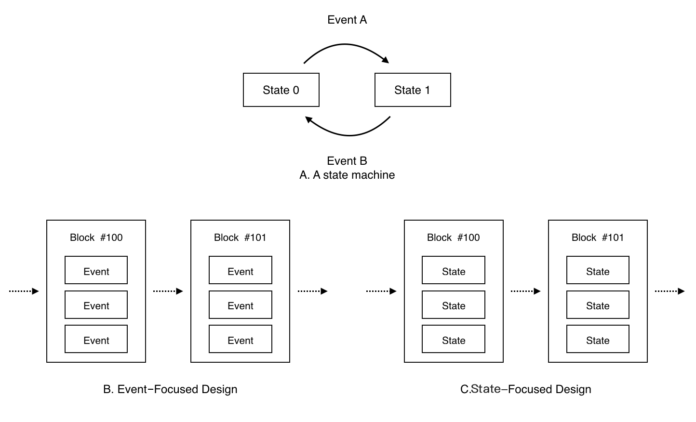
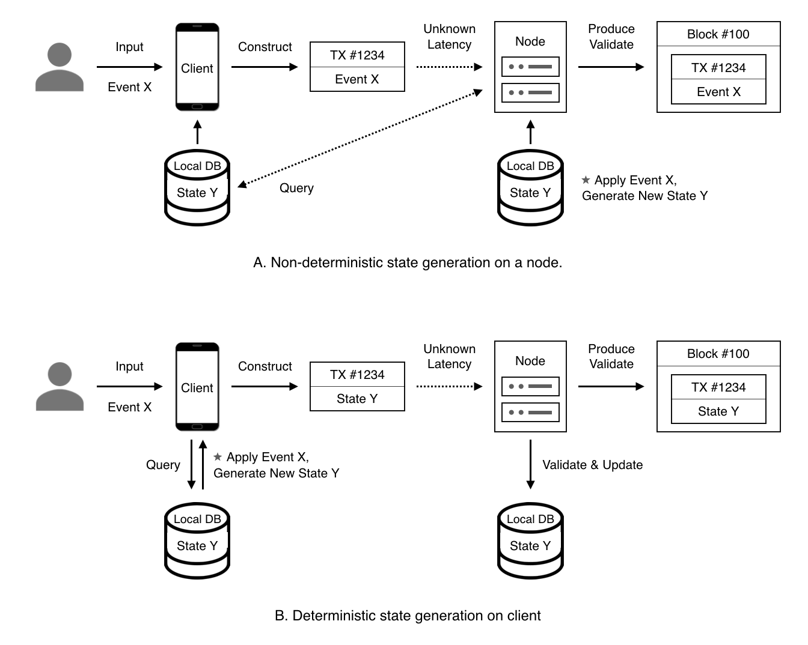
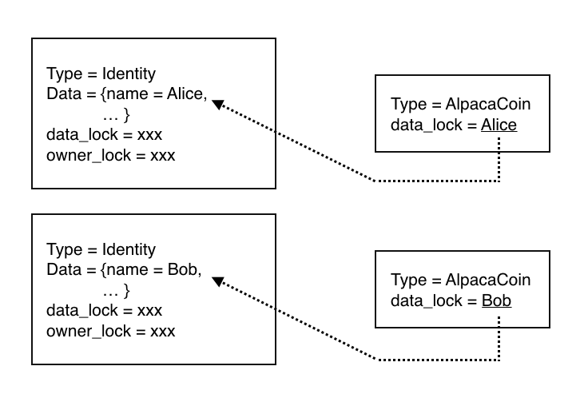
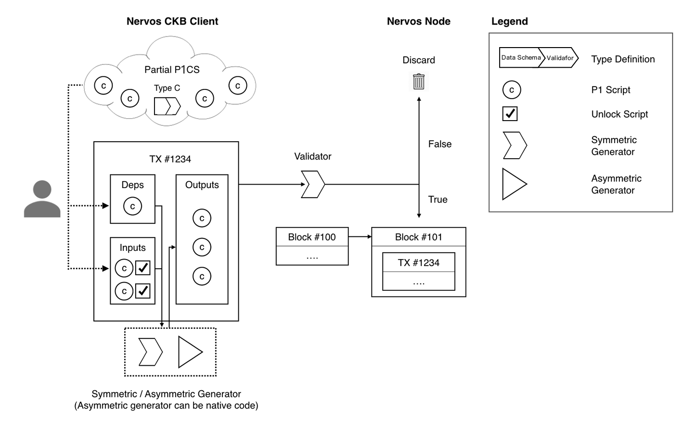

# Nervos CKB: 区块链和应用程序的CKB

## 概要

本文档为Nervos网络的核心Common Knowledge Base（CKB）提供一个概览性的描述。Nervos是一个分层架构的分布式应用网络；CKB则是Nervos网络中的layer 1，是一个可以为Nervos网络中所有分布式应用提供数据、资产与身份服务的共同知识库。

## 目录

1. 目的
    1. 背景
    1. 问题
    1. 愿景
2. Nervos CKB
    1. 状态生成和验证 
    2. Cell 
       1. 生命周期 
       2. 类型 
       3. 身份 
    3. Transaction 
    4. Generator 
3. 架构
    1. 分层网络
       1. 共识层 
       2. 生成层
    2. Nervos节点
       1. 轻客户端
    3. 混合共识
4. CKB Token
    1. 经济学
    2. 治理机制
    3. 流动投票 
5. 总结	
6. 参考文献
7. 附录
    1. Common Knowledge Base
    2. 通用共同知识库（General Purpose Common Knowledge Base）

## 1. 动机

### 1.1  背景

共识算法追求在网络延迟和各类节点故障存在的情况下实现两个目标：正确性和性能。正确性又包括一致性（指分布式系统中每一个节点的数据副本完全相同）以及可用性（指分布式系统能够在有限的时间内响应用户的请求）。性能也包括两个方面，一是交易延迟（即从客户端提交Transaction到客户端获得确定性结果所需要的时间，越短越好）；二是吞吐量（即系统每秒中可以处理多少笔交易）。

公有链运行在开放的分布式网络中，节点可以自由的加入和退出，在线节点不固定且变更频繁，这些都是传统BFT共识算法很难处理的问题。中本聪（Satoshi Nakamoto）巧妙的引入经济激励以及概率性共识应对这些难点[2]，因此要保证正确性需要额外的开放性与公平性。开放性使共识节点的加入退出无阻碍，无论是有100000个节点还是1个节点，公有链都能正常工作；公平性使共识节点可以获得与所付出的努力成比例的回报。公有链共识算法的性能指标除延迟和吞吐量外，还需要考虑运行开销。

以比特币工作量证明（Proof of Work）为代表的Nakamoto共识拥有极佳的开放性和可用性，比特币网络中的节点可以任意的加入和退出，网络性能随着共识节点数量的增加能够保持不变。但Nakamoto共识吞吐量低，以比特币7笔交易每秒的处理速度，难以消化商业场景的日常需求。即使通过次级通道技术（例如闪电网络）将大部分交易转移到链下，通道的建立与关闭依然受到链上处理速度的制约，在网络拥堵时甚至会影响到次级通道的安全性。Nakamoto共识以区块投票，交易确认速度慢，通常需要10分钟到一个小时，用户体验不佳。在分区的情况下，比特币网络能够继续提供服务，但交易是否被完全确认无法保证，无法满足对交易确定性要求较高的商业场景。

经历了30年发展的传统拜占庭容错（Byzantine Fault Tolerance）共识可以实现媲美中心化系统的吞吐量和交易确认速度，但其开放性不佳，节点动态增减难度大，网络性能随参与共识的节点数量增加而迅速下降。传统BFT共识对故障的容忍能力较低，在网络分区时节点无法达成一致，网络无法正常提供服务，难以满足公有链对可用性的要求。

比特币是世界上第一个区块链网络，专门为记录现金账本设计。比特币账本是比特币区块链网络维护的系统状态，账本中的最小存储单位是UTXO（未花费的交易输出）。用户可以使用钱包花费现有的UTXO，生成新的UTXO，并将其打包成交易，发送到比特币网络中接受验证和共识。UTXO中记录了金额以及表达所有权的锁脚本，用户必须提供相应的解锁数据才能够花费UTXO。由于UTXO数据结构以及比特币脚本能力的限制，我们很难使用比特币账本来记录其他类型的资产和数据，只能通过Color-coin、Meta-coin甚至硬分叉这样的方案来满足不同的场景，实现应用的代价很高。

以太坊通过智能合约引入通用性计算，创造出了一个基于智能合约实现的生态。以太坊账本是以太坊区块链网络维护的系统状态，账本由账户构成，账户内部可以存放代码，并提供一个256bits KV数据库存放数据，这样存放了代码的账户就是以太坊智能合约。用户在以太坊上可以发出两种类型的交易：一种交易可以创建合约，将用户编写的应用逻辑部署到区块链上，存放到合约账户中；另一种交易可以将用户提供的输入数据发给指定的合约账户，触发账户所保存的代码的执行，由代码产生更新账户内的KV数据库，产生新的内部状态。以太坊智能合约提供了更强大的计算能力以及灵活性，在一定程度上解决了比特币的问题，但依然有其局限性：

- 性能难扩展：以太坊以状态机事件作为设计中心（图1），交易中包含的是状态机事件输入，而不是状态本身，再加上EVM的图灵完备性，节点在处理交易之前难以判断交易相关性，难以对交易进行并行处理。同时，由于交易中没有包含账本状态，分片时还需要额外解决数据可用性难题。

- 状态不确定性：合约状态由合约代码更新，而合约代码执行又受执行环境影响（例如被调用合约的当前状态）。因此用户在发起交易时无法完全确定交易执行后的结果。

- 单体合约(Mono-Contract)：以太坊智能合约将计算和存储紧紧绑定，形成一个不可更改的整体。用户必须使用账户模型、EVM字节码以及256bits KV数据库范式来实现所有场景，缺乏效率和灵活性。

现有区块链的经济模型也面临着越来越多的挑战。随着用户和应用的增多，区块链上存储的数据也越来越多。现有的经济模型只考虑计算成本，使得用户产生的数据可以无成本的占用所有节点的存储空间。网络中使用的代币价格波动性极大，在代币价格上涨时为应用使用者制造了难以承受的手续费负担

### 1.2  问题

随着越来越多的应用程序出现，区块链技术在通用性、可扩展性、激励设计和信任模型方面都显示出了局限性。它们不能满足当今现实应用程序日益困难的需求。

现有的区块链追求完全的去中心化，即要求网络中的节点完全对等。在完全对等的节点间完成数据复制的需求，不仅降低了交易的速度，还增加了这些网络的计算和存储成本。这极大的限制了区块链自身的设计空间，难以应对越来越广泛的应用需求。随着区块链状态膨胀，运行全节点对硬件的要求越来越高，运行全节点的用户也越来越少。同时，用户使用互联网服务的模式已经完成了从桌面浏览器到移动应用的迁移，更加剧了完全对等设计的弊端。区块链节点类型分化已成为必然趋势。

### 1.3  愿景

综上，我们重新思考并设计了Nervos CKB，提出彻底解耦的分布式应用新范式，以支持更普遍的计算和存储需求，获得更好的性能，使经济激励更平衡，对移动设备更友好。我们希望Nervos CKB可以成为全球76亿人的共同知识库，承载各种分布式应用。

| | Bitcoin | Ethereum | Nervos CKB |
|-|---------|----------|------------|
|Knowledge Type|Ledger|Smart Contract|General|
|Storage|UTXO|Account K-V Store|Cell|
|Data Schema|N/A|N/A|Type|
|Validation Rule|Limited(Script)|Any(Contract)|Any(Validator)|
|State Write|Direct(User)|Indirect(EVM)|Direct(User)|
|State Read*|No|Yes|Yes|
<div align="center">表1：比特币、以太坊 (Ethereum)和Nervos CKB的比较 (*State Read仅指链上的可读性，即在链上验证过程中状态是否可读。链的状态在链外是不受影响的。)</div>

## 2. Nervos Common Knowledge Base

CKB提出一种全新的分布式应用范式，该范式由以下五种元素组成：

- Cell
- Type
- Validator
- Generator
- Identity

通过这五种元素，我们将分布式应用彻底解耦成计算、存储和身份三个方面。在此基础上，计算进一步分化为生成（Generator）和验证（Validator）两个步骤，存储（Cell）也进一步通用化，可以支持任意结构化（Type）的数据。CKB中的分布式应用，可以使用Type定义合适的数据结构，将应用数据存放在多个Cells中；应用的执行逻辑由Generator实现，状态验证逻辑由Validator实现；Generator在客户端运行，用户进行操作时生成新的应用状态，新状态被打包在交易中发送到全网；网络中的节点先验证交易发送者的身份，然后使用Validator对交易中新状态的有效性进行验证，验证通过后将新状态保存到CKB中。

CKB以状态为核心设计数据流及经济激励，交易中包含的是新的状态，而不是触发状态机的事件。因此，CKB区块链中直接保存了状态数据，状态随着区块一起同步，无需额外的状态同步协议，降低了系统复杂度，提高了系统可用性。分布式应用的状态被剥离到Cells中保存，Validator和Generator内部没有任何状态，计算结果完全依赖输入，因此都是确定性的纯函数（Pure function），容易组合形成更复杂的逻辑。


<div align="center">Figure 1. Event-focused vs. State-focused Design</div>

### 2.1 状态生成和验证

Nervos网络可以使用相同的算法进行状态生成和验证。在这个模型中，客户端使用该算法生成新的状态，节点利用交易中记录的依赖状态作为输入，执行同样的算法，对比输出的状态是否与交易中记录的新状态相同，相同则验证通过。

在使用相同算法的情况下，状态生成和验证只有执行环境的差别，没有计算复杂度的差别。将生成和验证分离，生成转移到客户端执行的好处是：

- 确定性：交易的确定性是分布式应用的核心诉求之一。交易时延的确定性（[Hybrid Consensus](#hybrid-consensus)）已经得到了广泛的重视，但交易结果（即由交易产生的新状态）的确定性却往往被忽视。如果状态在节点生成，用户在发起状态生成请求时无法完全确定请求被执行时的环境，由此可能产生用户不希望的执行结果。在CKB中，由于新的状态由用户生成，由用户完全确定新状态之后再广播，交易所能触发的状态变更用户可以完全确定。要么交易通过验证，由用户生成并确认的新状态被接受，要么交易没有通过验证，不造成任何状态改变（图2）。

- 可并行性：如果状态在节点生成，节点在处理交易前无法判断该交易依赖哪些状态，也就无法判断交易的相关性。在CKB中，由于交易显式地包含了交易依赖的旧状态以及生成的新状态，节点可以直接判断交易之间的相关性（[Transaction](#transaction)）。无相关性的交易可以通过各种方式并行处理，包括多核并行及分片。并行处理交易是解决区块链性能扩展问题的关键。

- 计算分布式程度高：充分利用客户端计算资源，减轻节点计算负担，整体效率更高。

- 灵活性：虽然使用相同的算法，但是生成和验证可以使用不同的方法实现。客户端可以灵活选择合适的编程语言来实现生成算法，计算效率可以更高，生成程序可以无缝集成到运行平台中，提供最好的用户体验。

对于许多特定类型的场景，我们可以找到计算复杂度远低于生成算法的验证算法，最典型的例子是UTXO账本和零知识证明。还有其他涉及排序和搜索的算法：平均复杂度最好的排序算法QuickSort的计算复杂度是`O(NlogN)`，而验算排序的复杂度总是只有`O(N)`；如果要搜索一个元素在数组中的位置，在数组已经排好序的情况下计算复杂度为`O(logN)`，而验算的复杂度是`O(1)`。对于越复杂的场景，出现生成与验算复杂度不对称情况的概率更高。

在可以利用这种不对称性的情况下，节点处理效率会有极大的提升，更多的计算细节只存在于客户端，也更有利于算法保护和隐私保护。随着密码学技术的发展，我们可能会发现为通用问题设计非对称生成和验证算法的方法，例如通用的非交互式零知识证明。CKB的状态生成与验证分离架构也能够为其提供恰到好处的支持。


<div align="center">Figure 2. Non-deterministic vs. Deterministic State Generation</div>

### 2.2  Cell

下文将对CKB的Cell数据模型及交易数据结构作示意性的描述，目的是更好的解释CKB的功能。在CKB的具体实现中，需要考虑包括激励一致、执行效率在内的其它因素，数据结构会更为复杂，相关细节将在专门的技术文档中描述。

CKB中数据的可信度来源有两种，一种是数据可以客观验证，一种是数据经过特定身份用户的背书。因此，CKB中数据的最小单元必须包含以下要素：

- 数据本身
- 数据的验证方法
- 数据提交者的身份

Cell是CKB中的最小数据单元，可以存放任意的数据。Cell包含以下基本内容：

- type：Cell的数据类型。
- capacity：Cell容量，可存放数据的最大字节数。
- data：Cell实际存储的二进制数据，可以为空。包含data在内，cell占用的字节数总是小于等于capacity。
- owner_lock：通过脚本表示的Cell所有者。Cell所有者可以转让Cell。
- data_lock：通过脚本表示的Cell使用者。Cell使用者可以更新data。

Cell一旦创建无法更改，是一种不可更改（immutable）的数据单元。对Cell的更新，实质上是通过创建所有权相同的新Cell来实现。用户通过交易提交包含新数据的新Cell，同时使老的Cell失效（见[Life Cycle](#life-cycle)）。因此，CKB也可以看作是一个支持版本的数据仓库，最新的Cells代表了数据仓库的当前版本，已经失效的Cells代表了数据仓库的历史。

对Cell的操作权分为两种，所有权和使用权。Cell的owner_lock规定了所有权，即转让Cell capacity的权利；Cell的data_lock规定了使用权，即创建新的Cell来更新Cell内容的权利。Cell capacity可以一次全部转让，也可以部分转让，部分转让会创建新的Cell（比如一个capacity为10的cell变成两个capacity各为5的cell）。Cell capacity的增长速度由[共识参与度](#economics)及[流动投票](#liquid-voting)决定。

Cell的lock脚本由CKB支持的虚拟机执行，用户在更新Cell数据或是转让Cell时需要提供相应的证明作为lock脚本输入，如果lock脚本执行结果为True则证明用户具有相应的权限，可以进行操作。

lock脚本表达了Cell的操作权限，可以代表单用户，也可以是门限签名或者更复杂的权限。Cell具有很好的隐私性，用户通过使用不同的lock脚本，可以很轻松地使用不同的假名（Pseudonomy）来管理自己的Cells。Cell的所有者和使用者可以是相同的用户，也可以是不同的用户，这也意味着CKB使用者不需要拥有Cell就可以使用CKB，使用门槛低。

#### 2.2.1  生命周期

Cell生命周期有两个阶段，新创建的Cell处于第一个阶段P1。Cell是不可变数据对象，一旦被创建其内容不能被修改，Cell的更新通过Transaction实现：Transaction以需要被更新的P1 Cell作为输入，以Generator产生的包含新状态的P1 Cell作为输出。

一个P1 Cell只能被使用一次，不能被用作两个不同Transaction的输入。P1 Cell被使用后进入第二个阶段P2，P2 Cell不能再用作Transaction输入。我们把所有的P1 Cells形成的集合称为P1 Cell Set（P1CS），P1CS中存储了CKB当前所有的共同知识；所有的P2 Cells形成的集合称为P2 Cell Set（P2CS），P2CS中存储了CKB所有的历史状态。

CKB网络上的全节点只需要P1CS就可以验证Transaction，P2CS可以按照一定的策略清理。P2CS可以保存在存档节点（Archive Node）或者是分布式存储网络上。CKB轻节点只需要保存区块头和特定的Cells，不需要保存完整的P1CS和P2CS。

#### 2.2.2 类型

CKB为Cell提供了类型系统，用户可以创建自定义的Cell类型。通过类型系统，我们可以在CKB中定义不同结构的共同知识以及相应的生成验证规则。

创建新的Cell类型需要定义Data Schema和Validator两个要素：

- Data Schema: 定义新类型的数据结构。
- Validator: 定义新类型的验证程序。

Data Schema和Validator的定义也是一种共同知识，存放在Cell中。每一个Cell都有一个且仅仅一个类型，多个Cell可以属于同一个类型，也可以属于不同的类型。

Data Schema提供该类型的数据结构定义，使Validator可以理解和使用Cell中保存的数据。Validator为验证程序，由每一个节点使用CKB支持的虚拟机执行，以交易的Deps, Inputs和Outputs作为程序输入（[Transaction](#transaction)），能够通过验证就返回True，不能则返回False。Cell的创建、更新和销毁可以使用不同的验证规则。

#### 2.2.3  身份

Identity是一种系统类型，用户可以任意创建属于自己的Identity Cell。Identity Cell可以作为Cell `data_lock``owner_lock`使用，Cell更新或者转让时，需要提供对应Identity Cell `data_lock`的解锁脚本（图3）。

Identity是广义的身份，Identity可以对应个人或者机器实体的任何身份侧面。Identity是Nervos网络中分布式身份协议NIP（详见Nervos Identity Protocol Paper）的基础。通过NIP，Nervos网络引入CA证书，可以兼容现有的PKI体系，用户可以表达自己的社会身份，分布式应用可以基于身份构建。Identity Cell中可以存放公开身份信息，或者是身份信息摘要，由用户在必要时与分布式应用交互，提供所需的详细信息。


<div align="center">Figure 3. Identity Cell</div>

相对于UTXO或是账户，Cell是一种更加通用的存储模型。UTXO模型和账户模型都可以表达资产和所有者之间的关系：UTXO以资产为基础定义所有权（锁脚本），账户则以所有者为基础记录资产（账户余额）。UTXO模型中的帐目变动更清晰，但显式账户概念的缺乏使表达能力本就欠缺的脚本更加难以使用，也无法记录权限等账户元信息。账户模型容易理解，可以很好的支持身份和权限系统，却有交易难并发的问题。支持类型和Identity的Cell设计集成了这两种模型的优点，创造了一种更加通用的数据模型。

### 2.3  Transaction

Transaction表达了Cells的转让和更新。在一个Transaction里面用户可以转让Cell，或是更新一个或者多个Cell的内容。Transaction包括以下基本内容：

- deps 依赖集合，对交易进行验证所依赖的只读数据，只能是P1 Cells的引用或者用户输入。
- inputs 输入集合，包含需要被转让更新的Cells，只能是P1 Cells的引用及相应的解锁脚本。
- outputs 输出集合，包含新产生的P1 Cells。

由于Cell的不可变更性，更新Cell时不会直接修改旧的Cell，而是会产生一个新版本的Cell，这些Cell版本可以前后衔接在一起，形成Cell的“版本链”：某一次Cell capacity转让时创建了这个Cell的第一个版本，对Cell的后续更新形成了这个Cell的一系列历史版本，在版本链的最后(Head)是Cell的最新版本。CKB是所有Cell版本链的集合，所有Cell Heads的集合是CKB的当前版本。

CKB Cell模型和Transaction的设计使CKB对轻节点更友好。由于所有的状态都在区块中，区块同步协议也支持了状态同步。轻节点只需要同步区块，不需要计算（生成状态），就可以获得新的状态。如果区块中只保存事件，则需要全节点支持额外的状态同步机制。在缺乏激励的情况下，区块链协议之外的额外机制很难大范围的部署。在区块链协议内同步状态，使轻节点与全节点之间的地位更平等，系统更加健壮和去中心化。


<div align="center">Figure 4. Transaction Parallelism and Conflict Detection</div>

CKB Transaction中包含的`deps`和`inputs`使节点可以方便地判断交易间的依赖关系，对交易进行并行验证（图4）。Transaction中可以混合多种类型的Cell，可以方便的实现跨类型的原子性操作。

### 2.4  Generator

Generator是生成程序，用来生成符合类型定义的新的Cells。Generator在发起交易的客户端本地执行，以用户的输入以及现有的Cells作为输入，生成包含新状态的Cells作为输出。Generator用到的输入以及产生的输出共同构成一个Transaction（图5）。

通过定义Data Schema, Validator和Generator，我们可以在CKB中实现任意共同知识的验证和存储。例如，我们可以定义一个`AlpacaCoin`的新类型：

```javascript
Data Schema = {amount “uint”}

 pseudo code of checker check()
 1. 检查inputs列表中的项都有正确的解锁数据
 2. 计算inputs列表中AlpacaCoin的amount之和IN
 3. 计算outputs列表中的AlpacaCoin的amount之和OUT
 4. 比较IN和OUT是否相等，并返回结果
Validator = validate(context ctx, inputs, outputs)

 pseudo code of generator gen()
 1. 查找用户能够花费的，属于AlpacaCoin类型的Cells
 2. 根据用户输入的转账地址和金额，生成类型为AlpacaCoin的属于收款人的Cell和找零Cell
 3. 返回被使用的Cells列表，以及新生成的Cells列表，这些Cells将用于构造交易
Generator = gen(context ctx, address to, uint amount, ...)
```


<div align="center">Figure 5. Transactions, Generations, and Validations</div>

## 3.  架构

### 3.1  分层网络

在Nervos网络中，CKB和Generator构成上下层的关系。

#### 3.1.1  Common Knowledge Layer

CKB是Nervos 网络的基础。CKB作为最底层，拥有最广泛的共识，为Dapp提供数据存储。CKB只关心Generator产生的新状态，不关心状态产生的具体方式。

#### 3.1.2  Generation Layer

生成器构成实现应用程序逻辑的数据生成层，可以以许多不同的方式实现(图6)。


<div align="center">Figure 6. Layered Structure</div>

分层架构将数据与计算分离，使每层都可以获得各自的灵活性与可扩展性，使用不同的共识协议。CKB作为最底层，拥有最广泛的共识，是整个Nervos网络的基础。不同的应用所需要的共识范围不同，强制所有应用都在最广泛的共识下进行会导致效率低下。在Nervos网络中，业务参与方可以根据自己所需的共识范围选择合适的Generator，只在需要与局部共识范围外的其他服务交互时，将局部状态提交到CKB上，使其获得更广泛的认同。

Generator可以包括（但不限于）以下几种形式：

- 客户端：在用户设备上直接运行Generator生成新状态。

  通过轻客户端提供的接口或是客户端程序库，生成算法可以用任何编程语言实现。

- 状态服务：用户使用中心化服务，由服务器执行生成算法，生成新状态。
 
  目前所有的互联网服务都可以通过状态服务的方式使用CKB，使服务状态数据获得更大的信任和流动性。例如，游戏公司可以使用状态服务架构，在中心化服务中执行游戏逻辑，生成道具信息；在CKB中定义道具类型和总量等规则，将生成的道具登记并确权。
 
  结合Nervos Identity Protocol，信息发布机构提供基于身份的可信Oracle，为Nervos网络中的其他服务提供必要的信息。

- 状态通道：两名或多名用户使用点对点网络连接通信，共同生成新的状态。

  状态通道的参与者可以通过CKB登记和获取参与者信息，建立通道连接。参与者可以在CKB上提供保证金，使其它参与者相信通道能够顺利运行。状态通道参与者之间可以使用共识协议或是多方安全计算技术来生成新状态。

- 生成链：一个用于生成CKB新状态的区块链。

  生成链可以是公有链（例如任何使用EVM的区块链），也可以是许可链（例如CITA以及Hyperledger Fabric）。使用许可链可以将状态计算限定在一定参与范围内，保护计算隐私，同时获得很好的性能。在应用链中，参与者共同执行状态生成并相互验证计算过程，在状态需要更广泛共识时，将其提交到CKB中，使之成为接受度更高的共同知识。

### 3.2  Nervos 节点

Nervos CKB(简称CKB)设计为通用通用知识库(附录:通用知识库)。CKB网络由三种节点组成:

- 归档节点：CKB网络中的完整节点。它们验证新的块和事务、中继块和事务，并将所有历史事务保存在磁盘上。归档节点可以提高系统的整体健壮性，并为历史数据提供查询服务。 
- 共识节点:共识参与CKB网络中的节点。协商一致节点侦听新的事务，将它们打包为块，并在新的块上实现协商一致。协商一致节点不必存储整个事务历史。
- Light Clients：用户与CKB网络与光客户交互。它们只存储非常有限的数据，可以在台式电脑或移动设备上运行。

CKB节点组成对等的分布式网络，以中继和广播块和事务。协商一致节点运行混合协商一致协议(混合协商一致)，在一定的时间间隔内对新创建的块达成一致。新的块将被所有节点识别并添加到CKB区块链的末尾。新块中的事务将更新CKB的状态。

#### 3.2.1    轻客户端

节点完全对等的区块链架构已经受到了严重的挑战。公有链网络上节点性能参差不齐，对等节点架构不仅对用户硬件要求越来越高，也无法充分发挥高性能节点的潜力。越来越多的用户放弃运行全节点，转而使用轻客户端以及中心化客户端。全节点需要对所有区块和交易数据进行验证，对信任依赖最小，但开销最大，使用非常不便。中心化客户端则完全信任中心服务器提供的数据，放弃了验证。轻客户端则通过稍微增加对全节点的信任，大大降低了验证开销，对用户体验有很大的提升。

同时，移动设备已经成为人们日常使用互联网服务的主要设备，原生应用也越来越流行。因此，对移动设备友好是CKB的设计原则之一，Nervos应用应该能够流畅的运行在移动设备上，与移动平台无缝的衔接。

CKB支持轻客户端。CKB使用可证数据结构组织区块头，可以极大地加快轻客户端的同步速度。得益于CKB以状态为中心的设计，轻客户端无需重复计算就能够方便地直接同步到最新的状态（P1CS）。使用本地保存用户关心的少量P1 Cells及网络带宽，轻客户端可以提供更好的分布式应用体验。

### 3.3  混合共识

在研究和实践中我们认识到，传统BFT算法在正常路径下逻辑简单，但需要以复杂的逻辑应对故障情况；Nakamoto共识则以不变应万变，无论是正常还是故障情况都是同样的逻辑，但也因此影响了正常路径下的系统性能。如果将Nakamoto和传统拜占庭容错两类共识协议有机的结合在一起，新的混合共识在一致性、可用性、公平性及运行开销等方面可以形成最佳组合[3][4]。

CKB将按照混合共识的思路，设计并实现自己的混合共识算法，为交易提供见证。通过将Nakamoto共识和传统BFT共识结合，我们既可以保留开放性和可用性，又可以在正常路径下获得传统BFT共识的优秀性能，将交易时延降到最低，最大程度的提升系统吞吐量。

CKB混合共识的详细设计请参考CKB Consensus Paper。

## 4. CKB Token

### 4.1  经济学

一个优秀的经济激励制度应该引导区块链的参与者为这个自治共同体作出贡献，最大化区块链的效用。

CKB经济模型应该能够激励用户、开发者和节点运行者合力为共同知识的形成与保存贡献力量。CKB的经济模型同样以状态为核心进行设计，通过Cell Capacity增发和手续费两部分奖励产生激励。

CKB状态的形成与存储都需要一定的成本。状态的形成需要节点验证，消耗计算资源，状态的存储则需要节点持续提供存储空间。现有的公有链经济模型只在处理交易时收取一次性手续费，一旦数据上链成为共同知识，则可以无需再付出任何成本，永久占用所有节点的本地空间。

在CKB中，Cell是状态的存储单元。未被占用的Cell Capacity可以转让，具有流动性，但是被占用的Capacity不能被转让，失去流动性。因此，Cell的使用者需要为状态的存储支付流动性作为成本。Cell的使用时间越长，需要付出的流动性成本越高。通过使用流动性成本而不是预付费的方式，避免了预付费用完导致Cell被强制回收的问题。Cell Capacity的价格是对CKB中共同知识价值的直接度量。

Cell的使用者和所有者可能是不同的，所有者可以帮使用者支付流动性成本。更新Cell中的数据或是转让Cell Capacity则需要支付手续费。共识节点可以设置自己愿意接受手续费水平，交易手续费高低是由市场决定的。手续费也可以由Cell所有者代替使用者支付。

当前主流用户难以使用区块链的一个重要原因是，交易手续费必须以原生代币进行支付，由此要求用户在使用服务之前自行寻找方法先获取原生代币，提高了使用门槛。另一方面，用户已经习惯了基本服务免费，增值服务收费的商业模式，无论做什么都要收费也不符合主流用户习惯。CKB通过允许Cell所有者代替用户付费的设计解决了这两个问题，为应用开发者提供了更多的商业模式选项。

除了用于支付共同知识的形成和存储成本，Cell Capacity还可以被用在共识抵押、流动投票等多个场景中。CKB的安全程度与共识节点抵押的代币数量息息相关。共识抵押代币越多，节点作恶成本越高，整个系统也更加安全。CKB的Cell Capacity增发调节的目标之一是保证一定的共识保证金抵押水平，以此保证系统安全。通过调节增发比例，调节共识参与者可以获得的无风险收益比例，进而调节共识的参与度。

CKB经济模型的细节请参考Nervos CKB Economic Paper。

### 4.2  治理机制

作为Nervos网络的基础设施，CKB必须能够与其所承载的生态同步进化，在不间断运行的同时进行调整运行参数，或是进行更深程度的网络升级。从区块链发展历史中我们能够看到，社区达成共识或是网络升级的成本过高将会阻碍创新，使网络难以进化，无法生态发展的需求。

因此，CKB内置了流动投票和热部署机制，使CKB成为一个能够自我进化的分布式网络。

### 4.3  流动投票

投票机制对Nervos系统的长期稳定至关重要。比如说，CKB的运行依赖一组系统参数，其中有一些能够自动调节，有一些需要进行投票达成共识；CKB的代码中可能会有bug，修复方案有可能需要投票共识；随着Nervos生态的发展，CKB的功能需要持续升级，实现和部署新的功能也需要投票共识。因此，投票工具是CKB长期稳定运行必不可少的组件之一。

CKB支持流动投票[5]（图7）。每一位Cell所有者都可以参与到与CKB发展有关的决策中来，投票权重由用户所持有的Cell Capacity决定。在流动投票中，用户可以设置自己的投票代表，由其进行代理投票。投票代表也可以设置自己的投票代表。考虑到提案专业度和参与激励的问题，不同的提案可以设置不同的接受条件，例如参与率和支持率。

值得注意的是，CKB流动投票是Nervos社区共识的表达工具，不是共识形成工具。在投票之前，社区应该利用各种沟通工具对提案进行细致的考察，事先形成粗略共识。

CKB流动投票细节请参考Nervos Governance Paper。


<div align="center">Figure 7. Liquid Voting</div>
得益于Cell数据模型的抽象性，CKB的功能模块可以利用Cell来实现和存放。我们把承担CKB系统功能的Cell称为Neuron，Neuron实质上是一种特殊的Cell类型，其使用者是CKB自身。

在功能变更升级提案被实现为Neuron之后，社区使用流动投票对是否部署进行表决。在获得社区共识后，新的Neuron将被部署到链上，修复系统bug或是提供新的系统功能。细粒度的Neuron升级能够大大降低CKB的进化难度。

## 5. 总结

Nervos CKB为一个全新的分布式应用网络提供了共同知识层。Nervos CKB以状态为中心设计，采用更为通用的存储模型，更好的平衡了激励机制，得到了一个更具可扩展性的分布式应用范式。

## 6. 参考文献

1. Alonzo Church, Lambda calculus, 1930s
2. Satoshi Nakamoto, “Bitcoin: A Peer-to-Peer Electronic Cash System”, 2008
3. Vitalik Buterin, Virgil Griffith, “Casper the Friendly Finality Gadget”, 2017
4. Rafael Pass, Elaine Shi, “Thunderella: Blockchains with Optimistic Instant Confirmation”, 2017
5. Bryan Ford, “Delegative Democracy”, 2002

## 7. 附录

### 7.1  Common Knowledge Base

共同知识（Common Knowledge）是被一个群体共同接受的数据，群体的参与者不仅自己接受该知识，还知道群体中的其他人同样接受该知识。一般的，我们可以根据形成方式将共同知识分为三种：

- 第一类是依赖其“可独立验证性”来被参与者接受的。例如，“11897 是一个质数”这个论断的提出者如果可以同时提交一份如何验证一个数字是质数的算法，就可以在不需要信任的前提下取得他人对这个论断的共识，进而促成交易。

- 第二类共识通常需要一个可信的权威，科学发现者在提交新发现的同时也需要提交独立验证的方法，在经过科学社区独立验证后，承认并把该发现作为领域共同知识的一部分。大众则是通过对科学方法和科学社区的信任而建立对这条共同知识的信任。

- 第三类型的共同知识是以信任和声誉为基点的，因而存在共同知识提交方信任和声誉能辐射到的范围。也就是说，商业场景中的一则数据如果能够成为交易参与者都能接受的 共同知识从而促成交易，交易的参与者必须对该数据产生者有足够的信任。共同知识是促成交易发生的必要条件。比如说在中心化交易所的场景里，交易是基于对交易所本身的信任，以及由此推及的报价数据的准确性和交易的公平性而产生的。 在信用卡境外消费的场景里，消费者和商家完成交易的前提是双方对包括双方银行和信用卡公司等中间机构的信任

过去，共同知识需要群体内的个体之间进行各种繁杂的交流和相互确认才能形成，之后分散记录在个体的大脑中。今天，基于密码学和分布式技术的区块链使得共同知识的产生和保存发生了质的变化。人们不再需要反复沟通以确保新知识在人群中达成一致，也不再需要将知识记录在空间有限的大脑中。区块链世界中的每一条数据，包括数字资产和智能合约都是共同知识，他们经过了全体节点的一致共识，以极低的成本在区块链中不断的形成和沉淀，却比一般的数据蕴含了更大的价值。

区块链是共同知识库。加入一个区块链网络意味着共同验证并认可网络中的知识。交易经过节点验证之后，与相关的证明一起被保存在区块链中。区块链的每一位使用者都能够确信区块链中的交易有效，也能够确信其他使用者认可区块链中的交易有效。

### 7.2  通用共同知识库

让我们考虑一个适用于形成和存放任何类型共同知识的通用共同知识库（General Purpose Common Knowledge Base）。它应该具有以下特征：

- 以状态为核心，而非以事件为核心（图1）。
- 数据模型足够抽象和通用，允许用户自定义业务数据模型。
- 共同知识的验证引擎足够抽象和通用，允许用户自定义数据验证规则。

如果说分布式账本是数字资产的“结算层”，通用共同知识库则可认为是各种类型共同知识的“结算层”。Nervos CKB的目标是成为一个通用共同知识库，作为整个Nervos网络的公共状态层，为上层应用提供状态与信任基础。

“The various ways in which the knowledge on which people base their plan is communicated to them is the crucial problem for any theory explaining the economic process, and the problem of what is the best way to utilizing knowledge initially dispersed among all the people is at least one of the main problems of economic policy - or of designing an efficient economic system.”

《知识在社会中的应用》，弗里德里希·哈耶克，1945
