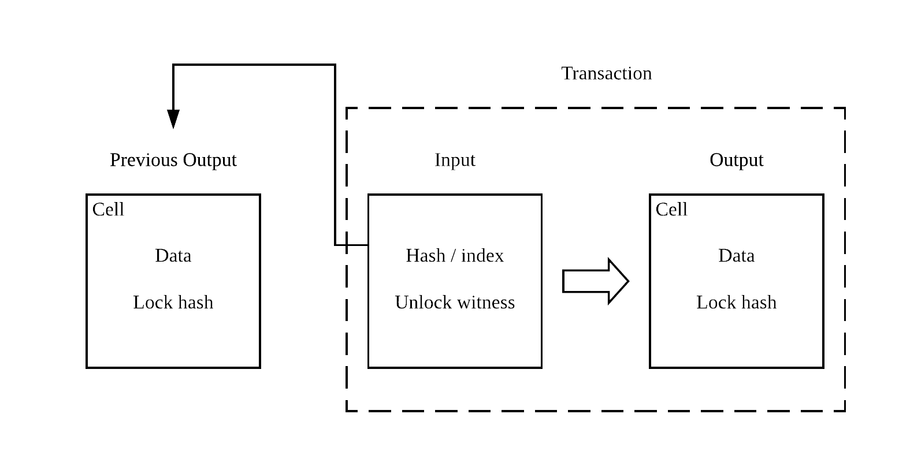
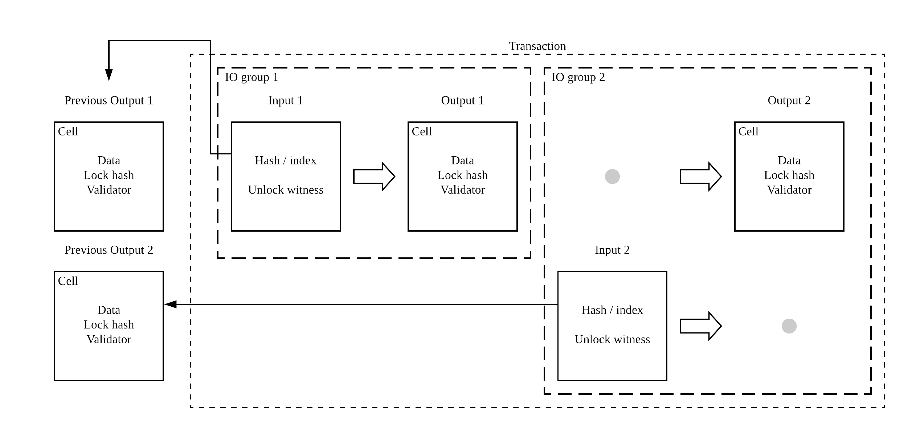

# Contract

```
Author: Xuejie Xiao <x@nervos.org>
Category: CKB
Start Date: 2018-08-27
```

## Overview

This RFC proposes several changes on current contract execution model to achieve following goals:

* Cell type schema and validator execution flows are finalized
* Communication solution between different contracts within a transaction is defined

Note that all sample code and examples in this RFC will be written in Ruby due to the following reasons:

* It is already been proved that CKB VM can run Ruby by running a Ruby VM directly
* The main goal here is to explain how CKB contract works here, not achieving absolutely minimal resource usage
* Most(if not all) of the team members already know Ruby, plus Ruby is easy to read.

## Recap

Right now, transaction execution flow is as follows:



1. Existing UTXOs, also known as `Cells` in CKB, has a data field as well as data/owner locks. For space consideration, each lock here only consists of a single lock script hash.
2. In a transaction, an input would reference a UTXO with the actual unlock script(whose hash should match the lock script hash in UTXO) and unlock script data. When we execute the script together with the data on CKB VM, it should return success.
3. The output of the transaction is also a UTXO(if there is one), which will also contain data field and data/owner locks. Existing or new unlock script hash could be used here in each lock.

## Concepts

Several concepts to current contract execution flow are proposed here.

### IO Group

First, IO group is added to transactions: A transaction is divided to one or more IO groups, each IO groups can contain one or more of the following cell actions:

* Create: a new output cell is created
* Transform: an existing input cell is transformed to a new output cell
* Destroy: an existing input cell is consumed, no output cell is created

A transaction is either all accepted, or all rejected, it's not possible to accept only some IO groups in a transaction. Refer to later sections on how IO group can affect transaction.


With the exception of coinbase transactions, all transactions should satisfy the property that the sum of capacities of all output cells must not exceed the sum of input capacities of all input cells.

### Cell Type


In the whitepaper CKB defines `cell type`, which consists of schema and validator. But the format of them are never settled. This RFC will define what schema and validator will look like.

#### Schema

Schema provides a handy way to access binary data stored in the designated cell. In CKB, schema is implemented as a dynamic linked library for CKB VM. Once loaded, it can provide one or more utility functions to parse and read cell data. For example, a weather oracle cell can provide the following schema to read current weather:

```c
int temperature(int city_index, int year, int month, int day);
int wind(int city_index, int year, int month, int day);
```

Note that it's just an example that we use C interface here. The only rules a schema needs to follow, is that it must be in ELF shared object format for RISC-V architecture, which is what CKB VM uses. That means it's totally okay to create a schema that can only be loaded into a mruby VM on top of CKB VM with Ruby-only contracts:

```ruby
module Weather
  def self.temperature(city_index, year, month, day)
    # calling actual library
  end

  def self.wind(city_index, year, month, day)
    # calling actual library
  end
end
```

In this case, an initialization function is needed to load the new Ruby modules into mruby VM, but the point is a C interface is totally optional depending on Cell creator.

Schema is entirely optional: for cell with simple data formats, it's definitely possible to read cell data directly instead of loading a library to access the data. But for more complex data structures, schema would be more helpful here.

Schema is also quite flexible: CKB doesn't have a set of rules for defining specific items in the cell, such as integers or strings. Instead, it just let Cell creator provide a series of functions to work on top of the binary data. It's totally up to the cell creator to decide what format he/she shall use for each individual component in the cell.

#### Validator

While schema provides a way to access formatted data in an existing cell, validator ensures the data of the cell follows this pre-defined format. At the very top level, validator is just a RISC-V executable contract like unlock script. CKB will run this validator contract in its own VM with the following arguments:

```bash
$ ./validator <number of deps> <dep 1 cell ID> <dep 2 cell ID> ... \
    <number of inputs> <input 1 cell ID> <input 2 cell ID> ... \
    <number of outputs> <output 1 cell ID> <output 2 cell ID> ... \
    <current output cell ID>
```

While running, contract can leverage CKB APIs and syscalls to load cell schema library, read cell data, communicate with other contract(this will be discussed in more details later). Upon completion, the returned code of the RISC-V executable denotes if the validator succeeds.

#### Cell Type Properties

Cell type part, including schema and validator, can either be inlined within current cell, or referenece external cell. It's possible to create a designated meta cell containing only cell type data(schema and validator), then create many other cells referencing this single meta cell as cell type.

Cell type is also immutable: once a cell is given a type, there's no way one can change the type of this cell via transform action. The only thing one can do here, is to use a destroy action to destroy the original cell, and then use a create action to create a new cell with new cell type.

## Current Contract Execution Flow

With newly introduced concepts above, now contract execution flow looks like this:



1. For each input in all IO groups in current transaction, CKB would locate the referenced UTXOs first. The exact lock script hash to use is based on action type:
   - If input is used in transform action, data lock hash will be used;
   - If input is used in destroy action, owner lock hash will be used.
2. CKB will launch a separate VM for each input unlock script with specificed script data. If any VM fails, the whole transaction is marked with failure. Notice all VMs here could run concurrently.
3. Once all inputs are verified via unlock script, CKB will then test all cell type validators: for each validator (if there exists one) in each output cells(this include all transform actions and create actions), a separate VM will be started with validator script. The validator script will be provided with following arguments:
   - All deps cells in the transaction are included as deps;
   - All input cells from current IO group are included as inputs;
   - All output cells from current IO group are included as outputs.
   - Current output cell ID is also provided for convenience.
4. All VMs from the same IO group here can be treated as running concurrently, VMs in the same IO group can communicate in the following way:
   - They can communicate via reading each other's cell;
   - CKB will also provide a special syscall in VM that can be used to create a channel between VMs in the same IO group, 2 VMs can leverage this channel to send and receive data.
5. One all VMs launched here return a success result, current transaction can be marked as success.

It's easy to see here that IO groups are used to isolate different cells: with IO groups, one can group related cells together for processing. Atomicity, on the other hand, is provided at transaction level.

Notice those steps only contain execution flow relating to contracts and VMs, CKB will still perform other sanity checks before and maybe after performing this execution flow, such as capacity checking.

## Examples

Examples will be provided here to show how the newly added changes can be used to achieve certain features. For simplicity reason, only the validator logic is included here. In most cases, unlock script just include signature verifying algorithms like bitcoin script does.

### Currency Exchange

In this example, 2 cells will hold the currency balance in each cell's own currency, they can participate in currency exchange, each will check their own balance, while communicating with the other one to agree on a currency rate and the amount to transfer. Obviously those 2 cells will be in a single IO group in a transaction.

Assume an oracle is provided in deps cells containing latest currency rate:

```ruby
module Currency
  def self.current_rate(type)
    # fetching current currency rate
  end
end
```

As mentioned above, this oracle cell will be provided in deps cell, each currency validator will load the schema part via shared library loading. The Ruby code will then be loaded into Ruby VM.

For each currency cell, it contains a JSON object of the following format:

```json
{
  "amount": 12300,
  "type": "USD"
}
```

`amount` is a integer type value, where 1 means 1 cent(so we don't have to deal with floating point number), `type` indicates the current currency type.

Now in a transaction, a single IO group will contain 2 transform actions using the following validator code:

```ruby
deps = ARGV.slice(1, ARGV[0].to_i)
input_start = deps.length + 1
inputs = ARGV.slice(input_start + 1, ARGV[input_start].to_i)
output_start = input_start + inputs.length + 1
outputs = ARGV.slice(output_start + 1, ARGV[output_start].to_i)
current_cell_id = ARGV[output_start + outputs.length + 1].to_i

# load deps[0] as a shared library, so we will have Currency module at our finger tips

# calculate current cell index
index = (current_cell_id == outputs[0].id) ? 0 : 1
other_index = index == 0 ? 1 : 0
# Parse input and output data
input_data = JSON.parse(inputs[index].data)
output_data = JSON.parse(outputs[index].data)
exit(false) if input_data["type"] != output_data["type"]
# calculate the amount transferred
amount = output_data["amount"] - input_data["amount"]
type = output_data["type"]

channel = CKB::create_channel(other_index)
channel.send(amount)
channel.send(type)
# fetch the amount from the other end
other_amount = channel.receive
other_type = channel.receive

# amount and other_amount must have different sign since one must be deposit, the other
# must be withdraw
exit(false) if amount * other_amount > 0

actual_rate = amount.abs / other_amount.abs
# Rate is determined by the 2 currency types
current_rate = Currency.current_rate("#{type}/#{other_type}")
exit(actual_rate == current_rate)
```

Via this contract, the following invariants are preserved:

* Each cell maintains the same currency type in transaction.
* Each transaction follows up-to-date currency rate from Currency Oracle.
* Each deposit and withdraw processes the same amount of money.

Now a currency exchange contract is completed.

### Plasma

Next, a simpler Plasma example is introduced. Since CKB is a layer 1 implementation, it only needs to implement the smart contract part deployed on Ethereum chain in the Plasma example, actual Plasma chain could be implemented elsewhere on layer 2.

The basic data structure looks like following:

```json
{
  "headers": {
    "10032": {
      "blockNumber": "10032",
      // ...
    },
    // ...
  },
  "depositRecords": {
    "bcf84dbc6d40d209afed26ca947bd98c47cf28f73afea6fb7e161ab1ed5dfe56": [
      {
        "blockNumber": "10032",
        "txIndex": "725bee66519a6567fabbb9b15128828af344960aa6a82e27e1fd255f61faee38",
        // ...
      },
      // ...
    ]
  },
  // ...
}
```

Basically this is a JSON serialized object containing the same data as [this contract](https://github.com/ethereum-plasma/plasma/blob/8b84007cc0a5a0f0e1439bd2299d381bf7d8ce28/contracts/PlasmaChainManager.sol#L46-L53)

Unlike Currency Exchange example, Plasma contract has the ability to perform more than one type of transformations, so there's a need to encode an input type representing how input cell is transformed to output cell.

While there might be other ways, one way to do this, is to encode another parameter after all the signature related parameters in unlock script data part. Unlock script can be written in a way that additional parameters are ignored:

```ruby
# assuming signature validation requires 3 parameters
exit(false) if ARGV.length < 3

args = ARGV.slice(0, 3)

# validating signature using args
# ...
```

Since validator can access input cells, they will have access to this additional parameter:

```ruby
deps = ARGV.slice(1, ARGV[0].to_i)
input_start = deps.length + 1
inputs = ARGV.slice(input_start + 1, ARGV[input_start].to_i)
output_start = input_start + inputs.length + 1
outputs = ARGV.slice(output_start + 1, ARGV[output_start].to_i)
current_cell_id = ARGV[output_start + outputs.length + 1].to_i

command = JSON.parse(inputs[0].arguments.last)
response = case command
when "submitBlockHeader"
  submitBlockHeader(...)
when "deposit"
  deposit(...)
# more actions can be included here
else
  false
end
exit(response)
```

Now validation can be done in a per-command basis:

```ruby
def submitBlockHeader(input_data, output_data, block)
  input_data["headers"][block["blockNumber"]] = block
  input_data == output_data
end
```

Other validation rules can perform in similar way:

1. Input and output cells are decoded into input and output data
2. Based on the command to run, we perform the transformation needed on input data
3. Transformed input data is then compared to output data, if they are identical, current IO group is considered valid

Note that it's up to different applications to determine how much calculation logic is needed on the chain, there's a tradeoff here:

* More computation on the chain ensures Cell data is always valid can could be trusted
* Less computation on the chain means less transaction fees when doing cell data transition

In one extreme case, validator might be totally skipped, meaning all computations and validations are performed outside of chain; while on the other extreme, we might have a lot of validation logic on the chain, like the Plasma example above.
