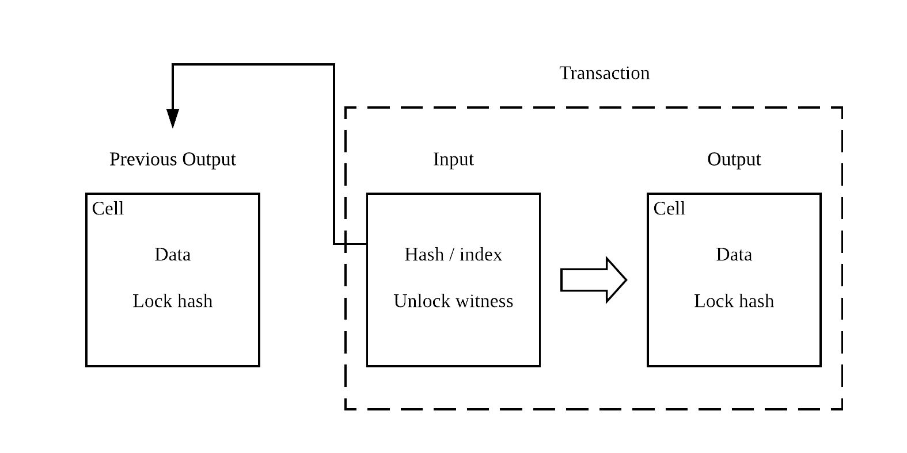
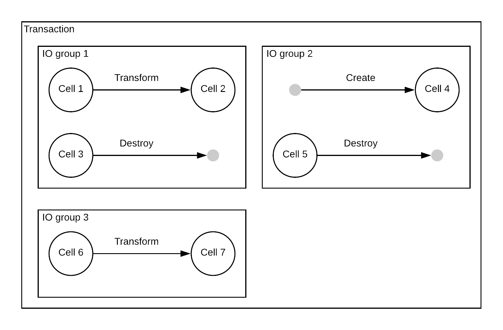
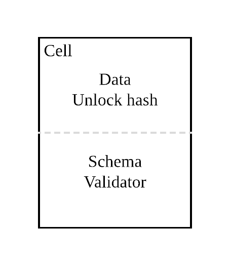
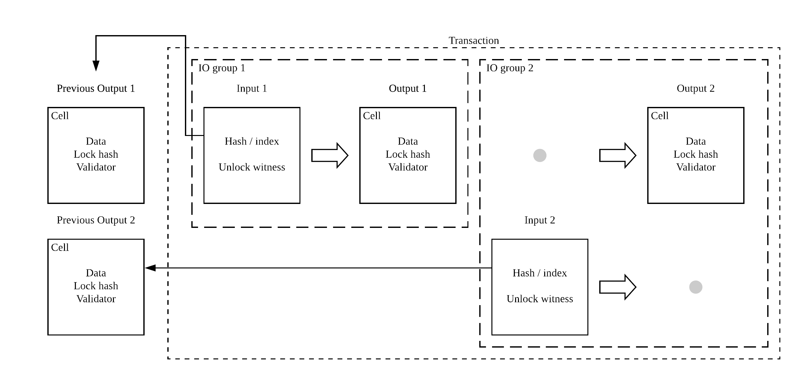

# Contract

```
Author: Xuejie Xiao <x@nervos.org>
Category: CKB
Start Date: 2018-08-27
```

## Overview

该 RFC 对现在的合约运行模型作出一些修改，以达到如下目的：

* 定义 Cell 类型的 schema 以及 validator 执行逻辑
* 定义交易内部的不同合约之间的交互方法

考虑到如下原因，注意本 RFC 中的所有实例代码在未经说明的情况下，均以 Ruby 来编写：

* 已经证明通过直接运行 Ruby 虚拟机的方式，CKB 虚拟机可以运行 Ruby 代码
* 这里主要的目的是说明合约如何运行，而不是达到最小的资源消耗
* 目前绝大部分的团队成员已经会 Ruby，同时对于不懂 Ruby 的人员来说，Ruby 也容易阅读说明问题

## 回顾

目前交易的执行模型如下：



1. 目前的 UTXO (在 CKB 中也叫做 `Cell`)，包含一个 data 数据字段，以及 data/owner lock。为了减小 UTXO 占用空间，UTXO 中只保存 lock 的哈希值。
2. 交易的每个输入会包含对一个 UTXO 的引用，实际的 unlock 脚本(这里脚本的哈希值应该与 UTXO 中相应 lock 的哈希值相同)，以及 unlock 脚本的输入参数。CKB 通过虚拟机在给定输入参数执行该脚本的时候，脚本应该返回成功的返回值。
3. 交易的每个输出也是一个 UTXO 结构（如果有输出的话），这个 UTXO 结构也包含 data 数据段以及 data/owner lock（仅包含哈希值）。输出的 UTXO 中即可以使用原有输入 UTXO 中的 lock，也可以使用全新的 lock。

## 概念

这里针对现有的合约执行模型添加了几个新概念。

### 组

首先，交易中添加了"组"：每个交易被分为若干个组，每个组中可以有若干个 cell 操作：

* 创建操作：创建一个新的 cell
* 转化操作：现有 cell 转化为新的 cell
* 销毁：销毁现有的 cell，不生成任何的新 cell

一个交易只能全部成功，或者全部失败。只有部分的组成功，而其他的组失败是非法的。后面会介绍组在合约执行模型中的实际用处



除 coinbase 交易外，所有的交易应该满足 output cell 的 capacity 总和不大于 input cell 的 capacity 总和的条件。

### Cell 类型



白皮书中提到了 Cell 的类型系统，类型系统包括了 schema 和 validator 两个部分。但是目前为止，他们的实际结构还没有定义。这里会定义 schema 与 validator 的结构。

#### Schema

Schema 提供了访问制定的 Cell 中的数据的方法。CKB 中，schema 以 CKB 虚拟机可以使用的动态链接库提供。它可以在加载之后为虚拟机提供一系列解析和读取 Cell 中存储内容的工具函数。针对一个包含天气信息的 Oracle Cell，可以提供以下的工具函数读取天气信息：

```c
int temperature(int city_index, int year, int month, int day);
int wind(int city_index, int year, int month, int day);
```

注意这里使用 C 语言来定义函数原型仅仅是一个可能的例子。Schema 仅需要保证是 RISC-V 架构的 ELF 格式动态链接库既可以。实际上完全可以定义一个只能被载入到 CKB 上运行的 mruby 虚拟机上，只能被 Ruby 语言调用的 Schema：

```ruby
module Weather
  def self.temperature(city_index, year, month, day)
    # calling actual library
  end

  def self.wind(city_index, year, month, day)
    # calling actual library
  end
end
```

在这里例子中，动态链接库还需要制定一个初始化函数用于把相应的 Ruby 模块载入 mruby 虚拟机中，但是这里想指出的点是是否提供 C 语言的 API 完全取决于 Cell 的维护者。

同时 Schema 也是可选的：简单的 Cell 完全可以直接读取 Cell 的部分数据来获取需要的信息，无需载入一个完整的动态链接库。但是对于复杂的 Cell，schema 可能会更加有用。

Schema 同时也是非常灵活的：CKB 本身并不制定构成 Cell 数据的基本结构（比如整型或是字符串）。与此相反，CKB 完全依赖于 Cell 的维护者来选择合适的数据结构来表示数据，他/她们可以按照需要提供任何函数来操作数据。

#### Validator

Schema 提供了便捷的访问已有 Cell 的格式化数据的方式，validator 则提供了确保新生成的 Cell 满足预先定义好的数据格式。与 unlock 脚本类似，Validator 实际上就是一个 RISC-V 架构下的可以执行合约。CKB 会在 Validator 自己的虚拟机中，通过如下输入参数执行合约：

```bash
$ ./validator <number of deps> <dep 1 cell ID> <dep 2 cell ID> ... \
    <number of inputs> <input 1 cell ID> <input 2 cell ID> ... \
    <number of outputs> <output 1 cell ID> <output 2 cell ID> ... \
    <current output cell ID>
```

在运行期，合约可以调用 CKB 提供的 API，或是相应的系统调用来载入 Cell 的 Schema 操作库，或是直接读取 Cell 内容，或是与其他合约交互（后面会介绍交互方式）。合约执行完毕时，通过返回值来表明 validator 执行是否成功。

#### Cell 类型的属性

Cell 的类型部分（包含 schema 和 validator）既可以直接包含在当前 Cell 内，也可以指向外部的 Cell。换句话说，可以设计一个只包含 Cell 类型数据（schema 以及 validator）的 Cell，同时以该 Cell 为类型创建很多同样类型的 Cell。

Cell 的类型也是不可以修改的：当一个 Cell 制定了类型之后，便不能通过转化操作修改当前 Cell 的类型。唯一的方式就是使用一个销毁操作销毁当前 Cell，再通过创建操作创建一个全新的 Cell，并制定新 Cell 的类型。

## 修正后的合约执行模型

有了这些新加入的概念之后，现在的合约执行模型如下：



1. 针对当前合约内的每一个组中的每一个输入，CKB 会查找到输入对应的 UTXO。针对输入所处的操作不同，不同的 lock 脚本哈希值会被使用：
   - 输入是转化操作时，使用 data lock 的哈希值
   - 输入是销毁操作时，使用 owner lock 的哈希值
2. 针对每一个输入 unlock 脚本，CKB 会创建一个独立的虚拟机来执行。如果任何一个虚拟机中的脚本执行失败，当前合约既可以认为是失败的。注意这里所有的合约没有依赖关系，可以假定全部并行执行。
3. 所有的输入全部验证过之后，CKB 会继续检查 Cell 类型的 validator：针对每一个输出 cell 中的每一个 validator（如果存在的话），CKB 会单独启动一个不同的虚拟机来运行 validator 脚本。脚本运行时会有如下的参数：
   - 合约中所有的 deps Cell 作为 deps 部分提供
   - 当前组中的所有输入 Cell 作为 inputs 部分提供
   - 当前组中的所有输出 Cell 作为 outputs 部分提供
   - 为方便计算，当前输出 cell 的 ID 也会被提供
4. 每一个组中的所有合约可以认为是并行执行，同时每一个组中的合约在运行时也可以以如下的方式进行交互：
   - 他们可以通过直接读取对方的 Cell 中的内容来交互；
   - CKB 也会提供一个特殊的系统调用，该系统调用可以用来在同一个组的不同 VM 之间创建 channel，2 个同一个组中的不同的虚拟机也可以通过这个 channel 来收发数据进行交互
5. 当所有的虚拟机均返回成功的结果是，可以认为当前的交易执行成功

这里要指出的是，与交易用来提供原子性不同，组的作用是隔离开不相关的 cell：可以认为在同一个组中，不同的 cell 是有相顾依赖关系，需要一起来进行处理的。

注意这里只包含合约在虚拟机上执行部分的逻辑。除此之外，CKB 还可能会在交易执行的前后做其他的检查，比如 capacity 检查等。

## 例子

这里会提供相关的例子来展示如何利用添加的功能更加便利的实现某些需求。处于简洁性的考虑，这里的例子只包含 validator 逻辑。在绝大多数情况下 unlock 脚本可以只包含类似于比特币脚本所做的签名验证逻辑。

### 货币兑换

在第一个例子中，两个 Cell 会保存各自 Cell 所对应货币的余额，这两个 Cell 可以参与货币兑换交易。在交易中，每个 Cell 会各自检查自身的余额，同时与对方交互达成在汇率及交易数额上的一致。显然这两个 Cell 会处于交易的同一个组中。

假设有一个 Oracle 可以提供最新的货币汇率，可以使用 deps Cell 来指向 Oracle：

```ruby
module Currency
  def self.current_rate(type)
    # fetching current currency rate
  end
end
```

就像上面提到的，Oracle Cell 会在 deps Cell 中提供引用，每一个货币兑换 validator 会通过加载动态链接库的方式载入该 Oracle 的 schema 部分。相应的 Ruby 代码会被加载到 Ruby 虚拟机中。

每一个 Cell 会包含如下格式的 JSON 数据：

```json
{
  "amount": 12300,
  "type": "USD"
}
```


`amount` 是一个整型数据，其中 1 代表 1 分，这样我们便可以省去使用浮点数的麻烦。`type` 包含当前 Cell 对应的货币币种。

在交易中，一个组会包含两个有着如下 validator 脚本的转化操作：

```ruby
deps = ARGV.slice(1, ARGV[0].to_i)
input_start = deps.length + 1
inputs = ARGV.slice(input_start + 1, ARGV[input_start].to_i)
output_start = input_start + inputs.length + 1
outputs = ARGV.slice(output_start + 1, ARGV[output_start].to_i)
current_cell_id = ARGV[output_start + outputs.length + 1].to_i

# load deps[0] as a shared library, so we will have Currency module at our finger tips

# calculate current cell index
index = (current_cell_id == outputs[0].id) ? 0 : 1
other_index = index == 0 ? 1 : 0
# Parse input and output data
input_data = JSON.parse(inputs[index].data)
output_data = JSON.parse(outputs[index].data)
exit(false) if input_data["type"] != output_data["type"]
# calculate the amount transferred
amount = output_data["amount"] - input_data["amount"]
type = output_data["type"]

channel = CKB::create_channel(other_index)
channel.send(amount)
channel.send(type)
# fetch the amount from the other end
other_amount = channel.receive
other_type = channel.receive

# amount and other_amount must have different sign since one must be deposit, the other
# must be withdraw
exit(false) if amount * other_amount > 0

actual_rate = amount.abs / other_amount.abs
# Rate is determined by the 2 currency types
current_rate = Currency.current_rate("#{type}/#{other_type}")
exit(actual_rate == current_rate)
```

这个合约可以保证如下的不变量：

* 每个 Cell 在交易前后的货币类型不变
* 每个交易保证使用 Oracle 中提供的最新汇率
* 交易中收入和支出部分的金额相匹配

这样就完成了一个货币交易合约。

### Plasma

接下来会介绍一个简化的 Plasma 实例。由于 CKB 是 layer 1 实现， 它只需要包含 Plasma 实例中在以太坊上部署的智能合约部分，真正的 Plasma 链则可以在 layer 2 上部署。

基本的数据结构如下：

```json
{
  "headers": {
    "10032": {
      "blockNumber": "10032",
      // ...
    },
    // ...
  },
  "depositRecords": {
    "bcf84dbc6d40d209afed26ca947bd98c47cf28f73afea6fb7e161ab1ed5dfe56": [
      {
        "blockNumber": "10032",
        "txIndex": "725bee66519a6567fabbb9b15128828af344960aa6a82e27e1fd255f61faee38",
        // ...
      },
      // ...
    ]
  },
  // ...
}
```

这里实际上包含了跟 [这个合约](https://github.com/ethereum-plasma/plasma/blob/8b84007cc0a5a0f0e1439bd2299d381bf7d8ce28/contracts/PlasmaChainManager.sol#L46-L53) 同样的数据，但是以 JSON 格式序列化存储。

与货币交易模型不同，Plasma 合约是可以执行不同的转化操作的，所以除输入输出外，还需要方式来提供输入 Cell 所进行的转化操作。

一种实现方式（当然，这里可能还有其他方式）是在 unlock 脚本的参数中，在所有跟签名相关的参数后面添加一个新的参与，用来保存当前 Plasma 合约进行的转化操作。Unlock 脚本编写时可以完全忽略这些额外的参数：

```ruby
# assuming signature validation requires 3 parameters
exit(false) if ARGV.length < 3

args = ARGV.slice(0, 3)

# validating signature using args
# ...
```

考虑到 validator 函数可以访问输入 Cell，自然也就可以访问这里提供的额外参数：

```ruby
deps = ARGV.slice(1, ARGV[0].to_i)
input_start = deps.length + 1
inputs = ARGV.slice(input_start + 1, ARGV[input_start].to_i)
output_start = input_start + inputs.length + 1
outputs = ARGV.slice(output_start + 1, ARGV[output_start].to_i)
current_cell_id = ARGV[output_start + outputs.length + 1].to_i

command = JSON.parse(inputs[0].arguments.last)
response = case command
when "submitBlockHeader"
  submitBlockHeader(...)
when "deposit"
  deposit(...)
# more actions can be included here
else
  false
end
exit(response)
```

因此，验证逻辑可以转化为针对每一个 Plasma 转化命令的分别验证：

```ruby
def submitBlockHeader(input_data, output_data, block)
  input_data["headers"][block["blockNumber"]] = block
  input_data == output_data
end
```

其他的验证逻辑也可以以同样的方式提供：

1. 首先把输入和输出 Cell 反序列化成输入输出数据
2. 根据不同类型的 Plasma 转化命令，我们针对输入数据做不同的转化操作
3. 然后将转化后的输入数据与输出数据做对比，如果她们相同，即可认为当前组验证成功

注意链上执行多少计算操作完全由执行的程序来决定，这里实际上有一个取舍关系：

* 链上执行更多的计算更能保证 Cell 的数据永远是合法的，并可以被信任的
* 链上执行更少的计算更能节约 Cell 数据转化时所需的开销

在一个极端情况下，validator 可以完全被忽略，这样所有的计算与验证逻辑均外链外执行；另一个极端是链上执行尽可能多的逻辑保证数据是正确的，例如上面提到的 Plasma 实例。
