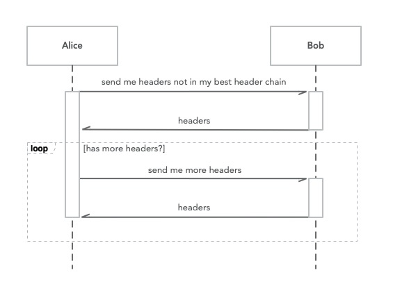

# CKB Block Synchronization Protocol

Glossary of Terms

- Chain: a list of blocks starting with genesis block and consisted of successive blocks
- Best Chain: a chain with the most accumulated PoW, and starting with a common genesis block which nodes agree with the consensus
- Best Header Chain: a chain with the most PoW and consisted only of blocks in the status of `Connected`, `Downloaded` or `Accepted`. Please refer to block status part for more details
- Tip: the latest block of a chain. Tip can be used to determine a specific chain
- Best Chain Tip: the tip of Best Chain

## Abstract

Block synchronization **must** be performed in stages with [Bitcoin Headers First](https://btcinformation.org/en/glossary/headers-first-sync) style. Blocks are downloaded in parts in each stage and are validated using the obtained parts.

1. Connect Header: Get block header, validate format and PoW.
2. Download Block: Get and validate the complete block. Transactions in ancestor blocks are not required.
3. Accept Block: Validate the block in the context of the chain.
4. New Block Announcement: Push the updated Best Chain Tip to other nodes.

The purpose of stage execution is trying to preclude most of the attacks with the least cost. For example, in the first stage, header connecting only accounts for 5% workload, but has 95% confidence to determine if the block is valid. 

According to the execution stages, there are 6 statuses of blocks:

- `Unknown`: the status of a block is unknown before header connecting
- `Invalid`: A block and all of its descendant blocks are marked as `Invalid` if any of above steps failed
- `Connected`: A block succeeds in stage Connect Header, and all its ancestor blocks are in a status of `Connected`, `Downloaded` or `Accepted`
- `Downloaded`: A block succeeds in stage Download Block, and all its ancestor blocks are in a status of `Downloaded` or `Accepted`
- `Accepted`: A block succeeds in stage Accept Block, and all its ancestor blocks are in the status of `Accepted`
- `Sent`: A block is sent to peer nodes.

The representation of blocks in different statuses shown in the following figure will be used throughout the article.

	

Block status is propagated from the previous block to the later ones. Using the serial number above, the status number of a block is always less than or equal to its parent block. If a block is invalid, all of its descendant blocks must be invalid. The cost of every step for synchronization is higher than the previous one and every step may fail. In this scenario, work will be wasted if a child block enters a later status before its parent block, and parent block is approved to be invalid later.

Initially, Genesis block is in status `Accepted` and the rest is in status `Unknown`. The Genesis block of the nodes who participate in synchronization **must be** the same, and all blocks can be constructed as a tree with the Genesis block being the root. Blocks will be removed if they cannot connect to the root eventually. 

Every participating node forms its local status tree where the chain consisting of `Accepted` blocks with the most PoW is considered as the Best Chain. The chain that consists of blocks in the status of `Connected`, `Downloaded` or `Accepted` with the most PoW is the Best Header Chain. 

The graph below is an example of Status Tree formed by Alice and blocks signed with name Alice is this node's current Best Chain Tip. 

	

 
## Connect Header

Headers first synchronization helps to validate PoW with the least cost. Since it costs the same work to construct PoW whether the included transactions are valid or not, attackers may use other more efficient ways, for example, fake headers. As a result, it's highly possible that the whole block is valid when the PoW is valid. This is why Headers first synchronization would avoid resource-wasting on invalid blocks.

Because of the low cost, Headers synchronization can be processed in parallel with all peers. Each nodes can construct a highly reliable global graph with all forks of the chain. In this way, block downloading can be scheduled in the most efficient way to avoid wasting resource on lower PoW branch.

The goal of Connect Header is demonstrated with the following example. When Alice connects to Bob, Alice asks Bob to send all block headers in Bob's **Best Chain** but not in Alice's **Best Header Chain** and then validate them to decide the blocks status are either `Connected` or `Invalid`.  When Alice connects Headers, keeping Best Header Chain Tip updated could help decrease the number of received headers which already existed. 

The process of Connect Header is illustrated below. After the first round of Connect Header, nodes keep up-to-date using New Block Announcement, which will be introduced in the later section.

	

Firstly Alice samples blocks from her Best Header Chain and sends the hashes to Bob. The basic principle of sampling is that later blocks are more likely to be selected than early blocks. For example, Alice can choose latest 10 blocks from the chain, then sample other blocks backward with 2's exponential increased intervals, a.k.a, `2, 4, 8, …` The list of hashes of the sampled blocks is called a Locator. The Genesis block should be always in the Locator. 

	

Bob can get the latest common block between these two chains according to the Locator and his own Best Chain. Because the Genesis block is identical, there must be such kind of a block. Bob will send all block headers from the common block to his Best Chain Tip to Alice.

	

In the figure above, blocks with dark green color should be sent from Bob to Alice. There are three possible cases in the process:

- If Bob's Best Chain Tip is in Alice's Best Header Chain, the latest common block will be Bob's Best Chain Tip and there are no block headers for Bob to send.
- If Alice's Best Header Chain Tip is in Bob's Best Chain but is not the Tip, the latest common block will be Alice's Best Header Chain Tip.
- If Alice's Best Header Chain and Bob's Best Chain fork, the latest common block will be the one before the fork occurs. Bod will send `DE'F'` in such case.

If there are too many blocks to send, pagination is required. Bob sends the first page, and Alice will ask Bob for the next page if she finds out that there are more block headers. A simple pagination solution is to limit the maximum number of block headers returned each time. If the number of block headers returned reaches the maximum, it means there may be more block headers to be returned. If the last block of a certain page is the ancestor of Best Chain Tip or Best Header Chain Tip, it can be optimized to get next page starting with the corresponding Tip.

Alice could observe Bob's present Best Chain Tip, which is the last block received during each round of synchronization. If Alice's Best Header Chain Tip is exactly Bob's Best Chain Tip, Alice couldn't observe Bob's present Best Chain because Bob has no block headers to send. Therefore, it should start building from the parent block of Best Header Chain Tip when sending the first request in each round.

A new round of Header synchronization must be performed if a node receives a new block notification from the others, but the parent block status of the new block is `Unknown`.

The following exceptions may occur during Connect Header: 

- Alice observes that Bob's Best Chain Tip has not been updated for a long time, or its timestamp is old. In this case, Bob does not provide valuable data. When the number of connections reaches a limit, Bob could be disconnected first.
- Alice observes that the status of Bob's Best Chain Tip is `Invalid`. This can be found in any page without waiting for the end of a round of Connect Header. Since Bob is on an invalid branch, Alice can stop synchronizing with Bob and add Bob to the blacklist.
- There are two possibilities if the Headers Alice received are all on her own Best Header Chain. One is that Bob sends them deliberately. The other is that Alice's Best Chain changes when she connects headers. In this case, those block headers can only be ignored because they are difficult to distinguish. However, the proportion of received blocks already in Best Header Chain would be recorded. If the proportion is above a certain threshold value, Bob could be disconnected or added to the blacklist.

Upon receiving the block headers message, the format should be verified first.

- The blocks in the message are continuous.
- The status of all blocks and the parent block of the first block are not `Invalid` in the local Status Tree. 
- The status of the parent block of the first block is not `Unknown` in the local Status Tree, which means Orphan Block will not be processed during synchronization.
- The consensus rules are satisfied and the PoW is valid.

	

The figure above is the Status Tree of Alice after synchronized with Bob, Charlie, Davis, Elsa. The observed Best Chain Tip of each peer is also annotated in the figure. The `Unknown` blocks are not considered on the Status Tree. New blocks in the status of `Connected` or `Invalid` will be extended to the leaves of the Status Tree during Connect Header. As a result, Connect Header stage explores and extends the status tree.

## Download Block

After Connect Header is completed, the branch of some observed Best Chain Tip ends with one or more `Connected` block, a.k.a., Connected Chain. Download Block stage should start to request complete blocks from peers and perform verification.

With the status tree, synchronization can be scheduled to avoid useless work. An effective optimization is to download the block only if the Best Chain of the observed peer is better than the local Best Chain. And priority can be ordered that the connected chain with more accumulated PoW should be processed first. The branch with lower PoW can only be attempted if a branch is confirmed to be `Invalid` or if the download times out.

When downloading a branch, earlier blocks should be downloaded first due to the block dependency, and should be downloaded concurrently from different peers to utilize full bandwidth. A sliding window can be applied to solve the problem.

Assume that the number of the first `Connected` status block to be downloaded is `M` and the length of the sliding window is `N`, then only the blocks numbered `M` to `M+N-1` can be downloaded. After the block M is downloaded and verified, the sliding window moves to the next `Connected` block. If verification of block M fails, then the remaining blocks of this branch are all `Invalid`, and there is no need to continue downloading. If the window does not move towards the right for a long time, it is considered as time out. The node should try again later, or waits until the branch has new `Connected` blocks.

	

The figure above is an example of a sliding window with length `8`. In the beginning, the downloadable blocks are `[3, 10]`. After block 3 is downloaded, the window will move to block 5 because block 4 has already been downloaded in advance.

The Best Chains of peers are already known in Connect Header stage, it is assumed that the peer has a block if it is in the peer's Best Chain and that peer is a full node. During the downloading, blocks in the sliding window can be split into several small stripes and those stripes could be scheduled among peers who have the blocks.

The downloaded transactions in a block may be mismatched with the Merkle Hash Root in the header, or the list contains duplicated txid. It doesn't mean that the block is invalid. It can only approve the downloaded block is incorrect. The block content provider could be added to the blacklist, but the block status should not be marked as `Invalid`. Otherwise, the malicious nodes may pollute the nodes' Status Tree by sending the wrong block contents.

Verification of transaction lists and block header matching is required in this stage, but any validation that relies on the transaction contents in the ancestor block is not required and they will be conducted in the next stage.

Several validations can be checked in this phase, for example, Merkle Hash validation, transaction txid cannot be repeated, transaction list cannot be empty, inputs and outputs cannot be blank at the same time, or only the first transaction can be generation transaction, etc.

Download Block will update the status of blocks in the best Connected Chain, from `Connected` to `Downloaded` or `Invalid`.

## Accept Block

In the previous stage, there will be some chains which ended with `Downloaded` status, hereinafter referred to as Downloaded Chain. If those chains' cumulative work is more than the Best Chain Tip's, the complete validation in the chain context should be performed in this stage. If there are more than one chain satisfy, the chain with the most work should be performed first.

All the verification must be completed in this stage, including all rules that depend on historical transactions. Because it involves UTXO (unspent transaction outputs) indexes, the cost of verification is huge in this phase. It can be simplified to keep only one set of UTXO indexes. First rollback local Best Chain Tip when necessary. After that, verify blocks in the candidate best Downloaded Chain and add them to the Best Chain one by one. If there is an invalid block during verification, the remain blocks in Downloaded Chain are also considered as `Invalid`. With the simplified solution, the Best Chain Tip would even have lower work than the previous Tip, which can be resolved in several different ways:

- If the work of the Best Chain before rollback is more than the present Tip, then restore the previous Best Chain.
- If the work of other Downloaded Chains is more than the Best Chain before rollback, try rollback and relocate to that chain.

The process of Accept Block will change the status of blocks in the Downloaded chain, from `Downloaded` to `Accepted` or `Invalid`. The verified Downloaded Chain which has the most work will become the new local Best Chain.

## New Block Announcement

When the local Best Chain Tip changes, the node should push an announcement to peers. The best header with most cumulative work sent to each peer should be recorded, to avoid sending duplicate blocks before the announced new Best Chain Tip. The best header recorded not only includes the headers in New Block Announcement, but also the ones sent as the responses in Connect Header stage.

It is assumed that the peers already know the Best Sent Header and its ancestors, so these blocks can be excluded when sending new block announcements.

	

From the above example, Alice's Best Chain Tip is annotated with her name. The best header sent to Bob is annotated as "Best Sent To Bob". The dark green blocks are the ones Alice should send to Bob in New Block Announcement. Following is the detailed description for each step:

1. Alice sends `DE`, which are blocks from "Best Sent to Bob" to Best Chain Tip, to Bob.
2. Alice updates "Best Sent to Bob" to be the Best Chain Tip.
4. Alice's Best Chain relocates to another fork. Only blocks after the last common block should be sent to Bob.

How to send the announcement is determined by connection negotiated parameters and the number of new blocks to be announced:

If there is only one block and the peer prefers Compact Block [^1], then use Compact Block. For other cases, just send the block header list with an upper limit `k` on the number of blocks to send. If exceeded, the node only sends latest `k-1` blocks. As a result, when receiving a new block announcement, there may be a situation the parent block's status is `Unknown`, also called Orphan Block. If so, a new round of Connect Header is required immediately. When a Compact Block is received, and its parent block is the local Best Chain Tip, then the full block may be recovered from the transaction pool. If the recovery succeeds, the work of these three stages can be compacted into one. Otherwise, it falls back to a header-only announcement.

## Synchronization Status 

### Configuration
- `GENESIS_HASH`: hash of Genesis block
- `MAX_HEADERS_RESULTS`: the max number of block headers can be sent in a single message
- `MAX_BLOCKS_TO_ANNOUNCE`: the max number of new blocks to be announced
- `BLOCK_DOWNLOAD_WINDOW`: the size of the download window

### Storage
- Block Status Tree
- Best Chain Tip, decide whether to download blocks and accept blocks
- Best Header Chain Tip, used in Connecting Header to construct the Locator of the first request in each round.

Each connection peer should store:
- Observed Best Chain Tip
- The block header hash with the most work sent last time —— Best Sent Header

### Message Definition

Only related message and fields are listed here. See completed definition and documentation in the reference implementation.

The message passing is completely asynchronous. For example, sending `getheaders` does not block other requests. Also, there is no need to guarantee the order relationship between the requests and the responses. For example, node A sends `getheaders` and `getdata` to B, and B can replies `block` firstly, and then `headers` to A.

Compact Block [^1] messages `cmpctblock` and `getblocktxn` will be described in related Compact Block documentation.

### getheaders

It is used to request a block header from a peer in Connect Header stage. The first-page request, and subsequent pages request can share the same getheaders message format. The difference between them is that the first page request generates a Locator from the parent block of the local Best Header Chain Tip, and the subsequent page request generates the Locator using the last block in the last received page.

- `Locator`: Sampled hashes of the already known blocks

### headers

It is used to reply `getheaders` and announce new blocks. There is no difference in processing logic, but if an Orphan Block is founded when the number of block headers is less than `MAX_BLOCKS_TO_ANNOUNCE`, a new round of Connect Header is required. If the number of block `headers` received is equal to `MAX_HEADERS_RESULTS`, it indicates that there are more blocks to request.

- `headers`：block headers list

### getdata

It is used in Download Block stage.

- `inventory`:  object lists for download, with following fields in each list element:
    - `type`: type of the object, only "block" here
    - `hash`: hash of the object as identity

### block

It is used to reply block downloading request of `getdata` 

- `header` block header
- `transactions` transaction list

[^1]: Compact Block is a technique for compressing and transferring complete blocks. It is based on the fact that when a new block is propagated, the transactions should already be in the pool of other nodes. Under this circumstances, Compact Block only contains the list of transaction txid list and complete transactions which are predicated unknown to the peers. The receiver can recover the complete block using the transaction pool. Please refer to [Block and Compact Block Structure](../0020-ckb-consensus-protocol/0020-ckb-consensus-protocol.md#block-and-compact-block-structure) and related Bitcoin [BIP](https://github.com/bitcoin/bips/blob/master/bip-0152.mediawiki) for details.
