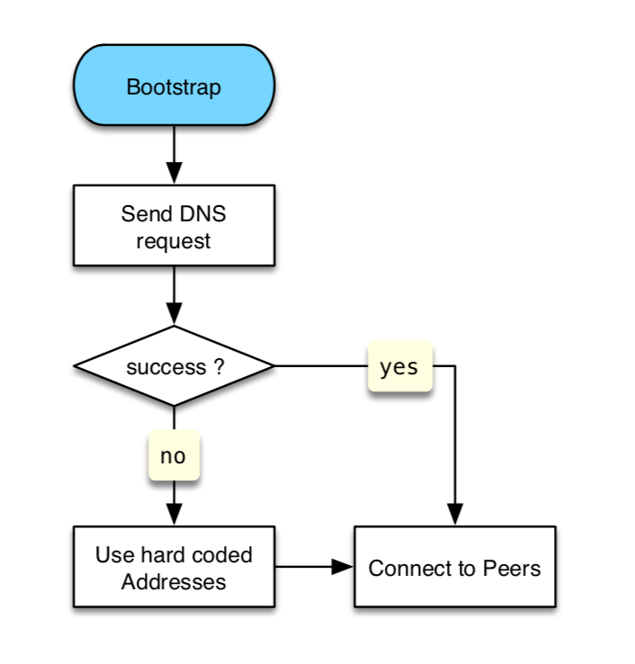
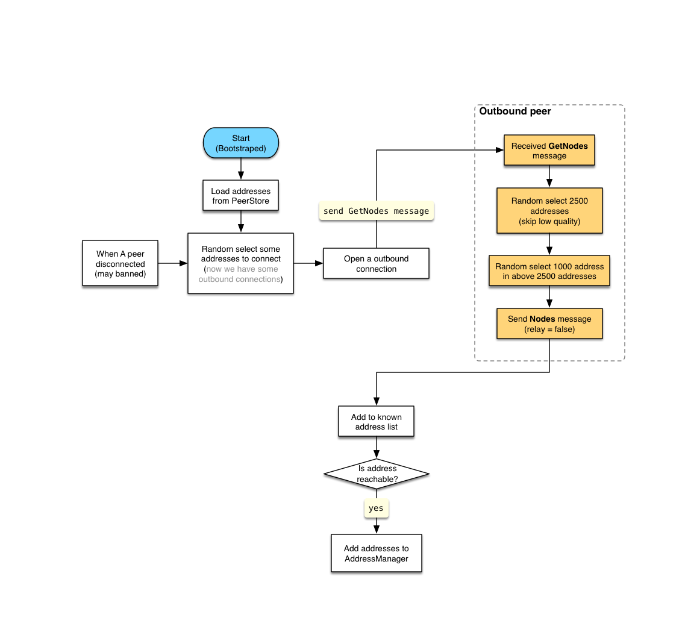
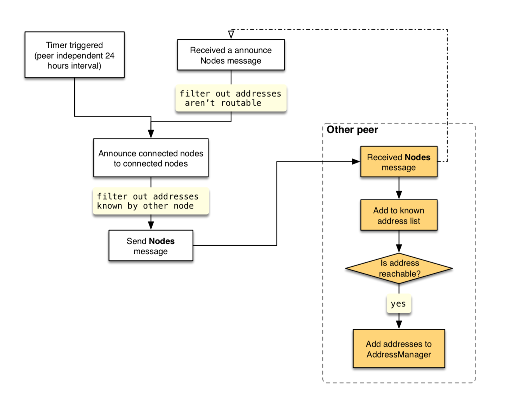

# CKB Node Discovery Protocol

CKB node discovery protocol mainly refers to [Satoshi Client Node Discovery][0]. The differences between them are summarized below:

* The node version number is included in the `GetNodes` message.
* The `Nodes` message is used to periodically broadcast all nodes currently connected.
* We use `multiaddr` as the format of node addresses  (There is no `/p2p/` field here and if it's considered as *misbehavior*, a low score will be given.)

Every time client startup, if PeerStore's address list is empty, it will try to issue DNS requests to initialize address list, if DNS requests failed it will fallback to hard coded address list.

## Discovery Methods
### DNS Addresses
When first time startup (bootstrap stage), if discovery service is needed, local node then issues DNS requests to learn about the addresses of other peer nodes. The client includes a list of host names for DNS services that are seeded. DNS server addresses can be replaced by command line arguments.

### Hard Coded "Seed" Addresses
The client contains hard coded IP addresses that represent CKB nodes. Those addresses only are used only if all DNS requests failed. Once the local node has enough addresses (presumably learned from the seed nodes), the client will close seed node connections to avoid overloading those nodes. "Seed" addresses can be specified manually with command-line arguments.

### Protocol Message
#### `GetNodes` Message
When all the following conditions are met, the local node will send a `GetNodes` message:

  1. It's an outbound connection (for resisting [fingerprinting attack][3]).
  2. The other node's version must bigger than a preset value.
  3. The number of addresses currently stored is less than 1000. 


#### `Nodes` Message
When the client receives a `GetNodes` request, it will return a `Nodes` message if this kind of reception is the first time and the connection is an inbound connection, the `announce` field is set to `false`. At regular intervals, local node will broadcast all connected `Node` informations in `Nodes` message to all connected nodes, the `announce` is field is set to `true`. When local node received a `Nodes` message and it's `announce` field is `true`, local node will relay those node addresses that are [routable][1] .

Here `announce` field is for distinguish a `Nodes` as an response of `GetNodes` or broadcast message, so it's convient to apply different rules for punishing misbehaviors. The main rules:

* A node can only send one `Nodes` message (announce=true) as an response of `GetNodes` message.
* A node's broadcast messages only the first `Nodes` message can include more than 10 node informations.

The number of `addresses` field of each `Node` in all `Nodes` messages cannot exceed `3`.

## Resist Typical Attacks
### Eclipse Attack
Choose an address randomly from PeerStore to connect then close every 2 minutes. The goal is to increase the list of addresses that have been tried.
Every 2 minutes random choose an address from PeerStore to connect. The goal is increasing the tired address list.

### Fingerprinting Attack
[Related paper][3]

`GetNodes` can only send to an outbound connection.

## Flow Diagram
### Node Bootstrap

### Send `GetNodes` Message

### Announce Connected Nodes


## Data Structures
We use [FlatBuffers][2] as serialize/deserialize format, the *schema*:

```
table DiscoveryMessage {
    payload: DiscoveryPayload;
}

union DiscoveryPayload {
    GetNodes,
    Nodes,
}

table GetNodes {
    version: uint32;
    count: uint32;
}

table Nodes {
    announce: bool;
    items: [Node];
}

table Node {
    node_id: Bytes;
    addresses: [Bytes];
}
```

[0]: https://en.bitcoin.it/wiki/Satoshi_Client_Node_Discovery
[1]: https://www.iana.org/assignments/iana-ipv4-special-registry/iana-ipv4-special-registry.xhtml
[2]: https://google.github.io/flatbuffers/
[3]: https://arxiv.org/pdf/1410.6079.pdf
