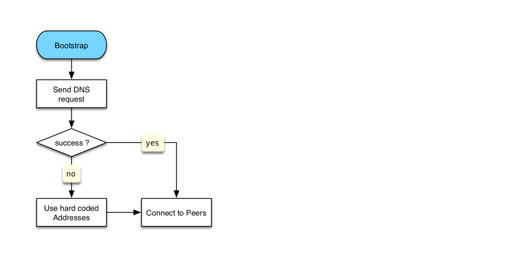
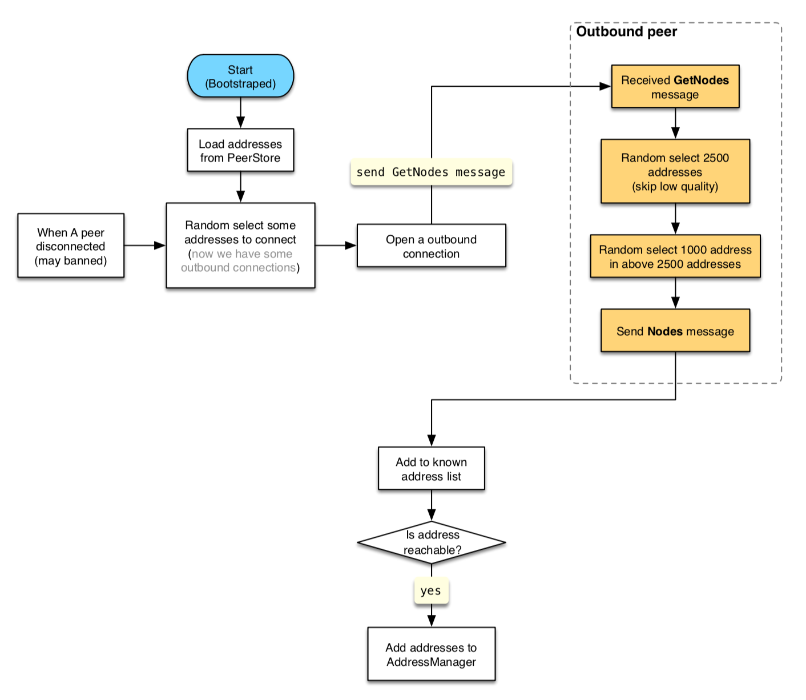
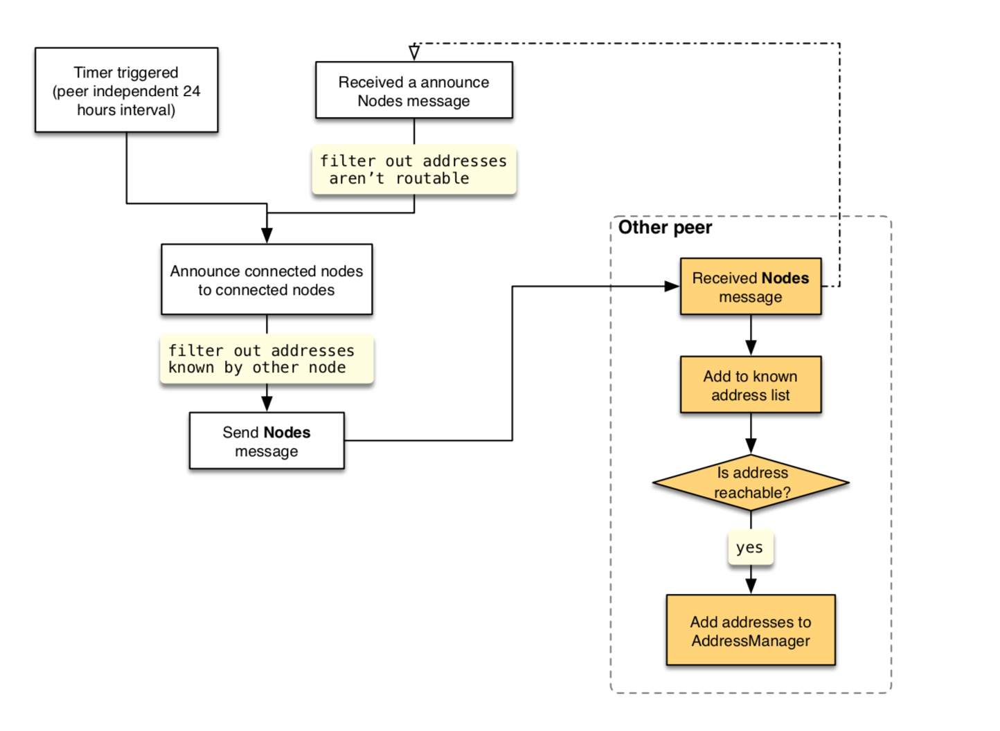

# CKB Node Discovery Protocol

CKB node discovery protocol mainly refers to [Satoshi Client Node Discovery][0]. The differences between them are summarized below:

* The node version number is included in the `GetNodes` message.
* The `Nodes` message is used to periodically broadcast all nodes currently connected.
* We use `multiaddr` as the format of node addresses (It MUST NOT include `/p2p/` segment otherwise it's considered as *misbehavior* and a low score SHOULD be given.)

Every time client startup, if PeerStore's address list is empty, it SHOULD try to issue DNS requests to initialize address list, if DNS requests failed it SHOULD fallback to the hard-coded address list.

## Discovery Methods
### DNS Addresses
At the first time startup (bootstrap stage), if the discovery service is needed, the local node SHOULD issues DNS requests to learn about the addresses of other peer nodes. The client includes a list of seed hostnames for DNS services.

### Hard-Coded "Seed" Addresses
The client contains hard-coded IP addresses that represent CKB nodes. Those addresses are used only if all DNS requests failed. Once the local node has enough addresses (presumably learned from the seed nodes), the client SHOULD close seed node connections to avoid overloading those nodes.

### Protocol Message
#### `GetNodes` Message
When all the following conditions are met, the local node will send a `GetNodes` message:

  1. It's an outbound connection (for resisting [fingerprinting attack][3]).
  2. The other node's version must bigger than a preset value.
  3. The number of addresses currently stored is less than `ADDRESSES_THRESHOLD` (default 1000). 


#### `Nodes` Message
When the client receives a `GetNodes` request, it SHOULD return a `Nodes` message if this kind of reception is the first time and the connection is an inbound connection, the `announce` field is set to `false`. At regular intervals, local node SHOULD broadcast all connected `Node` information in `Nodes` message to all connected nodes, the `announce` field is set to `true`. When local node received a `Nodes` message and it's `announce` field is `true`, local node SHOULD relay those node addresses that are [routable][1].

Here `announce` field is to distinguish a `Nodes` as a response of `GetNodes` or broadcast message, so it's convenient to apply different rules for punishing misbehaviors. The main rules:

* A node can only send one `Nodes` message (announce=false) as a response of `GetNodes` message.
* Among a node's broadcast messages only the first `Nodes` message (announce=true) can include more than `ANNOUNCE_THRESHOLD` (default 10) node information, in case other peer send reduplicative node information.

The number of `addresses` field of each `Node` in all `Nodes` messages cannot exceed `MAX_NODE_ADDRESSES` (default 3).

## Resist Typical Attacks
### Fingerprinting Attack
[Related paper][3]

`GetNodes` can only send to an outbound connection.

## Data Structures
We use [FlatBuffers][2] as serialize/deserialize format, the *schema*:

```
table DiscoveryMessage {
    payload: DiscoveryPayload;
}

union DiscoveryPayload {
    GetNodes,
    Nodes,
}

table GetNodes {
    version: uint32;
    count: uint32;
}

table Nodes {
    announce: bool;
    items: [Node];
}

table Node {
    node_id: Bytes;
    addresses: [Bytes];
}
```

## Flow Diagram
### Node Bootstrap

### Send `GetNodes` Message

### Announce Connected Nodes


[0]: https://en.bitcoin.it/wiki/Satoshi_Client_Node_Discovery
[1]: https://www.iana.org/assignments/iana-ipv4-special-registry/iana-ipv4-special-registry.xhtml
[2]: https://google.github.io/flatbuffers/
[3]: https://arxiv.org/pdf/1410.6079.pdf
