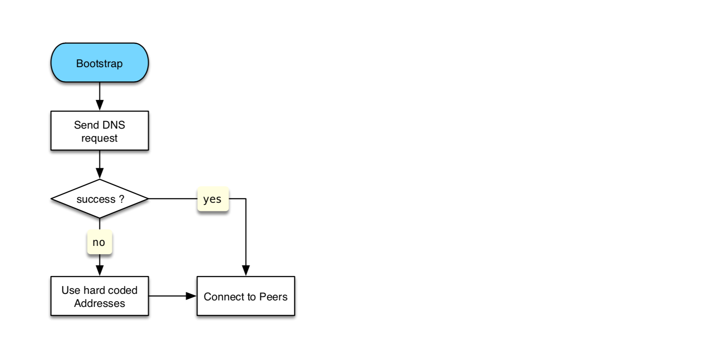
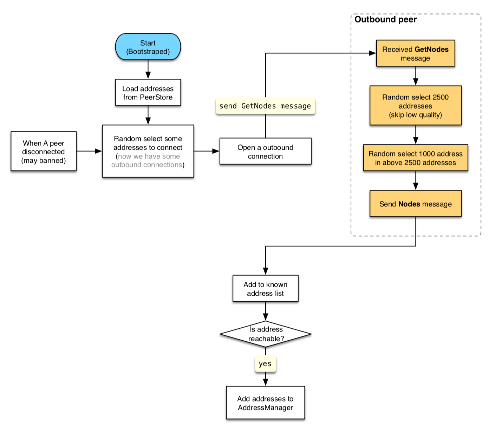
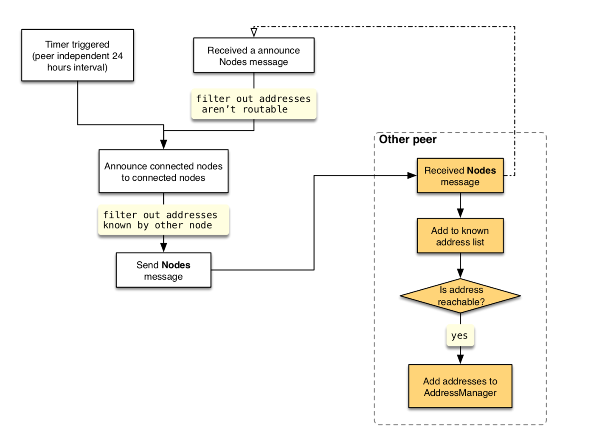

# CKB 节点发现协议

CKB 节点发现协议主要参考了[比特币的协议][0]。主要不同点如下:
* 节点版本号包含在 `GetNodes` 消息中
* 通过 `Nodes` 消息来定时广播当前连接的所有节点
* 我们使用 `multiaddr` 作为节点地址的格式 (不允许出现 `/p2p/` 段，如果违反会被认为是*不良*行为并被打低分)

每次客户端启动时，如果 PeerStore 中的地址列表为空就会尝试通过 DNS 的方式获取初始地址，如果 DNS 的方式失败了就使用硬编码的种子地址来初始化地址列表。

## 节点发现的手段
### DNS 获取地址
第一次启动的时候(引导阶段)，如果需要节点发现服务，客户端会尝试向内置的 DNS 服务器发送 DNS 请求来获取种子服务器地址。

### 硬编码的「种子」地址
客户端会硬编码一些「种子」节点地址，这些地址只有在 DNS 获取地址失败的时候被使用。当通过这些种子节点获取了足够多的地址后需要断开这些连接，防止它们过载。这些「种子」地址的时间戳被设置为 0 所以不会加入到 `GetNodes` 请求的返回值中。

「种子」节点是那些在线时间较长而且和很多其它节点互连的节点。

### 协议消息

#### `GetNodes` 消息
当满足所有以下条件时，节点会发送一个 `GetNodes` 请求：

  1. 这个连接是自己主动发起的 (防御[指纹攻击][3])
  2. 对方的版本号大于一个预设的值
  3. 当前存储的地址数量小于 `ADDRESSES_THRESHOLD` (默认 1000) 个

#### `Nodes` 消息

当客户端收到一个 `GetNodes` 请求时，如果是第一次收到 `GetNodes` 消息而且这个连接是对方主动发起的就会返回一个 `Nodes` 消息，该 `Nodes` 消息的 `announce` 字段为 `false`。每隔一定时间当前节点会将当前连接的节点信息以及本节点信息以 `Nodes` 消息广播给当前连接的所有节点，`announce` 字段为 `true`。当前收到 `announce` 字段为 `true` 的 `Nodes` 消息时会对地址[可路由][1]的那些节点地址进行转发。

这里 `announce` 字段的目的是为了区分 `Nodes` 消息是作为 `GetNodes` 消息的返回值还是广播消息，可以方便应用不同的规则来对节点的恶意行为做相应的处罚。涉及到的规则主要有:

* 一个节点只能有一个 `Nodes` 消息 (announce=false) 作为 `GetNodes` 消息的返回值。
* 一个节点的广播消息中只能第一个 `Nodes` 消息 (announce=true) 包含的节点信息数量超过 `ANNOUNCE_THRESHOLD` (默认 10) 个，这是为了防止对方发送重复的 `Node` 信息。

所有 `Nodes` 消息中的每个 `Node` 中的 `addresses` 的数量不能超过 `MAX_NODE_ADDRESSES` (默认 3) 个。

## 对主要攻击方式的处理
### 指纹攻击 (fingerprinting attack)
[相关论文][3]

`GetNodes` 消息只能通过 outbound 连接发送出去。

## 相关数据结构
我们使用 [FlatBuffers][2] 作为数据序列化格式，以下为相关数据结构的 schema:

```
table DiscoveryMessage {
    payload: DiscoveryPayload;
}

union DiscoveryPayload {
    GetNodes,
    Nodes,
}

table GetNodes {
    version: uint32;
    count: uint32;
}

table Nodes {
    announce: bool;
    items: [Node];
}

table Node {
    node_id: Bytes;
    addresses: [Bytes];
}
```

## 流程图
### 节点 Bootstrap

### 发送 `GetNodes` 消息

### 广播当前连接的节点信息


[0]: https://en.bitcoin.it/wiki/Satoshi_Client_Node_Discovery
[1]: https://www.iana.org/assignments/iana-ipv4-special-registry/iana-ipv4-special-registry.xhtml
[2]: https://google.github.io/flatbuffers/
[3]: https://arxiv.org/pdf/1410.6079.pdf
