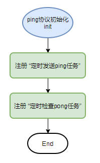
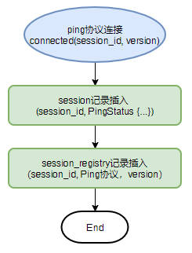
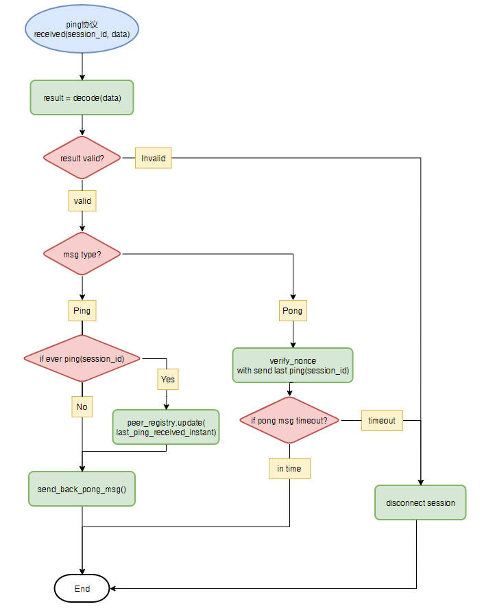
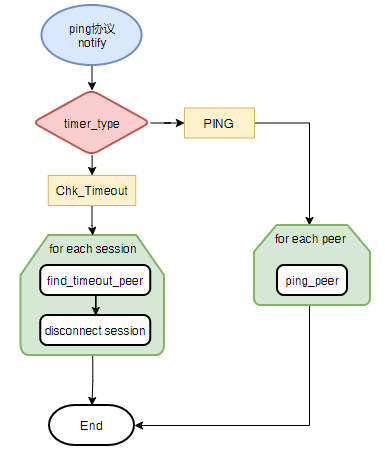

# CKB 网络PingPong协议

CKB 网络PingPong协议，提供了本节点与其他节点( peer )之间的RTT[0]( round-trip time )，帮助开发者衡量本节点与网络的其他外部节点的连接质量。

节点每隔固定时间（ping_interval_secs）发送Ping消息给与之相连接的其他外部节点，而其他外部节点在收到Ping消息后也需要在一定时间内（ping_timeout_secs）回送Pong消息。

如果外部节点未在ping_timeout_secs时间内回复Pong消息，即算作超时，节点会发送DisconnectMessage给该外部节点，之后切断与该外部节点的连接。

CKB配置文件ckb.toml中默认设置，ping_interval_secs为120秒（2分钟）；ping_timeout_secs为1200秒（20分钟）。

CKB节点默认内置PingPong协议，且无法关闭该协议。

### 协议消息

#### `Ping` 消息
包含一个随机生成的nonce数值（usigned int32）

每次发送Ping消息时，临时生成nonce，其值为当前时刻距离节点启动时刻之间的秒数，
同时会把本次发送时刻记录下来，方便计算对方回送Pong消息是否超时

#### `Pong` 消息
包含一个随机生成的nonce数值（usigned int32）

当节点收到一个 `Ping`消息时，将其中包含的nonce取出来，同时组装`Pong`消息，并放入该nonce值（方便对方节点收到回复的PongMessage，做nonce检查）。

### `ping_peers` RPC
CKB提供了RPC `ping_peers`，让开发者可以手动发送Ping消息给所有已连接外部节点，并把RTT的值存于与每一个外部节点关联的Session结构体中，开发者可以使用get_peers RPC来获取
last_ping_duration的值( Results provided in get_peers rpc last_ping_duration field )


## 相关数据结构
我们使用 [Molecule][1] 作为数据序列化格式，以下为相关数据结构的 schema:

```
union PingPayload {
    Ping,
    Pong,
}

table PingMessage {
    payload: PingPayload,
}

table Ping {
    nonce: Uint32,
}

table Pong {
    nonce: Uint32,
}

```

## 流程图
### 初始化

### 连接处理

### 收到 `PingMessage` 消息

### 定期任务


[0]: https://en.wikipedia.org/wiki/Round-trip_delay
[1]: ../0008-serialization/0008-serialization.md