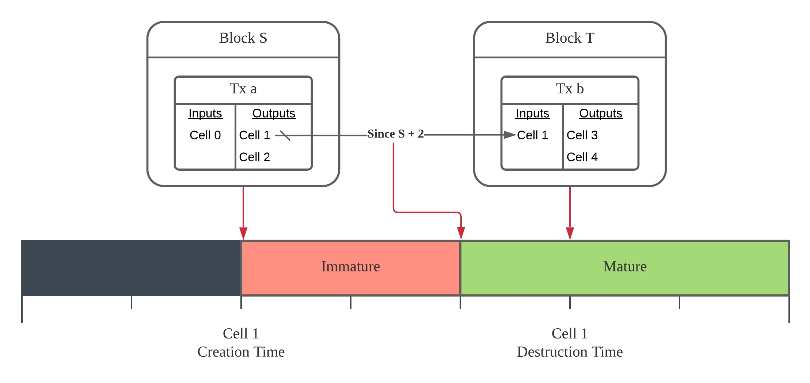
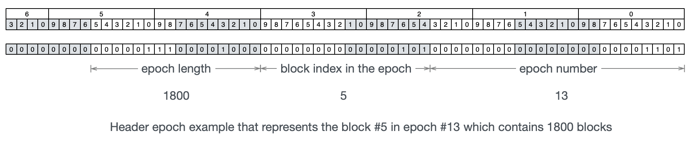

# Transaction valid since

<!-- Diagrams are created in LucidChart: https://lucid.app/documents/view/d756089a-2388-4ea4-b61a-3943cbe2620a -->

## Abstract

This RFC suggests adding a new consensus rule to prevent a cell to be spent before a certain time.

The time can be specified absolutely or relative to the cell committing time, and it can be measured using block number, epoch number with fraction, or block timestamp.

## Summary

Transaction input adds a new field `since`, which prevents the transaction to be mined before an absolute or relative time.

There are two important moments for a cell, the time of creation and destruction. The cell is created when the transaction producing it as an output has been committed into a block in the chain. And the destruction time is when the transaction consuming the cell as an input has been committed.

The field `since` specifies the earliest destruction time of the input cell. An input is said premature when its `since` field is present and the specified earliest destruction time has not arrived yet. A transaction is premature if any of its input is premature. A block should not commit any premature transactions.

## Specification

### Encoding

The `since` is a `u64` (unsigned 64-bit integer) type field in the transaction input. The highest 8 bits of the `since` field is the `flags`. The remaining `56` bits represent the `value`.

* The highest bit is the relative flag.
    * `0`: The `value` is absolute that the cell destruction time should not be earlier than `value`.
    * `1`: The `value` is relative that the cell destruction time should not be earlier than cell creation time plus `value`.
* The following two bits choose the time metric used to represent the creation time, destruction time, and the `value`.
    * `00`: Use block number.
    * `01`: Use epoch number with fraction.
    * `10`: Use the timestamp median of previous block headers.
    * `11`: Invalid. Transaction should not set metric flag to `11`.
* The next 5 bits are reserved for future extension. They must be set to all zeros now.

### Since Verification

A CKB node must iterate each input to check whether the cell is mature:

* An input is always due if its `since` is 0.
* If the relative flag is `0` (absolute), the cell is mature when the destruction time is larger than or equal to the `value`.
* If the relative flag is `1` (relative), the cell is mature when the destruction time is larger than or equal to the creation time plus the `value`.
* Otherwise, the cell is immature.

The transaction verification fails when any of its input is immature.

### Time Metrics

The metric flag determines how to obtain the cell creation and destruction time, and how to interpret the `value`.

Assume that the `S` is block in which the transaction creating the cell is committed, and `T` is the block where the current transaction is committed. If the transaction is still in the memory pool, `T` is the next to be mined block. `T - i` means the block which block number is  block `T`'s block number minus `i`.

| Metric | Creation Time | Destruction Time | Value |
| ------ | ------------- | ---------------- | ----- |
| 00     | block number of S | block number of T | Number of blocks in integer |
| 01     | epoch number with fraction of S | epoch number with fraction of T | number of epochs in fraction |
| 10     | timestamp median of \[ S - 37, S - 1 \] | timestamp median of \[ T - 37, T - 1 \] | Number of milliseconds |

#### Block Number

When the metric flag is `00` (Block number):

* The creation time is the block number of `S`.
* The destruction time is the block number of `T`.
* The `value` is a unsigned integer. It is a block number when the relative flag is `0` (absolute), and is the number of blocks when of relative flag is `1` (relative).

#### Epoch Number With Fraction

When the metric flag is `01` (Epoch number with fraction):

* The creation time is a rational number `E(S) + I(S) / L(S)`, where
    * `E(S)` is the epoch number of the epoch that the block `S` is in.
    * `I(S)` is the block index of `S` in the epoch. The index of the first block in an epoch is 0.
    * `L(S)` is the epoch length.
* The destruction time is a rational number `E(T) + I(T) / L(T)`, where
    * `E(T)` is the epoch number of the epoch that the block `T` is in.
    * `I(T)` is the block index of `T` in its epoch.
    * `L(T)` is the epoch length.
* The `value` is a encoded rational number `E + I / L` the same as the `epoch` field in the block header, where

    

    * `E` is the epoch number part, the three bytes from the lowest bit 0 to 23.
    * `I` is the block index in the epoch part, the two bytes from the bit 24 to 39.
    * `L` is the epoch length part, the two bytes from the bit 40 to 55. There's an **exception** here, `L` is at least 1. If `L` is zero, the whole rational number is considered as `E + 0 / 1`.

**Specially**, when the relative flag is `0` (absolute), the `value` is normalized first. But when the relative flag is `1` (relative), the `value` is interpreted as it is and is added to the creation time directly.

**Absolute Epoch With Fraction Value Normalization**: If the relative flag is `0` (absolute)　and `I` is larger than or equal to `L`, the `value` is normalized to `E + 1 + 0 / 1`.

#### Block Timestamp

When the metric flag is `10` (Timestamp median of previous block headers):

* The creation time is the timestamp median of the 37 blocks from `S - 37` to `S - 1`.
* The destruction time is the timestamp median of the 37 blocks from `T - 37` to `T - 1`.
* The `value` is the number of milliseconds since the Unix Epoch when the relative flag is `0` (absolute) or number of milliseconds when it is `1` (relative).

## Test Vectors

### Encoding

* `0x0000_0000_0000_0000`
    Valid, it represents that the since is absent.

* `0x0000_0000_0000_3039`
    Valid, where
    * The relative flag is 0 (absolute) = `since >> 63`,
    * The metric flag is 00 in binary (block number) = `(since >> 61) & 3`,
    * The value is 12345 = `since & ((1 << 56) - 1)`.

    It requires the minimal destruction time to be the block number 12345.

* `0x2000_0000_0000_0400`
    Valid, where
    * The relative flag is 0 (absolute) = `since >> 63`,
    * The metric flag is 01 in binary (epoch number with fraction) = `(since >> 61) & 3`,
    * The value is `1024 + 0/1`:
        * The epoch number is 1024 = `since & ((1 << 24) - 1)`,
        * The block index in epoch is 0 = `(since >> 24) & ((1 << 16) - 1)`,
        * The epoch length is 1 = `max(1, (since >> 40) & ((1 << 16) - 1))`.
    
    It requires the minimal destruction time to be the first block in the epoch 1024.
 
* `0x4000_0171_3309_9c00`
    Valid, where
    * The relative flag is 0 (absolute) = `since >> 63`,
    * The metric flag is 10 in binary (timestamp median) = `(since >> 61) & 3`,
    * The value is 1585699200000 = `since & ((1 << 56) - 1)`, which is 2020-04-01 12:00 AM in UTC.

    It requires the minimal destruction time to be the first block where the median of the block header timestamp of the previous 37 blocks is at least 1585699200000.

* `0x8000_0000_0000_0064`
    Valid, where
    * The relative flag is 1 (relative) = `since >> 63`,
    * The metric flag is 00 in binary (block number) = `(since >> 61) & 3`,
    * The value is 100 = `since & ((1 << 56) - 1)`.

    It requires the minimal destruction time to be the block number `S` plus 100.

* `0xa000_0000_0000_0018`
    Valid, where
    * The relative flag is 1 (relative) = `since >> 63`,
    * The metric flag is 01 in binary (epoch number with fraction) = `(since >> 61) & 3`,
    * The `value` is `24 + 0 / 1`:
        * The epoch number is 24 = `since & ((1 << 24) - 1)`,
        * The block index in epoch is 0 = `(since >> 24) & ((1 << 16) - 1)`,
        * The epoch length is 1 = `max(1, (since >> 40) & ((1 << 16) - 1))`.
    
    It requires the minimal destruction time to be the epoch number with fraction equal to creation time plus `24 + 0 / 1`.

* `0xc000_0000_4819_0800`
    Valid, where
    * The relative flag is 1 (relative) = `since >> 63`,
    * The metric flag is 10 in binary (timestamp median) = `(since >> 61) & 3`,
    * The value is 1209600000 = `since & ((1 << 56) - 1)`, which is 14 days.

    It requires the minimal destruction time to be the median timestamp equal to creation time plus 14 days.

* `0x0000_0000_0000_3039`
    Valid, where
    * The relative flag is 0 (absolute) = `since >> 63`,
    * The metric flag is 00 in binary (block number) = `(since >> 61) & 3`,
    * The value is 12345 = `since & ((1 << 56) - 1)`.

    It requires the minimal destruction time to be the block number 12345.

* `0x0100_0000_0000_3039`
    Invalid, the preserve flags are not all zeros: `(since >> 56) & ((1 << 5) - 1) = 1`

* `0x6000_0000_0000_3039`
    Invalid, the metric flag is 11 in binary: `(since >> 61) & 3`

### Since Verification

* Since is the absolute epoch with fraction `100 + 101 / 100`, which is normalized to `101 + 0 / 1` first. The transaction is valid when it is in the block which is in epoch 101 or later epochs. Or it is the transaction pool and the tip block is the last block of epoch 100, or any block in later epochs.
* Since is the relative epoch with fraction `100 + 101 / 100`, and the cell is created at `1 + 5 / 1800`. The transaction is valid when the destruction time is at least `100 + 101 / 100 + 1 + 5 / 1800`, which equals to `102 + 23 / 1800`.
