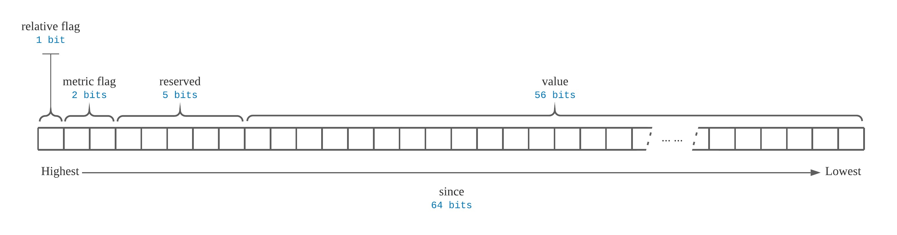
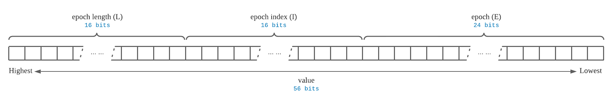
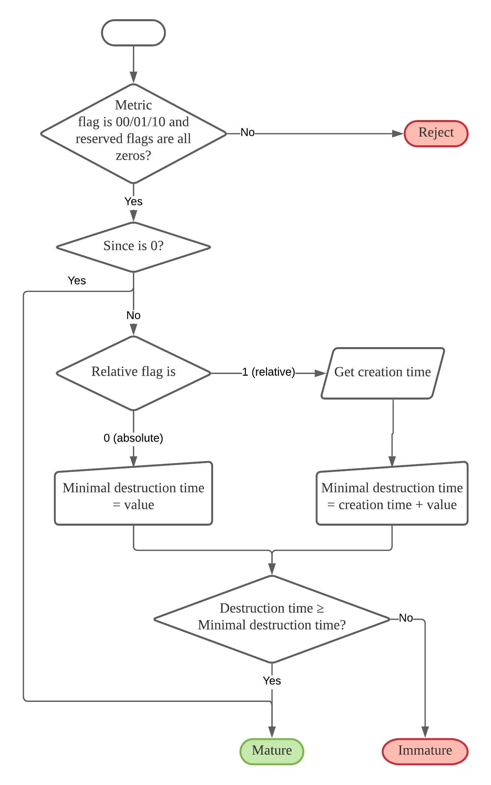
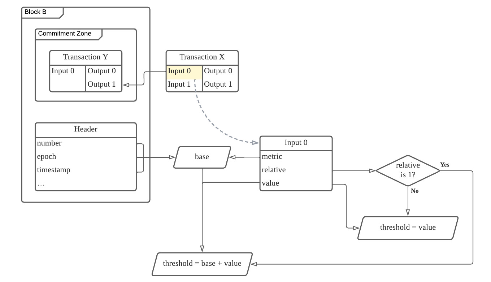
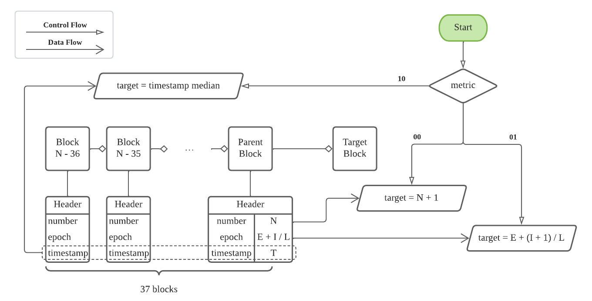

# Transaction Since Precondition

<!-- Diagrams are created in Lucid: https://lucid.app/documents/view/d756089a-2388-4ea4-b61a-3943cbe2620a -->

## Abstract

This RFC describes a consensus rule used to prevent a transaction input from being committed before a specified time in the future. 

## Summary

An optional `since` value can be added to any input within a transaction that specifies a time in the future when it can be committed. The current time must be equal to or greater than the time specified in the `since` value before a CKB node will consider this precondition fulfilled and allow the transaction to be committed.

A transaction may be composed of multiple inputs from different parties that are batched together. Therefore a `since` field is located on each input within the transaction to allow every party to set their `since` value individually. If the `since` precondition is not met on any input within the transaction, the entire transaction will be immediately rejected by the CKB node on submission.

Three metrics can be used to specify how the `since` time is expressed:

1. Block Number
2. Epoch Number (with fraction)
3. Timestamp (median of previous 37 blocks)

A developer can choose exactly one of these three metrics to use, and this will be used to indicate the format of `since` value. The metric used also used to determine how the threshold value, and the target value will be calculated. The threshold value is the block number, epoch number, or timestamp that must be reached to fulfill the precondition and allow the commit to occur. The target value can be thought of as the current block number, epoch number, or timestamp.

Note: Each one of these metrics will always increase in value over time with each new block added to the chain, meaning it is safe to assume these values will never decrease over time.

The relative flag must be set to either `absolute` or `relative` with the specified metric. This indicates how the threshold value should be calculated. 

When `absolute` is specified, the threshold value is set to the specified `since` value, which is interpreted by the metric selected.

When `relative` is specified, the threshold value is calculated by retrieving the base value from the commitment block and and adding the `since` value. The base value is the block number, epoch number, or timestamp depending on the metric selected. The commitment block is the block in which the input was committed.

After the threshold value and target value have been calculated they can be compared. The precondition is fulfilled only if the target value is equal to or greater than the threshold value.

## Specification

### How to Specify the Since Precondition

Each transaction input has a `since` field. The field itself is an unsigned 64-bit integer (u64) with special encoding for different values.[^1] A u64 value of `0` is used to indicate that the `since` precondition is disabled and will be ignored. If the field value is not `0`, then the highest 8 bits of the `since` field represent configuration `flags` and the remaining `56` bits represent the `value`.

[^1]: See [RFC22](../rfcs/0022-transaction-structure/0022-transaction-structure.md) for the full transaction structure.

* The highest bit is used to specify if the `value` is `absolute` or `relative`.

    * `0`: The `value` is `absolute`.
    * `1`: The `value` is `relative`.

* The next two bits specify the metric which will be used to interpret `value` and to calculate the treshold value and target value.

    * `00`: Use the block number.
    * `01`: Use the epoch number with fraction.
    * `10`: Use the median timestamp of the previous 37 block headers.
    * `11`: Invalid. The metric flag should never be set to `11`.

* The next 5 bits are reserved for future extension. They must all be set to zero for now.

Interpretation of `value` is dependent on the metric which was specified.

When the metric flag is set to block number (`00`) or timestamp median (`10`), then `value` is a 56-bit unsigned integer stored in little-endian.

When the metric flag is set to epoch number with fraction (`01`), `value` represents an epoch (E), epoch index (I), and epoch length (L). These three values are encoded into `value` as follows:

* `E` has 3 bytes, from the lowest bit 0 to 23.
* `I` has 2 bytes, from bit 24 to 39.
* `L` has 2 bytes, from bit 40 to 55.

Note: The bit ranges for `E`, `I`, and `L` are using [LSB 0 Bit Numbering](https://en.wikipedia.org/wiki/Bit_numbering#LSB_0_bit_numbering) which counts from right to left. All three values are stored in little-endian.

The following diagram illustrates how the `E`, `I`, and `L` bit ranges are positioned within the 56-bit `value` portion of the `since` field.

The following table shows how to decode different values contained within `since` using bit operations right shift (`>>`), left shift (`<<`), and bit and (`&`).

| Name | Bit Operation |
| ---- | ------------- |
| relative flag | `since >> 63` |
| metric flag   | `(since >> 61) & 3` |
| value         | `since & ((1 << 56) - 1)` |
| `E` in value  | `since & ((1 << 24) - 1)` |
| `I` in value  | `(since >> 24) & ((1 << 16) - 1)` |
| `L` in value  | `(since >> 40) & ((1 << 16) - 1)` |

### How to Verify the Since Precondition

There are three major steps to verify the since precondition:

1. Decode Values: Extract the necessary values which are encoded within the `since` field and verify the format is valid.
2. Compute Threshold Value: Determine the threshold value that will be used for comparison.
3. Derive Target Value and Compare: Derive the target value from the block that is going to commit the transaction. Compare it with the threshold value to check whether the precondition is fulfilled.

The following flowchart illustrates the verification process.

#### Step 1. Decode Values

> Extract the necessary values which are encoded within the `since` field and verify the format is valid.

If the `since` field value is zero, then this indicates that since precondition is not used and verification can be skipped.

If the `since` field value is not zero, verify that the format is valid:

1. The metric flag should not be `11`.
2. The reserved flags must be all zeros.
3. When the metric flag is epoch number with fraction (`01`), `I` must be less than `L`, or they must both be zeros. In the latter case, the `I` and `L` values will be set to `0` and `1` respectively.

If the format is valid, the process moves on to the next step.

#### Step 2. Compute Threshold Value

> Determine the threshold value that will be used for comparison.

The relative flag specifies if `absolute` or `relative` should be used to determine the threshold value.

When `absolute` is specified, the threshold value is set to the 56-bit `value` portion of the `since` field. This is a simple process that copies the value directly without any conversion, and no further steps need to be taken.

When `relative` is specified, the threshold value is set to the base value derived from the commitment block plus the (56-bit) `value` portion of the `since` field.

##### Commitment Block

A two-step transaction confirmation protocol is used by CKB, and it is defined in [RFC20][]. A transaction is only considered committed when it is included in the commitment zone of a block. The commitment block of a transaction is the block that committed the transaction.

[RFC20]: ../0020-ckb-consensus-protocol/0020-ckb-consensus-protocol.md#two-step-transaction-confirmation

A transaction input is a reference to an output of another transaction. The commitment block of a transaction input is the same as the commitment block of the transaction producing the referenced output.

In the diagram below, `Block B` is the commitment block of `Input 0` of `Transaction X`.

##### Base Value

The base value is derived from the input commitment block according to the metric that is specified.

1. If the metric flag is `00` (block number), the base value is the block number of the commitment block.
2. If the metric flag is `01` (epoch number with fraction), the base value is the epoch field in the commitment block header. This shares the same encoding as the aforementioned epoch field which contains the individual values for epoch (E), epoch index (I), and epoch length (L).
3. If the metric flag is `10` (timestamp), the base value is the timestamp field in the commitment block header.

The threshold value of an `absolute` precondition equals the 56-bit `value` portion of the `since` field. The threshold value of a `relative` precondition equals the base value plus the `value` portion of the `since` field.

The diagram below visualizes the threshold value computation process.

#### Step 3. Derive Target Value and Compare

> Derive the target value from the block that is going to commit the transaction. Compare it with the threshold to check whether the precondition is fulfilled.

We will use the term "target block" to refer to the block that commits a transaction. The target block of a committed transaction is the mined block which included the transaction. This is the same as the commitment block. The target block of a pending transaction in the mempool or in transit is the next block that will be mined, but has not been mined yet.

The target value is determined by the target block depending on which metric was selected. These are calculated as follows:

1. If the metric flag is `00` (block number), the target value is the block number of the last mined block, plus 1.
2. If the metric flag is `01` (epoch number with fraction), the target value is the next index of the last mined block. If the last mined block is `500 10/20` (E = 500, I = 10, L = 20), then the target value is `500 11/20` (E = 500, I = 11, L = 20).
3. If the metric flag is `10` (timestamp), the target value is the median of the timestamp field of the 37 blocks preceding the target block.

The final step is to compare the target value to the threshold value. The precondition is fulfilled if the target value is equal to or greater than the threshold value.
