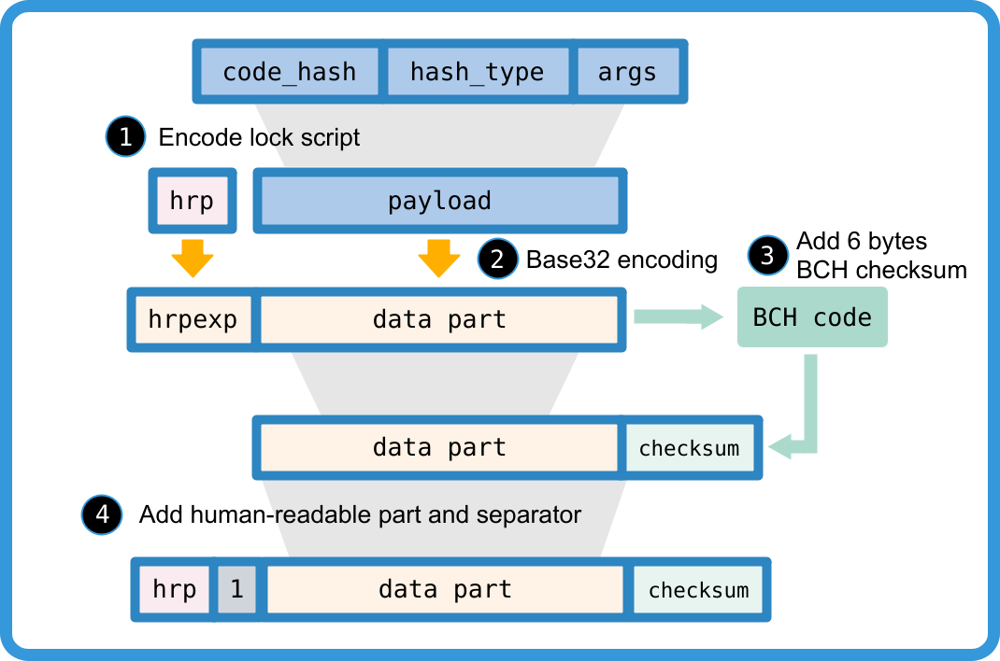

# CKB Address Format

## Abstract

*CKB Address Format* is an application level cell **lock script** display recommendation. The lock script consists of three key parameters, including *code_hash*, *hash_type* and *args*. CKB address packages lock script into a single line, verifiable, and human read friendly format.

## Data Structure

### Payload Format Types

To generate a CKB address, we firstly encode lock script to bytes array, name *payload*. And secondly, we wrap the payload into final address format.

There are several methods to convert lock script into payload bytes array. We use 1 byte to identify the payload format.

| format type |                   description                    |
|:-----------:|--------------------------------------------------|
|  0x00       | full version identifies the hash_type            |
|  0x01       | short version for locks with popular code_hash   |
|  0x02       | full version with hash_type = "Data", deprecated |
|  0x04       | full version with hash_type = "Type", deprecated |

### Full Payload Format

Full payload format directly encodes all data fields of lock script.
The encode rule of full payload format is Bech32m.

```c
payload = 0x00 | code_hash | hash_type | args
```

The `hash_type` field is for CKB VM version selection.

* When the hash_type is 0, the script group matches code via data hash and will run the code using the CKB VM version 0.
* When the hash_type is 1, the script group matches code via type script hash and will run the code using the CKB VM version 1.
* When the hash_type is 2, the script group matches code via data hash and will run the code using the CKB VM version 1.

### Short Payload Format

Short payload format is a compact format which identifies common used code_hash by 1 byte code_hash_index instead of 32 bytes code_hash.
The encode rule of short payload format is Bech32.

```c
payload = 0x01 | code_hash_index | args
```

To translate payload to lock script, one can convert code_hash_index to code_hash and hash_type with the following *popular code_hash table*. And args as the args.

| code_hash_index |        code_hash     |   hash_type  |          args           |
|:---------------:|----------------------|:------------:|-------------------------|
|      0x00       | SECP256K1 + blake160 |     Type     |  blake160(PK)*          |
|      0x01       | SECP256K1 + multisig |     Type     |  multisig script hash** |
|      0x02       | anyone_can_pay       |     Type     |  blake160(PK)           |

\* The blake160 here means the leading 20 bytes truncation of Blake2b hash result.

\*\* The *multisig script hash* is the 20 bytes blake160 hash of multisig script. The multisig script should be assembled in the following format:

```
S | R | M | N | blake160(Pubkey1) | blake160(Pubkey2) | ...
```

Where S/R/M/N are four single byte unsigned integers, ranging from 0 to 255, and blake160(Pubkey1) it the first 160bit blake2b hash of SECP256K1 compressed public keys. S is format version, currently fixed to 0. M/N means the user must provide M of N signatures to unlock the cell. And R means the provided signatures at least match the first R items of the Pubkey list.

For example, Alice, Bob, and Cipher collectively control a multisig locked cell. They define the unlock rule like "any two of us can unlock the cell, but Cipher must approve". The corresponding multisig script is:

```
0 | 1 | 2 | 3 | Pk_Cipher_h | Pk_Alice_h | Pk_Bob_h
```

Notice that the length of args in payload here is always 20 bytes. So, if you want to append [CKByte minimum field or/and UDT minimum field](https://github.com/nervosnetwork/rfcs/blob/master/rfcs/0026-anyone-can-pay/0026-anyone-can-pay.md#script-structure) to anyone_can_pay script, you should use the full payload format.

### Deprecated Full Payload Format

The deprecated full payload format directly encodes all data field of lock script.
The encode rule of deprecated full payload format is Bech32.

```c
payload = 0x02/0x04 | code_hash | args
```

The first byte identifies the lock script's hash_type, 0x02 for "Data", 0x04 for "Type".

Two reasons have caused this address format to be deprecated. First, a [flaw](https://github.com/sipa/bech32/issues/51) of Bech32 enables attackers to generate valid but unexpected addresses by deleting or inserting characters into certain full addresses. Last, the hard fork of [ckb2021](https://github.com/nervosnetwork/rfcs/blob/master/rfcs/0037-ckb2021/0037-ckb2021.md) requires a new field to indicate the CKB VM version for each script group.

## Wrap to Address

We follow [Bitcoin bech32 address format (BIP-173)][bip173] or [Bitcoin bech32m address format (BIP-350)][bip350] rules to wrap payload into address, which uses Bech32/Bech32m encoding and a [BCH checksum][bch].

The original version of Bech32/Bech32m allows at most 90 characters long. Similar with [BOLT][BOLT_url], we simply remove the length limit. The error correction function is disabled when the Bech32/Bech32m string is longer than 90. We don't intent to use this function anyway, because there is a risk to get wrong correction result.

A Bech32/Bech32m string consists of the **human-readable part**, the **separator**, and the **data part**. The last 6 characters of data part is checksum. The data part is base32 encoded. Here is the readable translation of base32 encoding table.

|       |0|1|2|3|4|5|6|7|
|-------|-|-|-|-|-|-|-|-|
|**+0** |q|p|z|r|y|9|x|8|
|**+8** |g|f|2|t|v|d|w|0|
|**+16**|s|3|j|n|5|4|k|h|
|**+24**|c|e|6|m|u|a|7|l|

The human-readable part is "**ckb**" for CKB mainnet, and "**ckt**" for the testnet. The separator is always "1".



## Examples and Demo Code

```yml
== short address (code_hash_index = 0x00) test ==
args to encode:          b39bbc0b3673c7d36450bc14cfcdad2d559c6c64
address generated:       ckb1qyqt8xaupvm8837nv3gtc9x0ekkj64vud3jqfwyw5v

== short address (code_hash_index = 0x01) test ==
multi sign script:       00 | 01 | 02 | 03 | bd07d9f32bce34d27152a6a0391d324f79aab854 | 094ee28566dff02a012a66505822a2fd67d668fb | 4643c241e59e81b7876527ebff23dfb24cf16482
args to encode:          4fb2be2e5d0c1a3b8694f832350a33c1685d477a
address generated:       ckb1qyq5lv479ewscx3ms620sv34pgeuz6zagaaqklhtgg

== full address test ==
code_hash to encode:     9bd7e06f3ecf4be0f2fcd2188b23f1b9fcc88e5d4b65a8637b17723bbda3cce8
hash_type to encode:     01
with args to encode:     b39bbc0b3673c7d36450bc14cfcdad2d559c6c64
full address generated:  ckb1qzda0cr08m85hc8jlnfp3zer7xulejywt49kt2rr0vthywaa50xwsqdnnw7qkdnnclfkg59uzn8umtfd2kwxceqxwquc4

 == deprecated full address test ==
code_hash to encode:     9bd7e06f3ecf4be0f2fcd2188b23f1b9fcc88e5d4b65a8637b17723bbda3cce8
with args to encode:     b39bbc0b3673c7d36450bc14cfcdad2d559c6c64
full address generated:  ckb1qjda0cr08m85hc8jlnfp3zer7xulejywt49kt2rr0vthywaa50xw3vumhs9nvu786dj9p0q5elx66t24n3kxgj53qks
```

Demo code: https://github.com/rev-chaos/ckb-address-demo

[bip173]: https://github.com/bitcoin/bips/blob/master/bip-0173.mediawiki

[bip350]: https://github.com/sipa/bips/blob/bip-bech32m/bip-0350.mediawiki

[bch]: https://en.wikipedia.org/wiki/BCH_code

[BOLT_url]: https://github.com/lightningnetwork/lightning-rfc/blob/master/11-payment-encoding.md

[multisig_code]: https://github.com/nervosnetwork/ckb-system-scripts/blob/master/c/secp256k1_blake160_multisig_all.c
