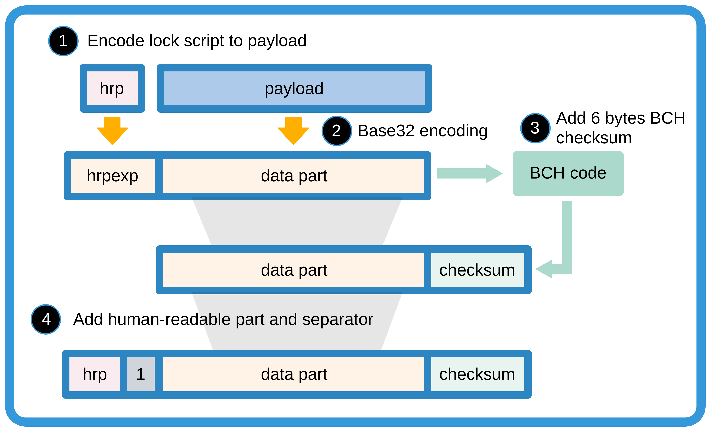

# CKB Address Format

## Abstract

*CKB Address Format* is an application level cell **lock script** display recommendation. The lock script consists of three key parameters, including *code_hash*, *hash_type* and *args*. CKB address packages lock script into a single line, verifiable, and human read friendly format.

## Data Structure

### Payload Format Types

To generate a CKB address, we firstly encode lock script to bytes array, name *payload*. And secondly, we wrap the payload into final address format.

There are several methods to convert lock script into payload bytes array. We use 1 byte to identify the payload format.

| format type |                   description                  |
|:-----------:|------------------------------------------------|
|  0x01       | short version for locks with popular code_hash |
|  0x02       | full version with hash_type = "Data"           |
|  0x04       | full version with hash_type = "Type"           |

### Short Payload Format

Short payload format is a compact format which identifies common used code_hash by 1 byte code_hash_index instead of 32 bytes code_hash.

```c
payload = 0x01 | code_hash_index | single_arg
```

To translate payload to lock script, one can convert code_hash_index to code_hash and hash_type with the following *popular code_hash table*. And single_arg as the args.


| code_hash_index |        code_hash     |   code_type  |          args           |
|:---------------:|----------------------|:------------:|-------------------------|
|      0x00       | SECP256K1 + blake160 |     Type     |  blake160(PK)*          |
|      0x01       | SECP256K1 + multisig |     Type     |  multisig script hash** |

\* The blake160 here means the leading 20 bytes truncation of Blake2b hash result.

\*\* The *multisig script hash* is the 20 bytes blake160 hash of multisig script. The multisig script should be assembled in the following format:

```
S | R | M | N | blake160(Pubkey1) | blake160(Pubkey2) | ...
```

Where S/R/M/N are four single byte unsigned integers, ranging from 0 to 255, and blake160(Pubkey1) are first 160bit blake2b hash of SECP256K1 compressed public keys. S is format version, currently fixed to 0. M/N means the user must provide M of N signatures to unlock the cell. And R means the provided signatures at least match the first R items of the Pubkey list.

For example, Alice, Bob, and Cipher collectively control a multisig locked cell. They define the unlock rule like "any two of us can unlock the cell, but Cipher must approve". The corresponding multisig script is:

```
0 | 1 | 2 | 3 | Pk_Cipher_h | Pk_Alice_h | Pk_Bob_h
```

**Notice**: The multisig lock code also support [valid since parameter][multisig_code]. Users could append a uint64 format since parameter to multisig script hash to setup cell lock period. The [RFC-0017][RFC0017] shows what the valid since means. To use this feature, we combine the 160 bits multisig script hash with 64 bits since variable, together as lock script arg. However, to keep address independent form time related variables, we don't encode the 64 bits since variable into address format. So **the multisig short address specification only cover first 20 bytes multisig script hash parameter, and simply ignore the following 8 bytes since parameter of lock script arg**.

### Full Payload Format

Full payload format directly encodes all data field of lock script.

```c
payload = 0x02/0x04 | code_hash | len(arg[0]) | arg[0] | ...
```

The first byte identifies the lock script's hash_type, 0x02 for "Data", 0x04 for "Type". We convert every element of args to plain bytes array format, and add a length number in front of every array. To keep it simple, we limit every argument size to maxium 256, which is 1 byte.

## Wrap to Address

We follow [Bitcoin base32 address format (BIP-173)][bip173] rules to wraps payload in to address, which uses Bech32 encoding and a [BCH checksum][bch].

The original version of Bech32 allows at most 90 characters long. Similar with [BOLT][BOLT_url], we simply remove the length limit. The error correction function is disabled when the Bech32 string is longer than 90. We don't intent to use this function anyway, because there is a risk to get wrong correction result.

A Bech32 string consists of the **human-readable part**, the **separator**, and the **data part**. The last 6 characters of data part is checksum. The data part is base32 encoded. Here is the readable translation of base32 encoding table.

|       |0|1|2|3|4|5|6|7|
|-------|-|-|-|-|-|-|-|-|
|**+0** |q|p|z|r|y|9|x|8|
|**+8** |g|f|2|t|v|d|w|0|
|**+16**|s|3|j|n|5|4|k|h|
|**+24**|c|e|6|m|u|a|7|l|

The human-readable part is "**ckb**" for CKB mainnet, and "**ckt**" for the testnet. The separator is always "1".



## Examples and Demo Code

```py
    # for short payload format
    pk = "13e41d6F9292555916f17B4882a5477C01270142"
    address = "ckb1qyqp8eqad7ffy42ezmchkjyz54rhcqf8q9pqrn323p"

    # for full payload format
    code_hash = "48a2ce278d84e1102b67d01ac8a23b31a81cc54e922e3db3ec94d2ec4356c67c"
    hash_type = "Data"
    args = ['dde7801c073dfb3464c7b1f05b806bb2bbb84e99', '00c1ddf9c135061b7635ca51e735fc2b03cee339']
    address = "ckb1qfy29n383kzwzyptvlgp4j9z8vc6s8x9f6fzu0dnaj2d9mzr2mr8c9xau7qpcpealv6xf3a37pdcq6ajhwuyaxg5qrqam7wpx5rpka34efg7wd0u9vpuaceeu5fsh5"
```

Demo code: https://github.com/CipherWang/ckb-address-demo 

[bip173]: https://github.com/bitcoin/bips/blob/master/bip-0173.mediawiki

[bch]: https://en.wikipedia.org/wiki/BCH_code

[BOLT_url]: https://github.com/lightningnetwork/lightning-rfc/blob/master/11-payment-encoding.md

[multisig_code]: https://github.com/nervosnetwork/ckb-system-scripts/blob/master/c/secp256k1_blake160_multisig_all.c

[RFC0017]: https://github.com/nervosnetwork/rfcs/blob/master/rfcs/0017-tx-valid-since/0017-tx-valid-since.md
