# CKB Transaction Structure

This RFC is about an essential data structure in CKB, the transaction. CKB is under active development. At the time of writing, the corresponding CKB version is v0.25.0.

The document contains two parts. The first one covers the core transaction features, and the second one introduces some extensions.

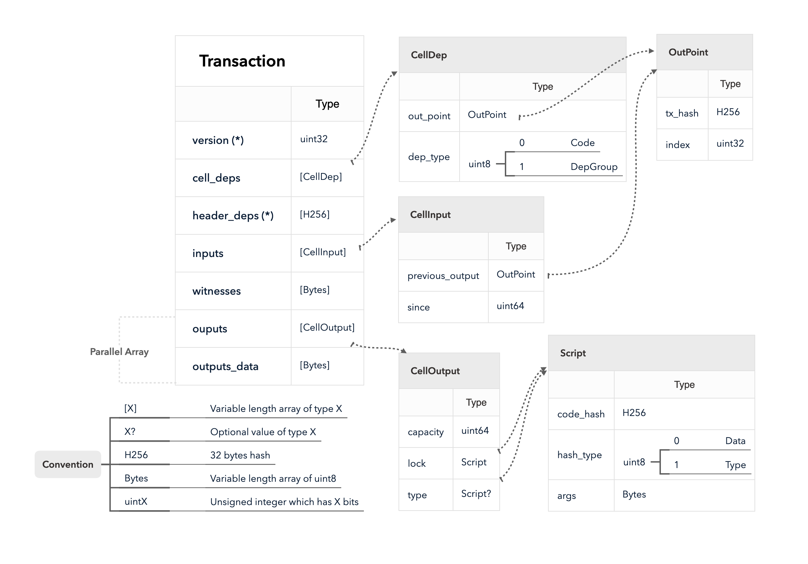

The diagram above is an overview of the transaction structure. Instead of explaining field by field, the following paragraphs introduce various features which the CKB transaction provides and how the fields play their roles in these features.

## TOC

* [Part I: Core Features](#part-i-core-features)
  + [Value Storage](#value-storage)
  + [Cell Data](#cell-data)
  + [Code Locating](#code-locating)
  + [Lock Script](#lock-script)
  + [Type Script](#type-script)
  + [Recap of The Transaction Structure in Part I](#recap-of-the-transaction-structure-in-part-i)
* [Part II: Extensions](#part-ii-extensions)
  + [Dep Group](#dep-group)
  + [Upgradable Script](#upgradable-script)
  + [Type ID](#type-id)
  + [Header Deps](#header-deps)
  + [Other Fields](#other-fields)
  + [Exceptions](#exceptions)
* [Appendix A: Compute Various Hash](#appendix-a-compute-various-hash)
  + [Crypto Primitives](#crypto-primitives)
  + [Transaction Hash](#transaction-hash)
  + [Cell Data Hash](#cell-data-hash)
  + [Script Hash](#script-hash)

## Part I: Core Features

### Value Storage

CKB adopts UTXO model. A transaction destroys some outputs created in previous transactions and creates some new outputs. We call the transaction output a cell in CKB. Thus the name cell and transaction output are interchangeable.

The following diagram shows the fields used in this layer.

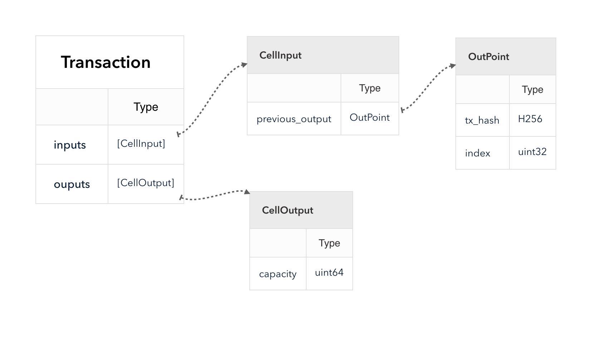

The transaction destroys the cells in `inputs` and creates the cells in `outputs`. 

The CKB chain packages transactions into blocks. We can use block number to refer to a block in the chain, which is an increasing non-negative integer starting from 0, the genesis block. The transactions in a block are also ordered. We say a block is older if it has a smaller block number, a transaction is older if either it is in an older block, or its position in a block is before another transaction. In the following example, Block i is older than Block i + 1. Transaction tx1 is older than tx2 and is older than tx3.

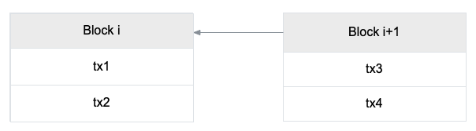

A live cell is the one that appears as an output but not as an input in all the older transactions. A dead cell has already been used as an input in any older transaction. A transaction can only use live cells as inputs.

We can compute the transaction hash from all transaction fields except `witnesses`. See Appendix A how to calculate the transaction hash.

The transaction hash is considered unique. Since cell is always created by a transaction, and every new cell has its position in the transaction outputs array, we can refer to a cell by transaction hash and outputs index. The structure `OutPoint` is just such reference type. The transaction uses `OutPoint` in inputs to reference the previously created cells instead of embedding them.

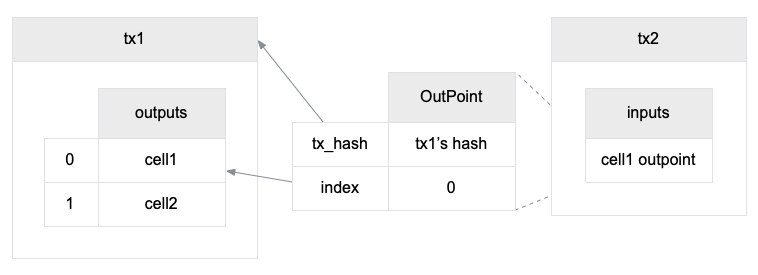

The cell stores the CKB Token in the field `capacity`. A transaction cannot mint capacities from the air, so a transaction must meet the following rule:

```json
sum(cell's capacity for each cell in inputs)
≥ sum(cell's capacity for each cell in outputs)
```

Miners can collect the difference as a fee.

```json
fee = sum(cell's capacity for each cell in inputs)
    - sum(cell's capacity for each cell in outputs)
```

If you are familiar with Bitcoin, you'll find out that the Value Storage layer is similar to Bitcoin, but lacking the locking script to protect the transaction output ownership. CKB does have that feature, but before that, I have to introduce Cell Data and Code Locating layer, which are the dependencies of any scripting feature in CKB.

### Cell Data

Instead of holding only the token value, CKB cell can store arbitrary data as well.

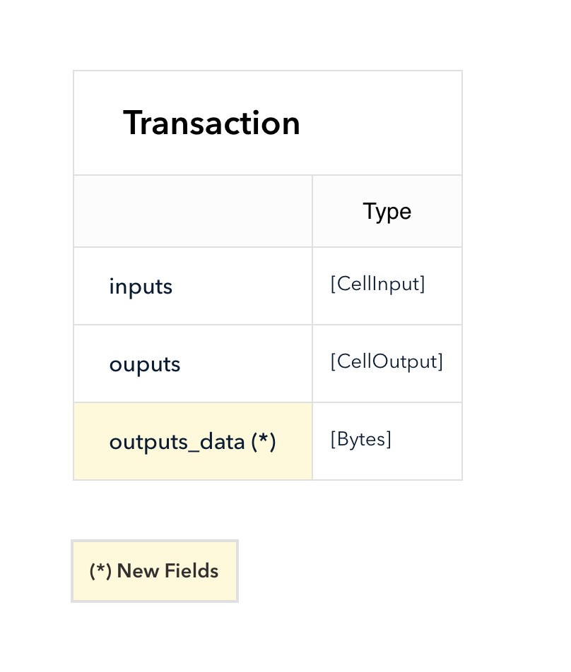

The field `outputs_data` is a parallel array of outputs. The data of the i-th cell in `outputs` is the i-th item in `outputs_data`.

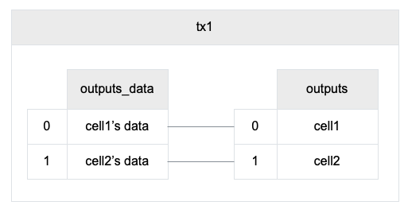

The `capacity` in the cell is not only just the amount of the stored tokens, but it is also a limit on how many data the cell can store. That's where the name comes from, It is the storage capacity of the cell.

The capacity is not only used to store data but it also has to cover all the fields in the cell, including `data`,  `lock`, `type`, and `capacity` itself.

The transaction must create an output cell which occupied capacity is less than the cell capacity.

```json
occupied(cell) ≤ cell's capacity
```
### Code Locating

The cell has two fields which type is `Script`. The CKB VM will run the `lock`  scripts of all the cells in inputs, and run the `type` scripts of all the cells in both inputs and outputs.

We differentiate the terms script and code.

- A script is the script structure.
- The code is the RISC-V binary.
- A code cell is cell which data is code.

The script does not include the code directly. See the script structure below. Let's ignore the hash type `Type` and the field `args` now.

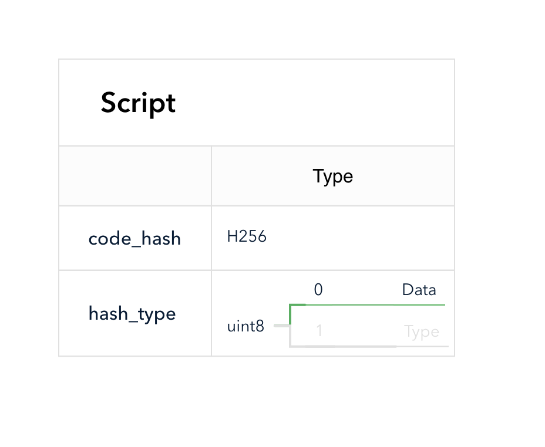

When a CKB VM needs to run a script, it must find its code first. The fields `code_hash` and `hash_type` are used to locate the code.

In CKB, the script code is compiled into RISC-V binary. The binary is stored as the data in a cell. When `hash_type` is "Data",  the script locates a cell which data hash equals the script's `code_hash`. The cell data hash, as the name suggests, is computed from the cell data (see Appendix A). The scope is limited in the transaction, script can only find a matched cell from `cell_deps`.

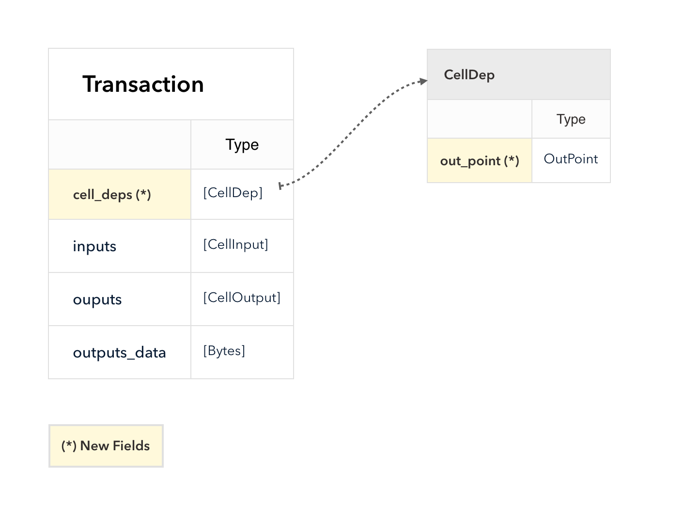

The following diagram shows how CKB finds a matched script code.

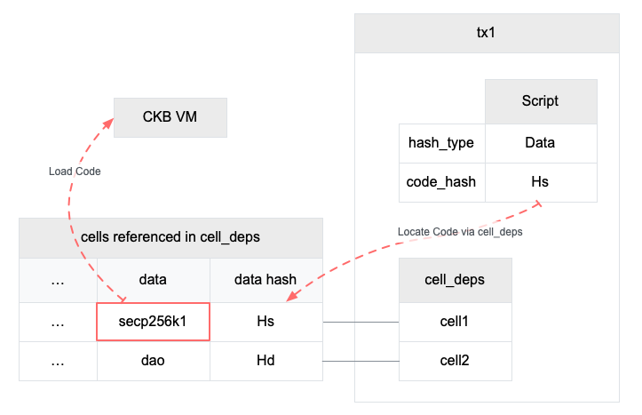

If you want to use a script in CKB, follow the code locating rules:

- Compile your code into RISC-V binary. You can find some examples in the [repository](https://github.com/nervosnetwork/ckb-system-scripts) which builds the code for system cells.
- Create a cell which stores the binary as data in a transaction, and send the transaction to the chain.
- Construct a script structure, which `hash_type` is "Data"[^1], and `code_hash` is just the hash of the built binary.
- Use the script as the type or the lock script in a cell.
- If the script has to run in a transaction, include the code cell's out point in the `cell_deps`.

[^1]: Or "Data1" after [rfc32] is activated.

[rfc32]: ../0032-ckb-vm-version-selection/0032-ckb-vm-version-selection.md

The cells in `cell_deps` must be live, just like `inputs`. Unlike `inputs`, a cell only used in `cell_deps` is not considered dead.

The following two chapters will talk about how the script is used in a transaction to lock the cells and establish contracts on cells.

### Lock Script

Every cell has a lock script. The lock script must run when the cell is used as an input in a transaction. When the script only appears in the outputs, it is not required to reveal the corresponding code in `cell_deps`. A transaction is valid only when all the lock scripts in the inputs exit normally. Since the script runs on inputs, it acts as the lock to control who can unlock and destroy the cell, as well as spend the capacity stored in the cell.

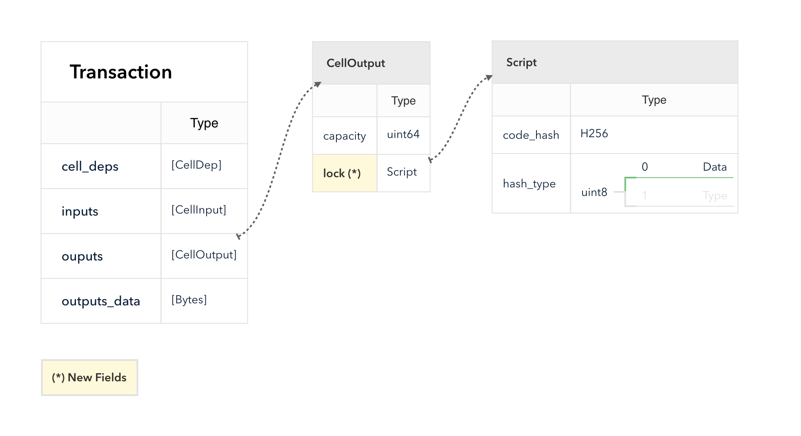

Following is an example lock script code which always exits normally. Anyone can destroy the cell if it uses the code as the lock script.

```c
int main(int argc, char *argv[]) {
  return 0;
}
```

The most popular way to lock a digital asset is the digital signature created by asymmetric cryptography.

The signature algorithm has two requirements:

- The cell must contain the information of the public key, so only the real private key can create a valid signature.
- The transaction must contain the signatures, which usually signs the whole transaction as the message.

In CKB, the public key fingerprint can be stored in the `args` field in the script structure, and the signature can be stored in the `witnesses` fields in transaction. I use "can" because it is just a convention and the recommended way, and is used in the default [secp256k1 lock script](https://github.com/nervosnetwork/ckb-system-scripts/blob/master/c/secp256k1_blake160_sighash_all.c). The script code is able to read any part of a transaction, so the lock script can choose a different convention, for example, storing the public key information in the cell data. However, if all the lock scripts  follow the recommended convention, it can simplify the apps which create transactions, such as a wallet.

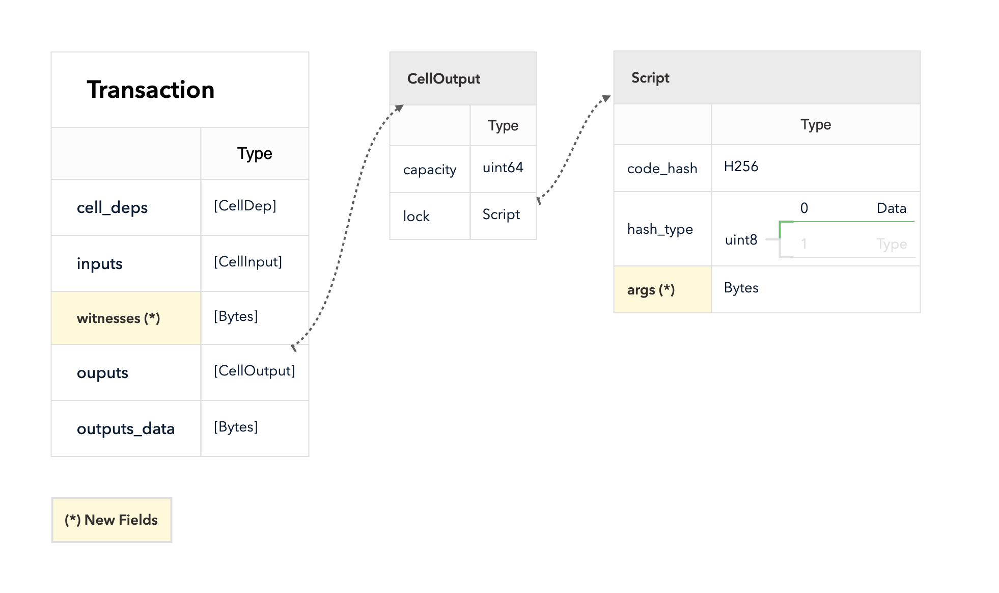

Now let's see how the script code is located and loaded, and how the code accesses inputs, script args, and witnesses.

First, pay attention that, CKB does not run the lock script input by input. It first groups the inputs by lock script and runs the same script only once. CKB runs a script in 3 steps: script grouping, code locating and running.

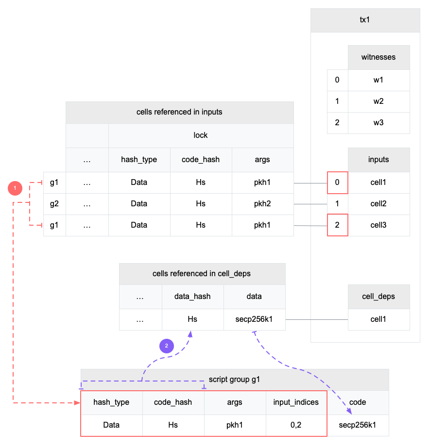

The diagram above shows the first two steps.

1. First, CKB groups inputs by lock script. In the example transaction, there are two different lock scripts used in inputs. Although they locate to the same code, they have different args. Let's focus on g1. It has two inputs with index 0 and 2. The script and the input indices will be used in step 3 later.
2. Then CKB locates the code from cell deps. It resolves to the cell with data hash `Hs` and will use its data as the code.

Now CKB can load the script code binary and run the code starting from the entry function. The script can read itself via syscall `ckb_load_script`.

```c
ckb_load_script(addr, len, offset)
```

Various CKB syscalls are designed to read data from the transaction. These syscalls have an argument to specify where to read the data. For example, to load the first witness:

```c
ckb_load_witness(addr, len, offset, 0, CKB_SOURCE_INPUT);
```

The first three arguments control where to store the read data and how many bytes to read. Let's ignore them in the following paragraphs.

The fifth argument is the data source. `CKB_SOURCE_INPUT` means reading from transaction inputs, and the fourth argument `0` is the index into the inputs array. `CKB_SOURCE_INPUT` is also used to read `witnesses`.

Remember that we have saved the indices of the input when grouping inputs by the lock script. This info is used to create the virtual witnesses and inputs array for the group. The code can read input or witness using the index in the virtual array via a special source `CKB_SOURCE_GROUP_INPUT`. Reading a witness using `CKB_SOURCE_GROUP_INPUT` just reads the witnesses which has the same position with the specified input.

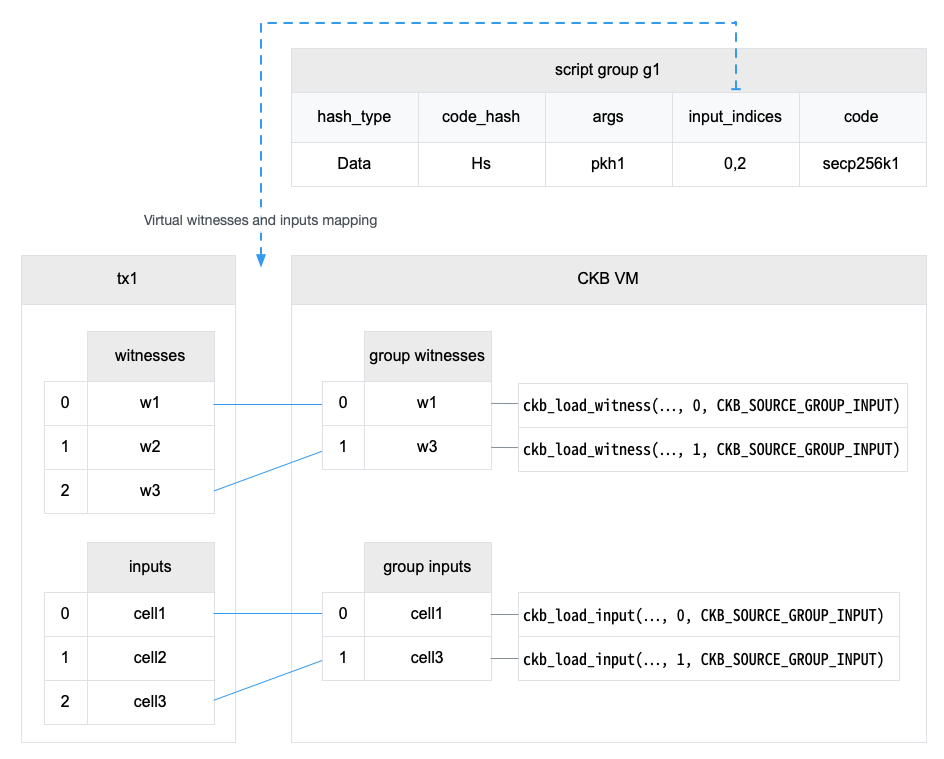

All the syscalls that read data related to the input, can use `CKB_SOURCE_GROUP_INPUT` and the index in the virtual inputs array, such as `ckb_load_cell_*` syscalls family.

### Type Script

Type script is very similar to lock script, with two differences:

- Type script is optional.
- In a transaction, CKB must run the type scripts in both inputs and outputs.

Although we can only keep only one type of script in the cell, we don't want to mess the different responsibilities in a single script.

The lock script is only executed for inputs, so its primary responsibility is protecting the cells. Only the owner is allowed to use the cell as input and spend the token stored along with it.

The type script is intended to establish some contracts on the cells. When you get a cell with a specified type, you can ensure that the cell has passed the verification in the specific code. And the code is also executed when the cell is destroyed. A typical scenario of type script is user-defined token. The type script must run on outputs, so the token issuance must be authorized.

Running type script on inputs is very important for contracts, for example, a contract to let user mortgage some amount of CKB tokens to rent an asset offline. If the type script does not run on inputs, the user can get back the CKB tokens without authority from the contract by merely destroying the cells and transfer the capacity to a new cell without type script.

The steps to run type script is also similar to lock script. Except that

1. Cells without a type script are ignored.
2. The script group contains both inputs and outputs.

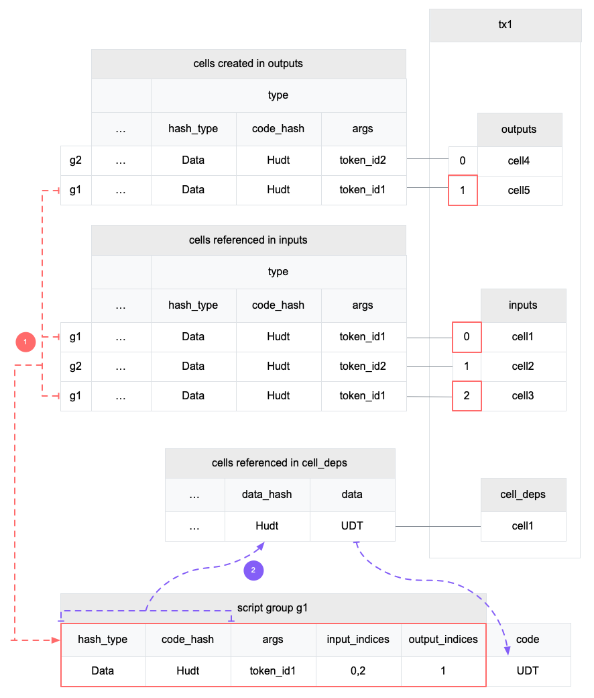

Like `CKB_SOURCE_GROUP_INPUT`, there's a special data source `CKB_SOURCE_GROUP_OUTPUT` to use the index into the virtual outputs array in the script group.

### Recap of The Transaction Structure in Part I

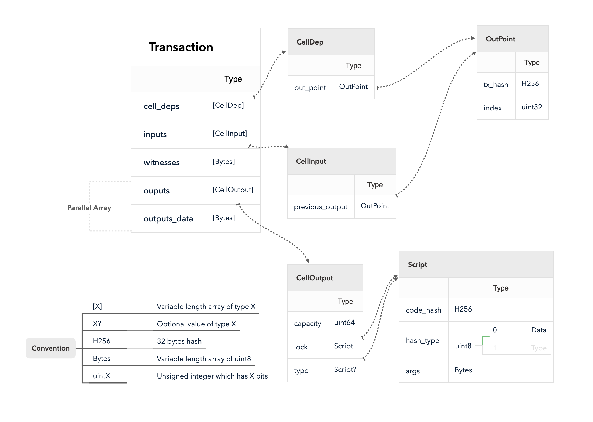

## Part II: Extensions

In part I, I have introduced the core features which the transaction provides. The features introduced in this part are some extensions that CKB can work without them, but these extensions will make the cell model better.

The diagram below is the overview of the new fields covered in this part.

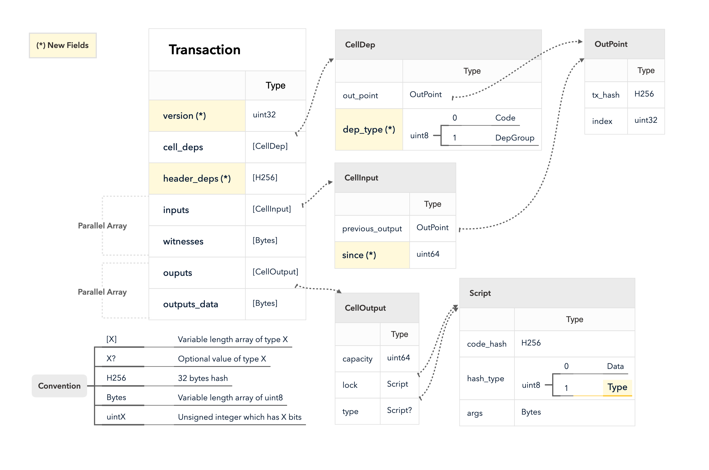

### Dep Group

Dep Group is a cell which bundles several cells as its members. When a dep group cell is used in `cell_deps`, it has the same effect as adding all its members into `cell_deps`.

Dep Group stores the serialized list of `OutPoint` in cell data. Each `OutPoint` points to one of the group members.

The structure `CellDep` has a field `dep_type` to differentiate the normal cells which provide the code directly, and the dep groups which is expanded to its members inside `cell_deps`.

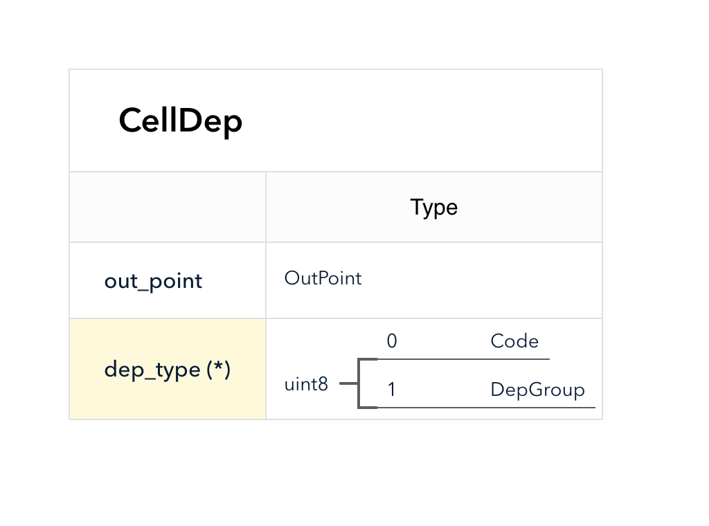

The dep group is expanded before locating and running code, in which only the expanded `cell_deps` are visible.

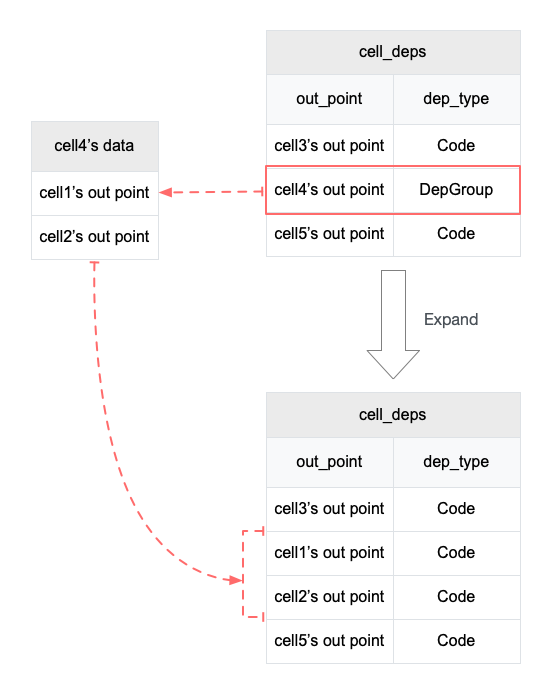

In v0.19.0, the lock script secp256k1 is split into code cell and data cell. The code cell loads the data cell via `cell_deps`. So if a transaction needs to unlock a cell locked by secp256k1, it must add both cells in `cell_deps`. With dep group, the transaction only needs the dep group.

There are two reasons why we split the secp256k1 cell.

- The code cell is small, which allows us to update it when the block size limit is low.
- The data cell can be shared. For example, we have implemented another lock script which uses ripemd160 to verify the public key hash. This script reuses the data cell.

### Upgradable Script

In the chapter Lock Script in Part I, I have described how a script locates its code via cell data hash. Once a cell is created, its associated script code cannot change, since it is known infeasible to find a different piece of code that has the same hash.

Script has another option for `hash_type`, *Type*.


When the script uses the hash type Type, it matches the cell which type script hash equals the `code_hash`. The type script hash is computed from the cell `type` field (see Appendix A).

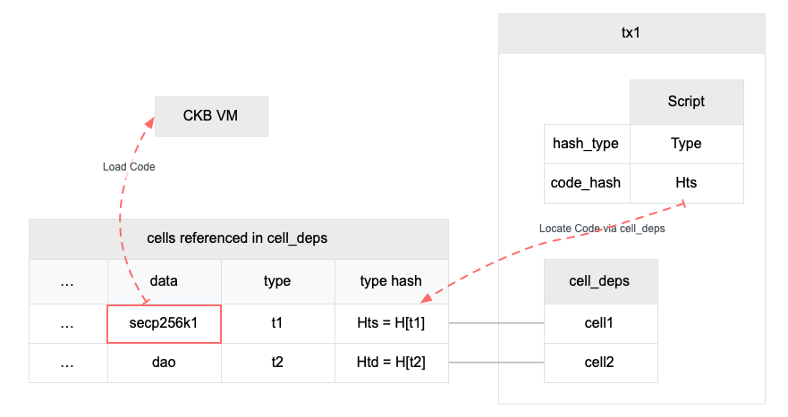

Now it is possible to upgrade code if the cell uses a script which locates code via type script hash by creating a new cell with the same type script. The new cell has the updated code. The transaction which adds the new cell in `dep_cells` will use the new version.

However, this only solves one problem that the script can refer to different versions of code. It is not safe if an adversary can create a cell with the same type script but using the forged code as the data. The adversary can bypass the script verification by using the fake cell as a dep. The following chapter will describe a script to solve the second problem.

Because the code referenced by type script hash can change, you must trust the script author to use such kind of type scripts. Although which version is used depends on which cell is added in the transaction in `dep_cells`, user can always inspect the code before signing the transaction. But if the script is used to unlock a cell, even the signature checking can be skipped.

### Type ID

There's a reason we choose cell type script hash to support upgradable script. If the adversary wants to create a cell with a specific type script, the transaction must be verified by the type script code.

Type ID is such a kind of type script. As the name suggests, it ensures the uniqueness of the type script.

This feature involves several type scripts, so I have to use different terms to differentiate them:

- The Type ID code cell is the cell which stores the code to verify that a type id is unique.
- The Type ID code cell has a type script as well. We don't care the actual content for now, let's assume the type script hash is TI.
- A Type ID is a type script which `hash_type` is "Type", and `code_hash` is TI.

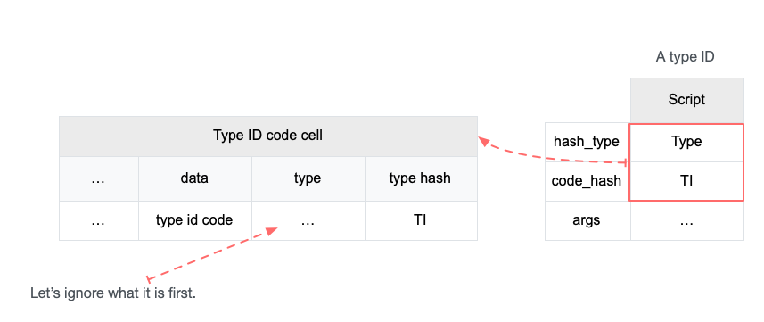

In the chapter Type Script in Part I, we know that type script groups inputs and outputs first. In other words, if the type script is a type ID, the inputs and outputs in the group all have the same type ID.

The Type ID code verifies that, in any type id group, there is at most one input and at most one output. But a transaction is allowed to have multiple type id groups. Depends on the numbers of inputs and outputs, the type id groups are categorized into three different types:

- Type ID Creation Group has only one output.
- Type ID Deletion Group has only one input.
- Type ID Transfer Group has one input and one output.

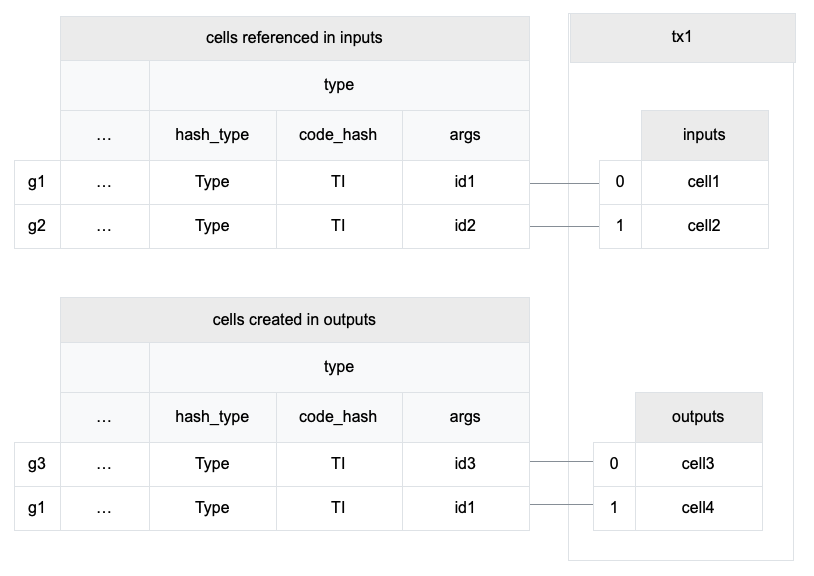

The transaction in the diagram above has all the three kinds of type id group. 

- G1 is a Type ID Transfer Group which transfers the type id from cell1 to cell4.
- G2 is a Type ID Deletion Group which deletes the type id along with cell2.
- G3 is a Type ID Creation Group which creates a new type id for cell3.

In the Type ID Creation Group, the only argument in `args` is the hash of this transaction first `CellInput` structure and the output index of the cell in the group. For example, in the group g3, id3 is a hash on `tx.inputs[0]` and 0 (cell3's index in `tx.outputs`).

There are two ways to create a new cell with a specific type id.

1. Create a transaction where the hash of `tx.inputs[0]` and any index equal to a specific value. Since a cell can only be used as an input once in the chain, `tx.inputs[0]` must different in each transaction, so this problem is equivalent to find out a hash collision, which probability is negligible.
2. Destroy the old cell in the same transaction.

We assume that method 2 is the only way to create a cell which equals to an existing type id. And this way requires the authorization of the original owner.

The Type ID code can be implemented via only CKB VM code, but we choose to implement it in the CKB node as a special system script. Because if we want to be able to upgrade Type ID code itself later, it has to use itself as the type script via type script hash, which is a recursive dependency.

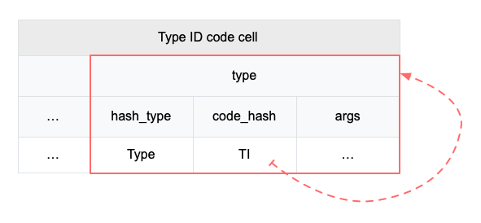

The Type ID code cell uses a special type script hash, which is just the ascii codes in hex of the text `TYPE_ID`.

```
0x00000000000000000000000000000000000000000000000000545950455f4944
```


### Header Deps

Header Deps allows the script to read block headers. This feature has some limitation to ensure the transaction is determined.

We say a transaction is determined that if all the scripts in the transaction have the determined results.

Header Deps allows the scripts to read a block header which hashes are listed in `header_deps`. There's another precondition that the transaction can only be added to the chain if all the block listed in `header_deps` are already in the chain (uncles excluded).

There are two ways to load a header in a script using syscall `ckb_load_header`:

- Via header deps index.
- Via an input or a cell dep. The syscall will return the block in which the cell is created if that block is listed in `header_deps`.

The second way to load a header has another benefit that the script knows the cell is in the loaded block. DAO withdraw transaction uses it to get the block number where the capacity was deposited.

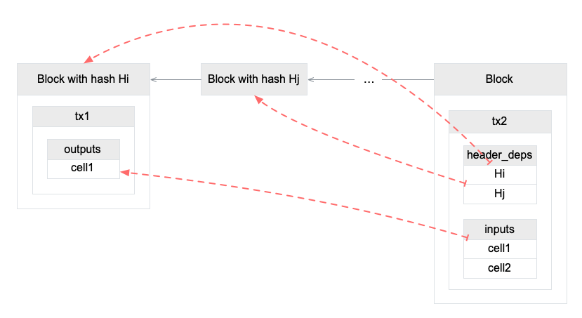

Here are some examples of loading header In the diagram above.

```c
// Load the first block in header_deps, the block Hi
load_header(..., 0, CKB_SOURCE_HEADER_DEP);

// Load the second block in header_deps, the block Hj
load_header(..., 1, CKB_SOURCE_HEADER_DEP);

// Load the block in which the first input is created, the block Hi
load_header(..., 0, CKB_SOURCE_INPUT);

// Load the block in which the second input is created.
// Since the block creating cell2 is not in header_deps, this call loads nothing.
load_header(..., 1, CKB_SOURCE_INPUT);
```
### Other Fields

The field `since` prevents a transaction been mined before a specific time. It already has its own [RFC](https://github.com/nervosnetwork/rfcs/blob/master/rfcs/0017-tx-valid-since/0017-tx-valid-since.md).

The field `version` is reserved for future usage. It must equal 0 in current version.

### Exceptions

There are two special transactions in the system.

The first one is the cellbase, which is the first transaction in every block. The cellbase transaction has only one dummy input. In the dummy input, the `previous_outpoint` does not refer to any cell but set to a special value. The `since` must be set to the block number.

The outputs of the cellbase are the reward and transaction fees for an older block in the chain.

Cellbase is special because the output capacities do not come from inputs.

Another special transaction is the DAO withdraw transaction. It also has a portion of output capacities that do not come from inputs. This portion is the interest by locking the cells in the DAO. CKB recognizes the DAO withdraw transaction by check whether there's any input uses DAO as the type script.

## Appendix A: Compute Various Hash

### Crypto Primitives

**ckbhash**

CKB uses blake2b as the default hash algorithm. We use **ckbhash** to denote the blake2b hash function with following configuration:

* output digest size: 32
* personalization: ckb-default-hash

### Transaction Hash

Transaction hash is `ckbhash(molecule_encode(tx_excluding_witness))` where

* `molecule_encode` serializes a structure into binary using [molecule](https://github.com/nervosnetwork/rfcs/blob/master/rfcs/0008-serialization/0008-serialization.md).
* `tx_excluding_witness` is the transaction structure excluding the witness field.  See the definition `RawTransaction` in the [schema file](https://github.com/nervosnetwork/ckb/blob/a6733e6af5bb0da7e34fb99ddf98b03054fa9d4a/util/types/schemas/blockchain.mol#L55-L62).

### Cell Data Hash

Cell data hash is just `ckbhash(data)`.

### Script Hash

Script hash is `ckbhash(molecule_encode(script))` where `molecule_encode` turns the script structure into a block of binary via molecule. See the definition `Script` in the [schema file](https://github.com/nervosnetwork/ckb/blob/a6733e6af5bb0da7e34fb99ddf98b03054fa9d4a/util/types/schemas/blockchain.mol#L28-L32).

