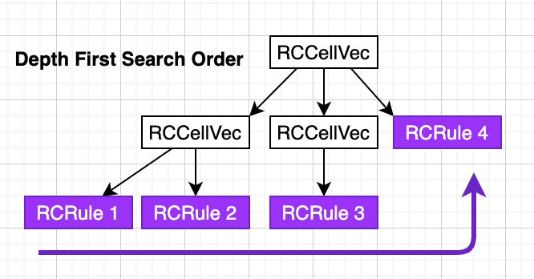

# Omnilock

Omnilock is a lock script designed for interoperability. It comes with built-in support for verification of transaction
signing methods used in Bitcoin, Ethereum, EOS, and Dogecoin. Omnilock is also extensible, so more verification
algorithms can be added in future.

Another feature of Omnilock for practitioners is the regulation compliance module which brings interoperability with
the traditional world. If enabled, the specified administrator can revoke tokens held by users under circumstances
which the administrator deems proper. This part has evolved from the [Regulation Compliance Extension
(RCE)](https://talk.nervos.org/t/rfc-regulation-compliance-extension/5338) proposal for
[xUDT](https://talk.nervos.org/t/rfc-extensible-udt/5337). This feature provides an option that sits at the other side
of the asset lock spectrum and lays the foundation of registered assets like Apple stock on CKB. When used together,
Omnilock and RCE provide an [ERC-1404](https://erc1404.org/) equivalence.


## Omnilock Script

### Lock Script

An Omnilock script has the following structure:
```text
Code hash: Omnilock script code hash
Hash type: Omnilock script hash type
Args: <21 byte auth> <Omnilock args>
```


There are 2 key fields in `args`: `Omnilock args` and `auth`. The `Omnilock args` is to control extra checking. It
allows different modes to be enabled in the same `Omnilock args`. The `auth` is used for authentication. It is generally
with pubkey hash in its content. 

The `Omnilock args` can be without mode (with `Omnilock flags` = 0) while the `auth` must be present. The functionality
of Omnilock script without mode is almost the same as traditional
[SECP256K1/blake160](https://github.com/nervosnetwork/rfcs/blob/master/rfcs/0024-ckb-genesis-script-list/0024-ckb-genesis-script-list.md#secp256k1blake160)
lock script. The Omnilock script can be considered as a traditional lock script with additional checking/modes.
Different modes can be enabled in different scenarios, depending on requirements.


### Omnilock args

The structure of `Omnilock args` is as follows:

```
<1 byte Omnilock flags> <32 byte AdminList cell Type ID, optional> <2 bytes minimum ckb/udt in ACP, optional> <8 bytes since for time lock, optional> <32 bytes type script hash for supply, optional>
```

| Name               | Flags      | Affected Args   |Affected Args Size (byte)|Affected Witness
| -------------------|------------|-----------------|---------|-------------------------------- 
| administrator mode | 0b00000001 |	AdminList cell Type ID | 32      | omni_identity/signature in OmniLockWitnessLock
| anyone-can-pay mode| 0b00000010 | minimum ckb/udt in ACP| 2 | N/A
| time-lock mode     | 0b00000100 | since for timelock| 8     | N/A
| supply mode        | 0b00001000 |type script hash for supply| 32 | N/A

All the modes will be described later.

### Authentication

An authentication (auth) is a 21-byte data structure containing the following components:

```
<1 byte flag> <20 bytes auth content>
```

Depending on the value of the flag, the auth content has the following interpretations:

* 0x0: The auth content represents the blake160 hash of a secp256k1 public key. The lock script will perform secp256k1
  signature verification, the same as the [SECP256K1/blake160
  lock](https://github.com/nervosnetwork/rfcs/blob/780b2f98068ed2337f3a97b02ec6b5336b6fb143/rfcs/0024-ckb-genesis-script-list/0024-ckb-genesis-script-list.md#secp256k1blake160).

* 0x01~0x05: It follows the same unlocking methods used by
  [PW-lock](https://github.com/lay2dev/pw-lock/blob/c2b1456bcca06c892e1bb8ec8ac0a64d4fb2b83d/c/pw_lock.h#L190-L223) with different [hash calculation](https://github.com/lay2dev/pw-lock#hash-calculation) on message. 


* 0x06: It follows the same unlocking method used by [CKB
  MultiSig](https://github.com/nervosnetwork/ckb-system-scripts/blob/master/c/secp256k1_blake160_multisig_all.c) with a little modification.
  When a message is calculated for signing, there is a step to clear witness. In omnilock, it clears the whole field `lock` in `witness`. But in CKB MultiSig script, it only clears part of `lock` in `witness`. This part is used as `signatures` followed by `multisig_script`.

* 0xFC: The auth content that represents the blake160 hash of a lock script. The lock script will check if the current
  transaction contains an input cell with a matching lock script. Otherwise, it would return with an error. It's similar
  to [P2SH in BTC](https://en.bitcoin.it/wiki/Pay_to_script_hash).

* 0xFD: The auth content that represents the blake160 hash of a preimage. The preimage contains
  [exec](https://github.com/nervosnetwork/rfcs/blob/master/rfcs/0034-vm-syscalls-2/0034-vm-syscalls-2.md#exec) information that is used to delegate signature verification to
  another script via exec.

* 0xFE: The auth content that represents the blake160 hash of a preimage. The preimage contains [dynamic
  linking](https://docs.nervos.org/docs/labs/capsule-dynamic-loading-tutorial/) information that is used to delegate
  signature verification to the dynamic linking script. The interface described in [Swappable Signature Verification
  Protocol Spec](https://talk.nervos.org/t/rfc-swappable-signature-verification-protocol-spec/4802) is used here.


### Administrator Mode

When "administrator mode" is enabled, `<32 byte AdminList cell Type ID>` must be present. The AdminList cell contains the
type script hash used by a special cell with the same format as [RCE
Cell](https://talk.nervos.org/t/rfc-regulation-compliance-extension/5338). The RCE cell follows a set of rules and contains
whitelists and blacklists. These lists can be used in the [SMT proofs
scenarios](https://github.com/nervosnetwork/sparse-merkle-tree).

The RCE cells are organized in tree structure illustrated in the following diagram:




The diagram above shows the 4 lists in total. The AdminList cell Type ID is pointed to the root of tree and represents 4 lists in
order. If the current `RCRule` uses blacklist, the `auth` identity in `omni_identity` (see below) must not be present in
the blacklist SMT tree. If the current `RCRule` uses whitelist, the `auth` identity in `omni_identity` must be present
in the whitelist SMT tree.

The AdminList cell has the following distinctions compared to RCE Cell:

* The cell used here contains auth identities, not lock script hashes.

* If the cell contains an RCRule structure, this structure must be in whitelist mode.

* If the cell contains an RCCellVec structure, there must be at least one RCRule structure using whitelists in the RCCellVec.

To make this mode more flexible, when no type script hash is found in `cell_deps`, it continues searching in input cells
with the same type script hash. Once a cell is found, it will be used as `AdminList Cell`.

If the administrator mode flag is on, Anyone-can-pay mode, Time-lock mode and Supply mode flag will be ignored even set.
That means both the administrator and the user can unlock the cell, but the administrator is not constrained by
timelock. The administrator can only unlock existing cells with Administrator mode on. It's still impossible to bypass
supply limitation or mint new tokens at will.

### Anyone-can-pay Mode

When anyone-can-pay mode is enabled, `<2 bytes minimum ckb/udt in ACP>` must be present. It follows the rules of
[anyone-can-pay
lock](https://github.com/nervosnetwork/rfcs/blob/master/rfcs/0026-anyone-can-pay/0026-anyone-can-pay.md). The `<1 byte
CKByte minimum>` and `<1 byte UDT minimum>` are present at the same time.

### Time-lock Mode

When time-lock mode is enabled, `<8 bytes since for time lock>` must be present. The
[check_since](https://github.com/nervosnetwork/ckb-system-scripts/blob/63c63e9c96887395fc6990908bcba95476d8aad1/c/common.h#L91)
is used. The input parameter since is obtained from `<8 bytes since for time lock>`.

### Supply Mode

When supply mode is enabled, `<32 bytes type script hash>` must be present. The cell data of info cell which is specified
by type script hash has the following data structure:

```
version (1 byte)
current supply (16 bytes, little endian number)
max supply (16 bytes, little endian number)
sUDT script hash (32 bytes, sUDT type script hash)
... (variable length, other data)
```

Currently, the version is 0. Only the current supply field can be updated during transactions. The script iterates all
input and output cells, accumulating input amounts and output amounts identified by sUDT script hash. Then the script
verifies:

```
<issued amount> = <output amount> - <input amount>
<output current supply> = <issued amount> + <input current supply>
```
and
```
<output current supply> <= <max supply>
```

All the modes mentioned above can co-exist in Omnilock args in memory layout.

## Omnilock Witness

In witness, there is a signature field which is signed from a message. The message can be calculated via [blake2b hash function](https://github.com/nervosnetwork/rfcs/blob/master/rfcs/0022-transaction-structure/0022-transaction-structure.md#crypto-primitives) with following data:
- Transaction hash
- Witness length and content in same script group covered by inputs, excluding `lock` field which contains signature
- Other witness length and content that not covered by inputs


When unlocking an Omnilock, the corresponding witness must be a proper `WitnessArgs` data structure in molecule format. In
the lock field of the `WitnessArgs`, an `OmniLockWitnessLock` structure must be present as follows:
```
import xudt_rce;

array Auth[byte; 21];

table Identity {
    identity: Auth,
    proofs: SmtProofEntryVec,
}
option IdentityOpt (Identity);

// the data structure used in lock field of witness
table OmniLockWitnessLock {
    signature: BytesOpt,
    omni_identity: IdentityOpt,
    preimage: BytesOpt,
}
```

When `omni_identity` is present, it will be validated whether the provided auth in `omni_identity` is present in RC
AdminList Cell associated with the current lock script via SMT validation rules. In this case, the auth included in
`omni_identity` will be used in further validation.

If `omni_identity` is missing, the auth included in lock script args will then be used in further validation.

Once the processing above is successfully done and the auth to be used is confirmed, the flag in the designated auth
will be checked for the succeeding operations:

* When the auth flag is 0x0, a signature must be present in `OmniLockWitnessLock`. We will use the signature for secp256k1
  recoverable signature verification. The recovered public key hash using the blake160 algorithm must match the current
  auth content.

* When the auth flag is 0xFC, we will check against the current transaction, and there must be an input cell, whose lock
  script matches the auth content when hashed via blake160.


When `signature` is present, the signature can be used to unlock the cell in anyone-can-pay mode.

When `preimage` is present, the auth flag can be 0xFD or 0xFE.

* When auth flag is 0xFD, the `exec` method is used. The preimage's memory layout will be as follows:
```
exec code hash (32 bytes)
exec hash type (1 byte)
place (1 byte)
bounds (8 bytes)
pubkey blake160 hash (20 bytes)
```

The `place` and `bounds` are passed in directly to [exec](https://github.com/nervosnetwork/rfcs/blob/master/rfcs/0034-vm-syscalls-2/0034-vm-syscalls-2.md#exec):
```C
int ckb_exec(size_t index, size_t source, size_t place, size_t bounds, int argc, char* argv[]);
```
The `index` is located by `exec code hash` and `exec hash type` from `cell_deps`([See usage](https://github.com/nervosnetwork/ckb-c-stdlib/blob/20578dfb092b3b3761df755395e20ec142a83d6e/ckb_syscalls.h#L368)].
Finally, message, signature, pubkey blake160 hash are encoded into hex strings. Then these hex strings are passed in as `argv`.

* When auth flag is 0xFE, the `dynamic linking` method is used. The preimage's memory layout will be as follows:
```
dynamic library code hash (32 bytes)
dynamic library hash type (1 byte)
pubkey blake160 hash （20 bytes)
```

It loads the dynamic linking libraries via `code hash` and `hash type`, and gets the entry function named 
`validate_signature`. The entry function is expected to have following C API:
```C
int validate_signature(void *prefilled_data, const uint8_t *signature_buffer,
    size_t signature_size, const uint8_t *message_buffer, size_t message_size,
    uint8_t *pubkey_hash, size_t *pubkey_hash_len);
```
Then the entry function is called to validate the message and signature. The `pubkey_hash` returned from the entry
function is compared with the blake160 hash of the pubkey. If they are the same, then validation succeeds.

## Examples

### Unlock via owner's public key hash
```
CellDeps:
    <vec> Omnilock Script Cell
Inputs:
    <vec> Cell
        Data: <...>
        Type: <...>
        Lock:
            code_hash: Omnilock
            args: <flag: 0x0> <pubkey hash 1> <Omnilock flags: 0>
    <...>
Outputs:
    <vec> Any cell
Witnesses:
    WitnessArgs structure:
      Lock:
        signature: <valid secp256k1 signature for pubkey hash 1>
        omni_identity: <EMPTY>
        preimage: <EMPTY>
      <...>
```

### Unlock via owner's lock script hash

```
CellDeps:
    <vec> Omnilock Script Cell
Inputs:
    <vec> Cell
        Data: <...>
        Type: <...>
        Lock:
            code_hash: Omnilock
            args: <flag: 0xFC> <lock hash: 0x12...34> <Omnilock flags: 0>
    <vec> Cell
        Data: <...>
        Type: <...>
        Lock: blake160 for this lock script must be 0x12...34
    <...>
Outputs:
    <vec> Any cell
Witnesses:
    WitnessArgs structure:
      Lock:
        signature: <EMPTY>
        omni_identity: <EMPTY>
        preimage: <EMPTY>
      <...>
```

### Unlock via administrator's public key hash

```
CellDeps:
    <vec> Omnilock Script Cell
    <vec> AdminList Cell 1
Inputs:
    <vec> Cell
        Data: <...>
        Type: <...>
        Lock:
            code_hash: Omnilock
            args: <flag: 0x0> <pubkey hash 1> <Omnilock flags: 1> <AdminList Cell 1's type ID>
    <...>
Outputs:
    <vec> Any cell
Witnesses:
    WitnessArgs structure:
      Lock:
        signature: <valid secp256k1 signature for pubkey hash 2>
        omni_identity:
           identity: <flag: 0x0> <pubkey hash 2>
           proofs: <SMT proofs for the above identity in AdminList Cell 1>
        preimage: <EMPTY>
      <...>
```
### Unlock via administrator's lock script hash (1)
Note: the location of AdminList Cell 1 is in cell deps

```
CellDeps:
    <vec> Omnilock Script Cell
    <vec> AdminList Cell 1
Inputs:
    <vec> Cell
        Data: <...>
        Type: <...>
        Lock:
            code_hash: Omnilock
            args: <flag: 0> <pubkey hash 1> <Omnilock flags: 1> <AdminList Cell 1's type ID>
    <vec> Cell
        Data: <...>
        Type: <...>
        Lock: blake160 for this lock script must be 0x12...34
    <...>
Outputs:
    <vec> Any cell
Witnesses:
    WitnessArgs structure:
      Lock:
        signature: <EMPTY>
        omni_identity:
           identity: <flag: 0xFC> <lock hash: 0x12...34>
           proofs: <SMT proofs for the above identity in AdminList Cell 1>
        preimage: <EMPTY>
      <...>
```

### Unlock via administrator's lock script hash (2)
Note: the location of AdminList Cell 1 is in input cell

```
CellDeps:
    <vec> Omnilock Script Cell

Inputs:
    <vec> Cell
        Data: <...>
        Type: <...>
        Lock:
            code_hash: Omnilock
            args: <flag: 0> <pubkey hash 1> <Omnilock flags: 1> <AdminList Cell 1's type ID>
    <vec> Cell
        Data: <...>
        Type: <...>
        Lock: blake160 for this lock script must be 0x12...34
    <vec> AdminList Cell 1
        Data: <RCData, union of RCCellVec and RCRule>
        Type: <its hash is same to AdminList Cell 1's type ID>
        Lock: <...>
    <...>
Outputs:
    <vec> Any cell
Witnesses:
    WitnessArgs structure:
      Lock:
        signature: <EMPTY>
        omni_identity:
           identity: <flag: 0xFC> <lock hash: 0x12...34>
           proofs: <SMT proofs for the above identity in AdminList Cell 1>
        preimage: <EMPTY>
      <...>
```

### Unlock via anyone-can-pay

```
CellDeps:
    <vec> Omnilock Script Cell
Inputs:
    <vec> Cell
        Data: <...>
        Type: <...>
        Lock:
            code_hash: Omnilock
            args: <flag: 0x0> <pubkey hash 1> <Omnilock flags: 2> <2 bytes minimun ckb/udt in ACP>
    <...>
    follow anyone-can-pay rules
    <...>
Outputs:
    <vec> Any cell
Witnesses:
    WitnessArgs structure:
      Lock:
        signature: <EMPTY>
        omni_identity: <EMPTY>
        preimage: <EMPTY>
      <...>
```

### Unlock via dynamic linking

```
CellDeps:
    <vec> Omnilock Script Cell
Inputs:
    <vec> Cell
        Data: <...>
        Type: <...>
        Lock:
            code_hash: Omnilock
            args: <flag: 0xFE> <preimage hash> <Omnilock flags: 0>
    <...>
Outputs:
    <vec> Any cell
Witnesses:
    WitnessArgs structure:
      Lock:
        signature: <valid secp256k1 signature for pubkey hash 1>
        omni_identity: <EMPTY>
        preimage: <code hash> <hash type> <pubkey hash 1>
      <...>
```

### Unlock via exec, using ethereum signature
```
CellDeps:
    <vec> Omnilock Script Cell
Inputs:
    <vec> Cell
        Data: <...>
        Type: <...>
        Lock:
            code_hash: Omnilock
            args: <flag: 0xFD> <preimage hash> <Omnilock flags: 0>
    <...>
Outputs:
    <vec> Any cell
Witnesses:
    WitnessArgs structure:
      Lock:
        signature: <valid ethereum signature for pubkey hash 1>
        omni_identity: <EMPTY>
        preimage: <code hash> <hash type> <place> <bounds> <pubkey hash 1>
      <...>
```

### Unlock via owner's public key hash with time lock limit
```
CellDeps:
    <vec> Omnilock Script Cell
Inputs:
    <vec> Cell
        Data: <...>
        Type: <...>
        Lock:
            code_hash: Omnilock
            args: <flag: 0x0> <pubkey hash 1> <Omnilock flags: 4> <since 1>
    <...>
Outputs:
    <vec> Any cell
Witnesses:
    WitnessArgs structure:
      Lock:
        signature: <valid secp256k1 signature for pubkey hash 1>
        omni_identity: <EMPTY>
        preimage: <EMPTY>
      <...>
```


### Unlock with supply mode
```
CellDeps:
    <vec> Omnilock Script Cell
    <vec> sUDT Script Cell
Inputs:
    <vec> Cell
        Data: <version> <current supply, 2,000>  <max supply: 10,000> <sUDT script hash, H1>
        Type: <Type ID script with hash H2>
        Lock:
            code_hash: Omnilock
            args: <flag: 0x0> <pubkey hash 1> <Omnilock flags: 8> <type script hash, H2>
    <... one of the input cell must have owner lock script as lock, to mint>

Outputs:
    <vec> Cell
        Data: <version> <current supply, 3,000>  <max supply: 10,000> <sUDT script hash, H1>
        Type: <Type ID script with hash H2>
        Lock:
            code_hash: Omnilock
            args: <flag: 0x0> <pubkey hash 1> <Omnilock flags: 8> <type script hash, H2>
    <vec> Minted sUDT Cell
        Data: <amount, 1,000>
        Type: <type script hash, H1>
    <...>
Witnesses:
    WitnessArgs structure:
      Lock:
        signature: <valid secp256k1 signature for pubkey hash 1>
        omni_identity: <EMPTY>
        preimage: <EMPTY>
      <...>
```
Note, Here we combine Omnilock(lock script) and Type ID script(type script) into one cell.
```
Type: <Type ID script with hash H2>
Lock:
    code_hash: Omnilock
    args: <flag: 0x0> <pubkey hash 1> <Omnilock flags: 8> <type script hash, H2>
```
They can be in different cells.


## Notes

An [implementation](https://github.com/nervosnetwork/ckb-production-scripts/blob/master/c/omni_lock.c) of the Omnilock spec above has been deployed to Mirana CKB mainnet and  Pudge testnet:


- Mirana

| parameter   | value                                                                |
| ----------- | -------------------------------------------------------------------- |
| `code_hash` | 0x9b819793a64463aed77c615d6cb226eea5487ccfc0783043a587254cda2b6f26   |
| `hash_type` | `type`                                                               |
| `tx_hash`   | 0xdfdb40f5d229536915f2d5403c66047e162e25dedd70a79ef5164356e1facdc8   |
| `index`     | `0x0`                                                                |
| `dep_type`  | `code`                                                               |

- Pudge

| parameter   | value                                                                |
| ----------- | -------------------------------------------------------------------- |
| `code_hash` | 0xf329effd1c475a2978453c8600e1eaf0bc2087ee093c3ee64cc96ec6847752cb   |
| `hash_type` | `type`                                                               |
| `tx_hash`   | 0x27b62d8be8ed80b9f56ee0fe41355becdb6f6a40aeba82d3900434f43b1c8b60   |
| `index`     | `0x0`                                                                |
| `dep_type`  | `code`                                                               |


Reproducible build is supported to verify the deploy script. To build the deployed the script above, one can use the following steps:

```bash
$ git clone https://github.com/nervosnetwork/ckb-production-scripts
$ cd ckb-production-scripts
$ git checkout 716433e2eb6fb862acbe8d858ab7f294d894faf5
$ git submodule update --init --recursive
$ make all-via-docker
```

A draft of this specification has already been released, reviewed, and discussed in the community at [here](https://blog.cryptape.com/omnilock-a-universal-lock-that-powers-interoperability-1) for quite some time.
