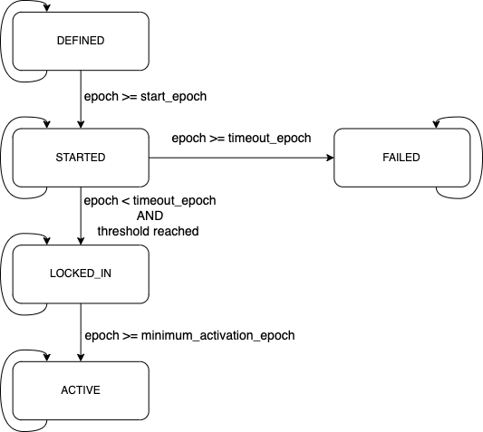

# CKB softfork activation

## Abstract

This document specifies a proposed change to the semantics of the 'version' field in CKB blocks, allowing multiple backward-compatible changes (further called "softforks") to be deployed in parallel. It relies on interpreting the version field as a bit vector, where each bit can be used to track an independent change. These are tallied in each period. Once the consensus change succeeds or times out, there is a "fallow" pause, after which the bit can be reused for later changes.

## Specification

### Parameters

Each softfork deployment is specified by the following per-chain parameters (further elaborated below):

1. The `name` specifies a very brief description of the softfork, reasonable for use as an identifier.
2. The `bit` determines which bit in the `version` field of the block is to be used to signal the softfork lock-in and activation. It is chosen from the set {0,1,2,...,28}.
3. The `start_epoch` specifies the first epoch in which the bit gains meaning.
4. The `timeout_epoch` specifies an epoch at which the miner signaling ends. Once this epoch has been reached, if the softfork has not yet locked_in (excluding this epoch block's bit state), the deployment is considered failed on all descendants of the block.
5. The `period` specifies length of epochs of the signalling period.
6. The `threshold` specifies the minimum ratio of block per `period`, which indicate the locked_in of the softfork during the `period`.
7. The `minimum_activation_epoch` specifies the epoch at which the softfork is allowed to become active.

These parameters will be written to the software binary at the start of deployment and deployment will begin as the software is released.

### Selection guidelines
The following guidelines are suggested for selecting these parameters for a softfork:

1. `name` should be selected such that no two softforks, concurrent or otherwise, ever use the same name.
2. `bit` should be selected such that no two concurrent softforks use the same bit.
3. `start_epoch` can be set soon after software with parameters is expected to be released.
4. `timeout_epoch` should be set to an epoch when it is considered reasonable to expect the entire economy to have upgraded by, ensure sufficient time for the signaling `period`, should at least one and a half month, 270 epochs after `start_epoch`.
5. `period` should at least 42 epochs，approximately one week.
6. `threshold` should be 90% or 75% for testnet.
7. `minimum_activation_epoch` should be set to several epochs after `timeout_epoch` if the `start_epoch` is to be very soon after software with parameters is expected to be released.
Where the locked_in threshold is reached, softforks are guaranteed to activate eventually but not until `minimum_activation_epoch` after signal tracking starts, allowing users, developers, and organizations to prepare software, announcements, and celebrations for that event.

### States

With each block and softfork, we associate a deployment state. The possible states are:

1. DEFINED is the first state that each softfork starts. The blocks of 0 epoch is by definition in this state for each deployment.
2. STARTED for all blocks reach or past the `start_epoch`.
3. LOCKED_IN for one `period` after the first `period` with STARTED blocks of which at least `threshold` has the associated bit set in `version`.
4. ACTIVE for all blocks after the LOCKED_IN `period`.
5. FAILED for all blocks after the `timeout_epoch`, if LOCKED_IN was not reached.

### Bit flags

The `version` block header field is to be interpreted as a 32-bit little-endian integer, and bits are selected within this integer as values (1 << N) where N is the `bit` number.

```rust
    pub fn mask(&self) -> u32 {
        1u32 << bit as u32
    }
```

Blocks in the STARTED state get a `version` whose bit position bit is set to 1. The top 3 bits of such blocks must be 000, so the range of possible `version` values is [0x00000000...0x1FFFFFFF], inclusive.

By restricting the top 3 bits to 000, we get 29 out of those for this proposal and support future upgrades for different mechanisms.

Miners should continue setting the bit in the LOCKED_IN phase, so uptake is visible, though this does not affect consensus rules.

### New consensus rules
The new consensus rules for each softfork are enforced for each block with an ACTIVE state.

### State transitions



The blocks of 0 epoch has a state DEFINED for each deployment, by definition.

```rust
if epoch.number().is_zero() {
    return ThresholdState::DEFINED;
}
```

We remain in the initial state until we reach the `start_epoch`.

```rust
match state {
    ThresholdState::DEFINED => {
        if epoch.number() >= start {
            next_state = ThresholdState::STARTED;
        }
    }
```

After a `period` in the STARTED state, we tally the bits set and transition to LOCKED_IN if a sufficient number of blocks in the past `period` set the deployment bit in their version numbers. If the threshold has not been met and we reach the `timeout_epoch`, we transition directly to FAILED.

Note that a block's state never depends on its version, only on that of its ancestors.

```rust
match state {
    ThresholdState::STARTED => {
        let mut count = 0;
        for block in (0..period_blocks) {
            if (block.version() & 0xE0000000 == 0x00000000 && (block.version() >> bit) & 1 == 1) {
                ++count;
            }
        }
        let threshold_number = threshold_number(period_blocks, threshold);
        if count >= threshold_number {
            next_state = ThresholdState::LOCKED_IN;
        } else if epoch_ext.number() >= timeout {
            next_state = ThresholdState::FAILED;
        }
    }
```
After a `period` of LOCKED_IN, we automatically transition to ACTIVE if the `minimum_activation_epoch` is reached. Otherwise, LOCKED_IN continues.

```rust
ThresholdState::LOCKED_IN => {
    if epoch.number() >= min_activation_epoch {
        next_state = ThresholdState::ACTIVE;
    }
}
```

Furthermore, ACTIVE and FAILED are terminal states in which a deployment stays once reached.

```rust
ThresholdState::FAILED | ThresholdState::ACTIVE => {
    // Nothing happens, these are terminal states.
}
```


## Reference

1. Wuille, P., Todd, P., Maxwell, G., & Russell, R. (2015). BIP9: Version bits with timeout and delay. Bitcoin BIPs. https://github.com/bitcoin/bips/blob/master/bip-0009.mediawiki
2. Fry, S., & Dashjr, L. (2017). BIP8: Version bits with lock-in by height. Bitcoin BIPs. https://github.com/bitcoin/bips/blob/master/bip-0008.mediawiki
3. Harding, D. A. (2021). Taproot activation proposal “Speedy Trial.” Bitcoin-Dev Mailing List. https://lists.linuxfoundation.org/pipermail/bitcoin-dev/2021-March/018583.html
