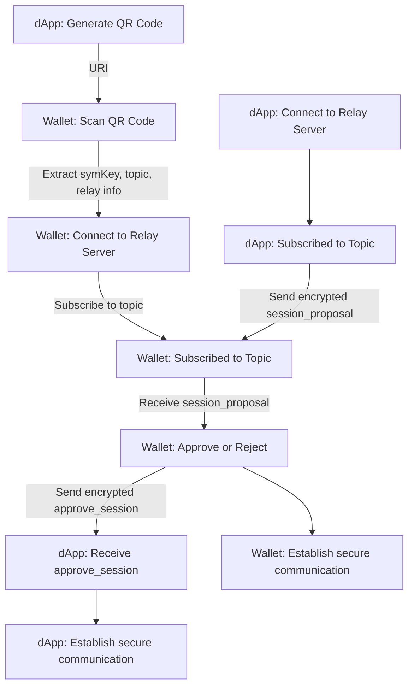

# Reference-level explanation

Here is a flowchart illustrating this linking process:




https://github.com/Magickbase/neuron-public-issues/assets/11756869/50deb328-171a-4237-985d-daa85238b9d2


## Initialization

This `PROJECT_ID` will be described in-depth in the External Tasks section of this document

### dapp

```javascript
  import { Web3Modal } from "@web3modal/standalone";
  import { SignClient } from "@walletconnect/sign-client";

  SignClient.init({
      projectId: PROJECT_ID,
      metadata: {
        name: "Demo Dapp",
        description: "Demo Dapp for WalletConnect",
        url: location.href,
        icons: [],
      },
    });
```

### wallet

First, we need to instanciate  `@walletconnect/core`, passing a `PROJECT_ID` that is registered on https://walletconnect.com

Using the `core` instance, we can init the `@walletconnect/web3wallet` instance passing it and some metadata with information about the wallet:

```javascript
import { Core } from '@walletconnect/core'
import { IWeb3Wallet, Web3Wallet } from '@walletconnect/web3wallet'

const core = new Core({
	projectId: PROJECT_ID,
})

Web3Wallet.init({
 core,
 metadata: {
    name: 'Neuron',
    url: 'https://github.com/nervosnetwork/neuron',
    icons: [],
    description: '',
  },
})
```

## Pairing

On both wallets, we need to enable the user to scan a QRCode containing the connection URI and also allow him to manage his connected sections

### dApp

```javascript
const { uri, approval } = await signClient.connect({
  requiredNamespaces: {
    ckb: {
        chains: ["ckb:testnet"],
        methods: ["ckb_getAddresses","ckb_signMessage","ckb_signTransaction"],
        events: ["accountChanged","addressesChanged"],
    },
  },
  sessionProperties: {
    scriptBases: "<script_base a>,<script_base b>",
  },
});
await web3Modal.openModal({ uri });
const session = await approval();

```

### wallet

```javascript
await web3Wallet.core.pairing.pair({ uri: walletConnectUri })
```


## Handling session proposals

A `session_proposal` event is received by the wallet just as soon as the connection is established with the relay server, so we need to handle it by displaying the proposal request to the user with a popup to accept or reject it.

### proposal (wallet received)

```javascript
{
  "id": 1690302681590244,
  "params": {
    "id": 1690302681590244,
    "pairingTopic": "78eba166ce5385e54afe5e58df9394c16d731c3496140bc9371b1ce7ad274919",
    "expiry": 1690302988,
    "requiredNamespaces": {
      "ckb": {
        "chains": [
          "ckb:testnet",
        ],
        "methods": [
          "ckb_getAddresses",
          "ckb_signMessage",
          "ckb_signTransaction"
        ],
        "events": [
          "accountChanged",
          "addressesChanged"
        ]
      }
    },
    "optionalNamespaces": {},
    "relays": [
      {
        "protocol": "irn"
      }
    ],
    "proposer": {
      "publicKey": "930fb9ac962835844bd6bc22afae8fe19ea4673e56e1179474477ced7291b650",
      "metadata": {
        "name": "Demo Dapp",
        "description": "Demo Dapp for WalletConnect",
        "url": "http://localhost:3100/",
        "icons": []
      }
    },
    "sessionProperties": {
      "scriptBases": "<script_base a>,<script_base b>"
    }
  },
  "verifyContext": {
    "verified": {
      "verifyUrl": "",
      "validation": "UNKNOWN",
      "origin": "http://localhost:3100/"
    }
  }
}

```

###  session (dApp received)

```javascript
{
  "topic": "04478855bfbec1470ce6a1da7be45547c097c3be0c303a17e883962a16e9c760",
  "relay": {
    "protocol": "irn"
  },
  "expiry": 1690907597,
  "namespaces": {
    "ckb": {
      "accounts": [
        "ckb:testnet:ckt1qzda0cr08m85hc8jlnfp3zer7xulejywt49kt2rr0vthywaa50xwsqwh8z6fkne05j0emqeen59qnn8a6xkm3fs0xf9en"
      ],
      "methods": [
        "ckb_getAddresses",
        "ckb_signMessage",
        "ckb_signTransaction"
      ],
      "events": [
        "accountChanged",
        "addressesChanged"
      ]
    }
  },
  "acknowledged": true,
  "pairingTopic": "ac5727dca7a8ab7fef8afd5d6688afc833dce5513f00316cf62c27fa0e4976f4",
  "requiredNamespaces": {
    "ckb": {
      "chains": [
        "ckb:testnet"
      ],
      "methods": [
        "ckb_getAddresses",
        "ckb_signMessage",
        "ckb_signTransaction"
      ],
      "events": [
        "accountChanged",
        "addressesChanged"
      ]
    }
  },
  "optionalNamespaces": {},
  "controller": "6743f243e8e1e7e08d041b1342fb4a936c9b4f904930948b4c1c35e83686461a",
  "self": {
    "publicKey": "d664efb0c3829b7aace810d73effb2d1d9b6c83d896123b169359f6d50f2d173",
    "metadata": {
      "name": "Demo Dapp",
      "description": "Demo Dapp for WalletConnect",
      "url": "http://localhost:3100/",
      "icons": []
    }
  },
  "peer": {
    "publicKey": "6743f243e8e1e7e08d041b1342fb4a936c9b4f904930948b4c1c35e83686461a",
    "metadata": {
      "name": "Neuron",
      "url": "https://github.com/nervosnetwork/neuron",
      "icons": [],
      "description": ""
    }
  }
}

```

## Handling session requests

After the session is established, we will receive RPC requests through the `session_request` event, here is an  example request(ckb_signMessage):

### session request(wallet received)

```javascript
{
  "id": 1690303076942789,
  "topic": "4037816dd9a6ddadae1336cf3f13bde5e327b84f58c17ee14a74d97497d095b8",
  "params": {
    "request": {
      "method": "ckb_signMessage",
      "params": {
        "address": "ckt1qzda0cr08m85hc8jlnfp3zer7xulejywt49kt2rr0vthywaa50xwsqwh8z6fkne05j0emqeen59qnn8a6xkm3fs0xf9en",
        "message": "This is a like message"
      }
    },
    "chainId": "ckb:testnet"
  },
  "verifyContext": {
    "verified": {
      "verifyUrl": "",
      "validation": "UNKNOWN",
      "origin": "http://localhost:3100/"
    }
  }
}
```

### result (dApp received)
#### approved
```javascript
{
  "signature": "0xcf1e3196731313a1ca4cee73fb217539d359fe874e01be620e4ceeff4b51a1853f3e241210aaa030e8716fe5aec934f0be3e4c42963cdd2b9719c882b459ed0301"
}

```

#### rejected
```javascript
{
  "code": 5000,
  "message": "User rejected."
}

```
